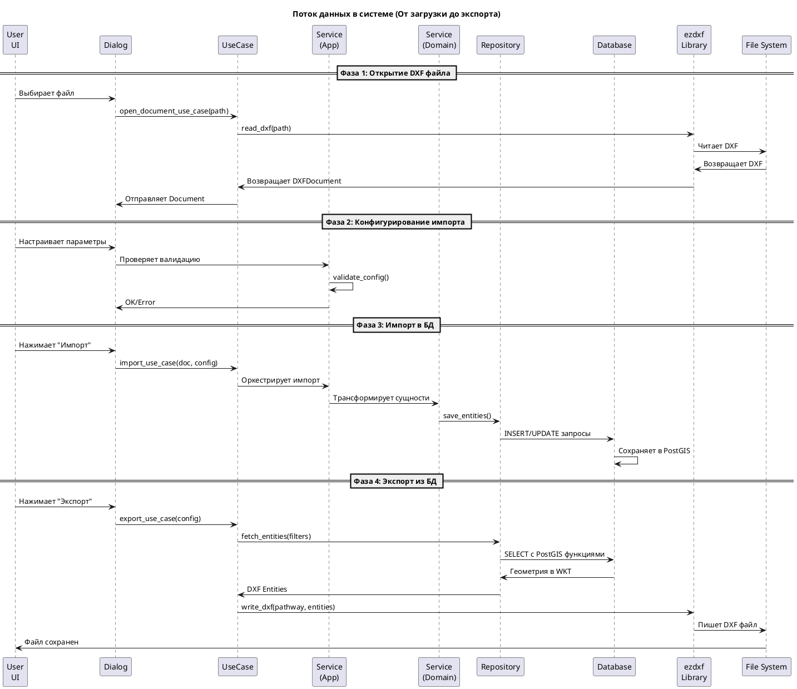
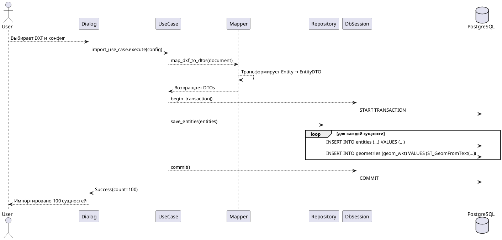

# Диаграмма компонентов и архитектурных паттернов системы

**Системная архитектура, взаимодействия компонентов и паттерны проектирования**

---

## 1. Диаграмма компонентов системы (C4 Model - Container Level)

```plantuml
@startuml system_components

!define PERSON_COLOR #08427B
!define SYSTEM_COLOR #1168BD
!define EXTERNAL_COLOR #999999
!define INTERNAL_COLOR #85BBF0

title Диаграмма компонентов DXF-PostGIS Converter системе

actor User #PERSON_COLOR
rectangle "QGIS Application" as qgis_rectangle #00CCFF {
    component "Main Plugin Entry" as entry_comp #1168BD
    component "Converter Dialog" as dialog_comp #1168BD
    
    rectangle "Presentation Layer" as pres_rect {
        component "UI Dialogs" as dialogs #85BBF0
        component "Widgets (Tree, Canvas)" as widgets #85BBF0
        component "Workers (Async)" as workers #85BBF0
        component "UI Services" as ui_services #85BBF0
    }
    
    rectangle "Application Layer" as app_rect {
        component "Use Cases" as usecases #1168BD
        component "DTOs & Mappers" as dtos #1168BD
        component "Services (Active Doc, Import, Export)" as app_services #1168BD
        component "Events & Interfaces" as events #1168BD
        component "Result Monad" as results #1168BD
    }
    
    rectangle "Domain Layer" as domain_rect {
        component "Entities (DXF objects)" as entities #85BBF0
        component "Repositories (I)" as repositories #85BBF0
        component "Services (Domain Logic)" as domain_services #85BBF0
        component "Value Objects" as vo #85BBF0
    }
}

rectangle "Infrastructure Layer" as infra_rect #999999 {
    rectangle "DXF I/O" {
        component "ezdxf (Reader/Writer)" as ezdxf #85BBF0
    }
    
    rectangle "Database" {
        component "PostgreSQL/PostGIS" as postgres #00CCFF
        component "DbSession & Repos (Impl)" as db_impl #85BBF0
    }
    
    rectangle "QGIS Integration" {
        component "Qt Logger, Settings, Events" as qt_integration #85BBF0
    }
    
    rectangle "Localization" {
        component "i18n Manager" as i18n #85BBF0
    }
}

rectangle "External Systems" as external_rect #AAAAAA {
    database "PostgreSQL Server" as pg_server {
        rectangle "PostGIS Tables" as postgis_tables
    }
    file "DXF Files" as dxf_files_ext
}

' Взаимодействия между пользователем и системой
User --> entry_comp: Открывает плагин
User --> dialog_comp: Интерфейсирует с диалогами
dialog_comp --> dialogs
dialogs --> widgets
widgets --> ui_services

' Действия пользователя (Use Cases)
dialogs --> usecases: Инициирует операции
widgets --> usecases

' Use Cases используют Domain слой
usecases --> entities: Работает с сущностями
usecases --> repositories: Запрашивает данные
repositories --> domain_services: Бизнес логика
domain_services --> entities
usecases --> dtos: Трансформирует данные
dtos --> entities

' Services координируют
app_services --> usecases: Оркестрирует
app_services --> entities
app_services --> dtos

' Events и Results
events --> dialogs: Уведомления
app_services --> results: Возвращает результаты
results --> dialogs: Обрабатывает результаты

' Workers для асинхронности
workers --> usecases: Запускает долгие операции
workers --> app_services
workers --> ui_services: Обновляет UI

' Infrastructure - DXF I/O
ezdxf --> dxf_files_ext: Читает/пишет
ezdxf --> entities: Конвертирует в Entity
dtos --> ezdxf: Использует конвертер

' Infrastructure - Database
repositories --> db_impl: Реализовано через
db_impl --> postgres: SQL запросы (DDL, DML)
postgres --> pg_server: Соединение

' Infrastructure - QGIS Integration
qt_integration --> dialogs: Логирование, сигналы
qt_integration --> ui_services

' Локализация
i18n --> dialogs: Переводит тексты UI
i18n --> app_services

' Value Objects (используются везде)
entities --> vo
dtos --> vo
domain_services --> vo

@enduml
```

---

## 2. Диаграмма потока данных (Data Flow)



---

## 3. Архитектурные паттерны и SOLID принципы

### 3.1 Реализованные паттерны

#### **1. Clean Architecture (4 Слоя)**
```
┌─────────────────────────────────────┐
│    Presentation Layer               │ ← Диалоги, Виджеты, Workers
├─────────────────────────────────────┤
│    Application Layer                │ ← Use Cases, Services, DTOs, Events
├─────────────────────────────────────┤
│    Domain Layer                     │ ← Entities, Repositories (I), Services, VO
├─────────────────────────────────────┤
│    Infrastructure Layer             │ ← БД, ezdxf, QGIS, i18n
└─────────────────────────────────────┘
```

**Принцип**: Внешние слои зависят от внутренних, но не наоборот → обратные зависимости через интерфейсы (IRepository, IConnection, ILogger).

---

#### **2. Dependency Injection (Through Container)**
```python
# container.py
- Регистрирует все сервисы
- Настраивает жизненный цикл (singleton, transient)
- Принцип: IoC (Inversion of Control)

class Container:
    def __init__(self):
        self.services = {}
    
    def register(self, name: str, factory, singleton=True):
        self.services[name] = {'factory': factory, 'singleton': singleton}
    
    def resolve(self, name: str):
        return self.services[name]['factory']()
```

**Преимущества**: Слабая связанность, легко тестировать, легко менять реализацию.

---

#### **3. Repository Pattern (Domain + Infrastructure)**
```python
# Domain Layer (интерфейс)
class IDocumentRepository:
    def find_by_id(self, id: UUID) -> DXFDocument: pass
    def save(self, document: DXFDocument) -> None: pass

# Infrastructure Layer (реализация)
class DocumentRepository(IDocumentRepository):
    def __init__(self, connection: IConnection):
        self.connection = connection
    
    def find_by_id(self, id: UUID) -> DXFDocument:
        result = self.connection.execute_query(
            "SELECT * FROM documents WHERE id = %s", (id,)
        )
        return self._map_to_entity(result)
```

**Результат**: Разделение бизнес-логики от баз данных, возможность подменять реализацию.

---

#### **4. Value Objects Pattern (Immutable)**
```python
# domain/value_objects/bounds.py
@dataclass(frozen=True)
class Bounds:
    x_min: float
    x_max: float
    y_min: float
    y_max: float
    
    def intersection_with(self, other: 'Bounds') -> 'Bounds':
        return Bounds(
            max(self.x_min, other.x_min),
            min(self.x_max, other.x_max),
            ...
        )
```

**Преимущества**: Безопасность (не может измениться), сравнение по значению, переиспользуемость.

---

#### **5. Result Monad (Functional Error Handling)**
```python
# application/results/app_result.py
class AppResult[T]:
    def match(self, on_success, on_failure):
        if self.is_success:
            return on_success(self.value)
        else:
            return on_failure(self.error)

# Вместо исключений
def import_use_case(dxf_doc, config) -> AppResult[int]:
    if not valid_config(config):
        return Failure("Invalid config")
    
    count = save_entities(dxf_doc)
    return Success(count)

# Использование
result.match(
    on_success=lambda count: show_message(f"Imported {count}"),
    on_failure=lambda error: show_error(error)
)
```

**Преимущества**: Явная обработка ошибок, отсутствие исключений, функциональный стиль.

---

#### **6. Event System (Reactive/Observer)**
```python
# application/events/i_app_events.py
class IAppEventBus:
    def subscribe(self, event_type: type, handler: Callable) -> None: pass
    def publish(self, event: IEvent) -> None: pass

# infrastructure/qgis/qt_app_events.py (реализация)
class QtAppEventBus(IAppEventBus):
    def __init__(self):
        self.handlers = defaultdict(list)
    
    def subscribe(self, event_type, handler):
        self.handlers[event_type].append(handler)
    
    def publish(self, event):
        for handler in self.handlers[type(event)]:
            handler(event)

# Использование
event_bus.subscribe(DocumentOpenedEvent, on_document_opened)
event_bus.publish(DocumentOpenedEvent(document=doc))
```

**Результат**: Слабая связанность компонентов, реактивное программирование.

---

#### **7. Use Case Template (Interactor Pattern)**
```python
class UseCase:
    def __init__(self, repository: IRepository, service: IService, ...):
        self.repository = repository
        self.service = service
    
    def execute(self, request: Request) -> AppResult[Response]:
        # Валидация
        if not request.is_valid():
            return Failure("Invalid request")
        
        # Получение доменных объектов
        entity = self.repository.find_by_id(request.id)
        
        # Бизнес-логика
        self.service.do_something(entity)
        
        # Сохранение
        self.repository.save(entity)
        
        # Возврат результата
        return Success(response)
```

**Преимущества**: Единообразный интерфейс для всех операций, чистая архитектура.

---

#### **8. Factory Pattern (Dependency Creation)**
```python
# domain/repositories/i_repository_factory.py
class IRepositoryFactory:
    def create_document_repository(self) -> IDocumentRepository: pass
    def create_layer_repository(self) -> ILayerRepository: pass

# infrastructure/database/repository_factory.py
class RepositoryFactory(IRepositoryFactory):
    def __init__(self, connection: IConnection):
        self.connection = connection
    
    def create_document_repository(self):
        return DocumentRepository(self.connection)
```

**Результат**: Централизованное создание объектов, легко менять реализацию.

---

### 3.2 SOLID Принципы

| Принцип | Реализация | Пример |
|---------|-----------|---------|
| **S**ingle Responsibility | Каждый класс/модуль имеет одну причину для изменения | `DocumentService` только работает с документами, `LayerService` с слоями |
| **O**pen/Closed | Открыт для расширения, закрыт для модификации | Использование интерфейсов `IRepository` позволяет добавлять новые реализации |
| **L**iskov Substitution | Подтипы могут заменять базовые типы | `DocumentRepository` может заменить `IDocumentRepository` везде |
| **I**nterface Segregation | Узкие специализированные интерфейсы | `ILogger` для логирования, `ILocalization` для i18n (не один большой I*Everything) |
| **D**ependency Inversion | Зависимость от абстракций, а не конкретики | UseCase зависит от `IRepository`, а не от `PostgreSQLRepository` |

---

## 4. Взаимодействие компонентов (Sequence Diagrams)

### 4.1 Сценарий: Импорт DXF в БД



---

### 4.2 Сценарий: Экспорт из БД в DXF

```plantuml
@startuml export_sequence

actor User
participant "Dialog" as dialog
participant "UseCase" as usecase
participant "Repository" as repository
database "PostgreSQL" as db
participant "ezdxf" as ezdxf
file "DXF File" as dxf_file

User --> dialog: Вводит фильтры и путь
dialog --> usecase: export_use_case.execute(config)

usecase --> repository: find_entities(filters)
repository --> db: SELECT e.*, ST_AsText(g.geom) FROM entities e JOIN geometries g
db --> repository: Результаты с WKT геометриями
repository --> usecase: Список Entity объектов

usecase --> ezdxf: write_dxf(path, entities)
ezdxf --> ezdxf: Создает DXF документ
ezdxf --> ezdxf: Добавляет примитивы (LINE, CIRCLE)
ezdxf --> dxf_file: Пишет .dxf файл

usecase --> dialog: Success(path)
dialog --> User: Файл сохранен: /path/to/file.dxf

@enduml
```

---

## 5. Таблица паттернов по слоям

| Слой | Паттерны | Примеры классов |
|------|---------|-----------------|
| **Domain** | Entity, Value Object, Repository (I), Factory (I) | DXFDocument, Bounds, IDocumentRepository, IRepositoryFactory |
| **Application** | UseCase, Service, DTO, Mapper, Event, Result Monad | OpenDocumentUseCase, ActiveDocumentService, DocumentDTO, DXFMapper, DocumentOpenedEvent, AppResult[T] |
| **Presentation** | Dialog, Widget, Worker, Service | ConverterDialog, SelectableDXFTreeHandler, LongTaskWorker, DialogService |
| **Infrastructure** | Repository (Impl), Factory (Impl), Adapter, Service Locator | DocumentRepository, RepositoryFactory, QtAppEventBus, LocalizationManager |

---

## 6. Диаграмма зависимостей (Dependency Graph)

```
┌─ User (QGIS) ─────┐
│                   │
│  ▼                │
┌──────────────────────────────────┐
│   Presentation Layer               │
│  - Dialogs ──────────────────────├──► Use Cases
│  - Widgets ────────────────────┐ │
│  - Workers                     │ │
│  - UI Services    ◄────────────┘ │
└──────────────────────────────────┘
       ▲                   ▼
       │              Application Layer
       │          ┌──────────────────────┐
       │          │ Use Cases            │────────────────────┐
       │          │ Services             │────┐               │
       │          │ DTOs & Mappers       │    │               │
       │          │ Events               │    │               │
       │          │ Results              │    │               │
       │          └──────────────────────┘    │               │
       │                 ▼                    ▼               ▼
       │          Domain Layer            Results        Infrastructure
       │       ┌──────────────────┐                      ┌────────────────────┐
       │       │ Entities         │                      │ PostgreSQL         │
       ├─────► │ Repositories (I) │◄─────────────────────│ DBSession (Impl)   │
       │       │ Services         │                      │ DocumentRepo (Impl)│
       │       │ Value Objects    │                      │ ...                │
       │       └──────────────────┘                      └────────────────────┘
       │                                                         ▲
       │                   ezdxf Library                         │
       └──────────────────────────────────────────────────────────┘
                  QGIS API (Qt / Logger / Settings / Events)
```

---

## 7. Критические пути и точки интеграции

### Точка 1: Dependency Injection (container.py)
- **Роль**: Центр всей системы, где создаются все экземпляры
- **Критичность**: Максимальная
- **Зависит от**: Конфиг, все сервисы

### Точка 2: Repository Pattern
- **Роль**: Адаптер между доменом и БД
- **Критичность**: Высокая
- **Abstraction**: IRepository interface

### Точка 3: Event Bus
- **Роль**: Коммуникация между компонентами
- **Критичность**: Высокая для UI реактивности
- **Реализация**: QtAppEventBus (через Qt signals)

### Точка 4: Use Cases
- **Роль**: Бизнес-логика приложения
- **Критичность**: Максимальная
- **Паттерн**: Interactor pattern с AppResult[T]

### Точка 5: mapper.py
- **Роль**: Трансформирование Entity ← → DTO
- **Критичность**: Средняя (изолированная)
- **Testing**: Unit-tested isolated logic

---

## 8. Масштабируемость и модификация

### Добавление нового типа сущности (например, SPLINE)
1. Добавить `SPLINE_VO` в `EntityType` enum
2. Добавить `handle_spline()` в `DXFEntity`
3. Добавить миграцию БД для новую таблицу
4. Обновить конвертер геометрии в `ezdxf`
5. Обновить Use Cases

**Слои затронуты**: 4/4 (все)

### Смена БД (например PostgreSQL → MongoDB)
1. Создать новую реализацию `IRepository{Impl}`
2. Обновить `RepositoryFactory`
3. Обновить конфиг и `DbSession`

**Слои затронуты**: 2/4 (Infrastructure + Application config)

### Добавление новой локализации (японский язык)
1. Добавить переводы в `i18n/`
2. Обновить `LocalizationManager`

**Слои затронуты**: 1/4 (Infrastructure)

---

## 9. Резюме архитектуры

✅ **Clean Architecture** — 4 слоя с правилом зависимостей
✅ **SOLID Принципы** — Каждый класс отвечает за одно, зависимость от интерфейсов
✅ **DI + IoC** — container.py управляет всеми зависимостями
✅ **Паттерны** — Repository, Factory, Value Objects, Result Monad, Events, UseCase
✅ **Тестируемость** — Все сложности абстрагированы за интерфейсы
✅ **Масштабируемость** — Легко добавлять новые функции, менять реализации
