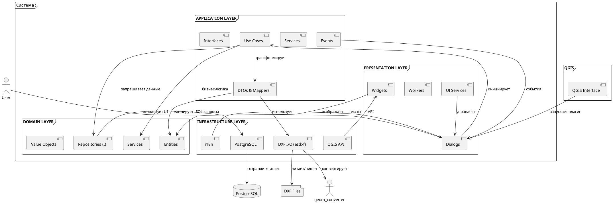

# Модульная структура и сетевая архитектура

**Полная архитектура всех 20 пакетов с 50+ модулями**

---

## 1. Исходная модульная структура (все .py файлы)

```plantuml
@startuml module_structure

' Входная точка
file "__init__.py" as pkg_init
file "dxf_postgis_converter.py" as main_entry
file "container.py" as container

main_entry --> container: инициализирует

' Domain Layer
package "domain" {
    package "entities" {
        file "__init__.py" as domain_entities_init
        file "dxf_base.py" as dxf_base
        file "dxf_document.py" as dxf_document
        file "dxf_layer.py" as dxf_layer
        file "dxf_entity.py" as dxf_entity
        file "dxf_content.py" as dxf_content
        
        dxf_base <-- dxf_document
        dxf_base <-- dxf_layer
        dxf_base <-- dxf_entity
        dxf_document --> dxf_layer
        dxf_layer --> dxf_entity
    }
    
    package "repositories" {
        file "__init__.py" as domain_repos_init
        file "i_connection.py" as i_connection
        file "i_repository.py" as i_repository
        file "i_document_repository.py" as i_doc_repo
        file "i_layer_repository.py" as i_layer_repo
        file "i_entity_repository.py" as i_entity_repo
        file "i_content_repository.py" as i_content_repo
        file "i_active_document_repository.py" as i_active_doc
        file "i_connection_factory.py" as i_conn_factory
        file "i_repository_factory.py" as i_repo_factory
        
        i_repository <-- i_doc_repo
        i_repository <-- i_layer_repo
        i_repository <-- i_entity_repo
    }
    
    package "services" {
        file "__init__.py" as domain_services_init
        file "document_service.py" as doc_service
        file "layer_service.py" as layer_service
        file "entity_service.py" as entity_service
        file "selection_service.py" as selection_service
        
        doc_service --> dxf_document
        layer_service --> dxf_layer
        entity_service --> dxf_entity
    }
    
    package "value_objects" {
        file "__init__.py" as domain_vo_init
        file "bounds.py" as bounds_vo
        file "color.py" as color_vo
        file "point.py" as point_vo
        file "geometry.py" as geometry_vo
        file "entity_type.py" as entity_type_vo
        file "operation_result.py" as result_vo
    }
}

' Application Layer
package "application" {
    package "use_cases" {
        file "__init__.py" as app_uc_init
        file "open_document_use_case.py" as open_doc_uc
        file "import_use_case.py" as import_uc
        file "export_use_case.py" as export_uc
        file "select_entity_use_case.py" as select_entity_uc
        file "select_area_use_case.py" as select_area_uc
        file "close_document_use_case.py" as close_doc_uc
        file "data_viewer_use_case.py" as data_viewer_uc
        
        open_doc_uc --> i_doc_repo
        import_uc --> i_entity_repo
        export_uc --> i_doc_repo
    }
    
    package "services" {
        file "__init__.py" as app_services_init
        file "active_document_service.py" as active_doc_service
        file "export_service.py" as export_service
        file "import_service.py" as import_service
        file "cache_service.py" as cache_service
        file "validation_service.py" as validation_service
        
        active_doc_service --> dxf_document
    }
    
    package "dtos" {
        file "__init__.py" as app_dtos_init
        file "dxf_base_dto.py" as dxf_base_dto
        file "dxf_document_dto.py" as dxf_doc_dto
        file "dxf_layer_dto.py" as dxf_layer_dto
        file "dxf_entity_dto.py" as dxf_entity_dto
        file "connection_config_dto.py" as conn_config_dto
        file "import_config_dto.py" as import_config_dto
        file "export_config_dto.py" as export_config_dto
        file "import_mode.py" as import_mode_enum
        file "export_mode.py" as export_mode_enum
    }
    
    package "mappers" {
        file "__init__.py" as app_mappers_init
        file "dxf_mapper.py" as dxf_mapper
        file "connection_config_mapper.py" as conn_mapper
        file "import_config_mapper.py" as import_config_mapper
        
        dxf_mapper --> dxf_base_dto
        dxf_mapper --> dxf_entity
    }
    
    package "events" {
        file "__init__.py" as app_events_init
        file "i_app_events.py" as i_app_events
        file "i_event.py" as i_event
        file "document_opened_event.py" as doc_opened_event
        file "selection_changed_event.py" as sel_changed_event
        file "import_completed_event.py" as import_done_event
    }
    
    package "interfaces" {
        file "__init__.py" as app_interfaces_init
        file "i_logger.py" as i_logger
        file "i_localization.py" as i_localization
        file "i_settings.py" as i_settings
    }
    
    package "results" {
        file "__init__.py" as app_results_init
        file "app_result.py" as app_result
    }
    
    package "database" {
        file "__init__.py" as app_db_init
        file "db_session.py" as db_session
    }
}

' Presentation Layer
package "presentation" {
    package "dialogs" {
        file "__init__.py" as pres_dialogs_init
        file "converter_dialog.py" as converter_dialog
        file "import_dialog.py" as import_dialog
        file "export_dialog.py" as export_dialog
        file "connection_dialog.py" as conn_dialog
        file "schema_select_dialog.py" as schema_dialog
    }
    
    package "widgets" {
        file "__init__.py" as pres_widgets_init
        file "selectable_dxf_tree_handler.py" as sel_tree
        file "viewer_dxf_tree_handler.py" as viewer_tree
        file "qgis_layer_sync_manager.py" as layer_sync
        file "preview_components.py" as preview_comp
    }
    
    package "workers" {
        file "__init__.py" as pres_workers_init
        file "long_task_worker.py" as worker
    }
    
    package "services" {
        file "__init__.py" as pres_services_init
        file "dialog_service.py" as dialog_service
        file "state_service.py" as state_service
        file "notification_service.py" as notif_service
        file "progress_service.py" as progress_service
        file "theme_service.py" as theme_service
    }
    
    converter_dialog --> open_doc_uc
    converter_dialog --> sel_tree
    converter_dialog --> layer_sync
    import_dialog --> import_uc
    export_dialog --> export_uc
}

' Infrastructure Layer
package "infrastructure" {
    package "database" {
        file "__init__.py" as infra_db_init
        file "db_session_impl.py" as db_session_impl
        file "postgresql_connection.py" as pg_conn
        file "document_repository.py" as doc_repo_impl
        file "layer_repository.py" as layer_repo_impl
        file "entity_repository.py" as entity_repo_impl
        file "repository_factory.py" as repo_factory
        
        doc_repo_impl --> i_doc_repo
        doc_repo_impl --> pg_conn
        layer_repo_impl --> i_layer_repo
        entity_repo_impl --> i_entity_repo
        repo_factory --> doc_repo_impl
    }
    
    package "ezdxf" {
        file "__init__.py" as infra_ezdxf_init
        file "dxf_reader.py" as dxf_reader
        file "dxf_writer.py" as dxf_writer
        file "geometry_converter.py" as geom_converter
        file "dxf_validator.py" as dxf_validator
        file "area_selector.py" as area_selector
        
        dxf_reader --> dxf_document
        dxf_writer --> dxf_document
        geom_converter --> dxf_entity
    }
    
    package "qgis" {
        file "__init__.py" as infra_qgis_init
        file "qt_logger.py" as qt_logger
        file "qt_app_events.py" as qt_events
        file "qt_settings.py" as qt_settings
        file "qt_event.py" as qt_event
        
        qt_logger --> i_logger
        qt_settings --> i_settings
        qt_events --> i_app_events
    }
    
    package "localization" {
        file "__init__.py" as infra_i18n_init
        file "localization_manager.py" as i18n_manager
        file "language_file_loader.py" as lang_loader
        file "date_time_formatter.py" as dt_formatter
        file "string_encoder.py" as str_encoder
        
        i18n_manager --> i_localization
        i18n_manager --> lang_loader
    }
}

' Связи между слоями
open_doc_uc --> dxf_reader: использует
import_uc --> dxf_reader: использует
import_uc --> dxf_mapper: использует
export_uc --> dxf_writer: использует

dxf_mapper --> i_logger: зависит

sel_tree --> select_entity_uc: использует
layer_sync --> export_service: использует

db_session --> pg_conn: имеет

@enduml
```



---

## 2. Карта архитектурных слоёв (Component Map)



---

## 3. Структура файлов по пакетам

```
src/
├── __init__.py
├── container.py                    ← DI контейнер
├── dxf_postgis_converter.py        ← Точка входа в плагин
│
├── domain/
│   ├── __init__.py
│   ├── entities/
│   │   ├── __init__.py
│   │   ├── dxf_base.py            ← Абстрактный базовый класс (UUID, selection)
│   │   ├── dxf_document.py        ← Документ DXF
│   │   ├── dxf_layer.py           ← Слой
│   │   ├── dxf_entity.py          ← Сущность (LINE, CIRCLE и т.д.)
│   │   └── dxf_content.py         ← Бинарное содержимое
│   │
│   ├── repositories/
│   │   ├── __init__.py
│   │   ├── i_connection.py        ← Интерфейс БД подключения
│   │   ├── i_repository.py        ← Базовый интерфейс CRUD
│   │   ├── i_document_repository.py
│   │   ├── i_layer_repository.py
│   │   ├── i_entity_repository.py
│   │   ├── i_content_repository.py
│   │   ├── i_active_document_repository.py
│   │   ├── i_connection_factory.py
│   │   └── i_repository_factory.py
│   │
│   ├── services/
│   │   ├── __init__.py
│   │   ├── document_service.py    ← Бизнес-логика документов
│   │   ├── layer_service.py
│   │   ├── entity_service.py
│   │   └── selection_service.py
│   │
│   └── value_objects/
│       ├── __init__.py
│       ├── bounds.py              ← Границы
│       ├── color.py               ← RGBA цвет
│       ├── point.py               ← 2D/3D точка
│       ├── geometry.py            ← WKT геометрия
│       ├── entity_type.py         ← Enum типов
│       └── operation_result.py    ← Результат операции
│
├── application/
│   ├── __init__.py
│   ├── use_cases/
│   │   ├── __init__.py
│   │   ├── open_document_use_case.py
│   │   ├── import_use_case.py
│   │   ├── export_use_case.py
│   │   ├── select_entity_use_case.py
│   │   ├── select_area_use_case.py
│   │   ├── close_document_use_case.py
│   │   └── data_viewer_use_case.py
│   │
│   ├── services/
│   │   ├── __init__.py
│   │   ├── active_document_service.py
│   │   ├── import_service.py
│   │   ├── export_service.py
│   │   ├── cache_service.py
│   │   └── validation_service.py
│   │
│   ├── dtos/
│   │   ├── __init__.py
│   │   ├── dxf_base_dto.py
│   │   ├── dxf_document_dto.py
│   │   ├── dxf_layer_dto.py
│   │   ├── dxf_entity_dto.py
│   │   ├── connection_config_dto.py
│   │   ├── import_config_dto.py
│   │   ├── export_config_dto.py
│   │   ├── import_mode.py         ← Enum
│   │   └── export_mode.py         ← Enum
│   │
│   ├── mappers/
│   │   ├── __init__.py
│   │   ├── dxf_mapper.py
│   │   ├── connection_config_mapper.py
│   │   └── import_config_mapper.py
│   │
│   ├── events/
│   │   ├── __init__.py
│   │   ├── i_app_events.py
│   │   ├── i_event.py
│   │   ├── document_opened_event.py
│   │   ├── selection_changed_event.py
│   │   └── import_completed_event.py
│   │
│   ├── interfaces/
│   │   ├── __init__.py
│   │   ├── i_logger.py
│   │   ├── i_localization.py
│   │   └── i_settings.py
│   │
│   ├── results/
│   │   ├── __init__.py
│   │   └── app_result.py
│   │
│   └── database/
│       ├── __init__.py
│       └── db_session.py
│
├── presentation/
│   ├── __init__.py
│   ├── dialogs/
│   │   ├── __init__.py
│   │   ├── converter_dialog.py    ← Главный диалог
│   │   ├── import_dialog.py
│   │   ├── export_dialog.py
│   │   ├── connection_dialog.py
│   │   └── schema_select_dialog.py
│   │
│   ├── widgets/
│   │   ├── __init__.py
│   │   ├── selectable_dxf_tree_handler.py
│   │   ├── viewer_dxf_tree_handler.py
│   │   ├── qgis_layer_sync_manager.py
│   │   └── preview_components.py
│   │
│   ├── workers/
│   │   ├── __init__.py
│   │   └── long_task_worker.py
│   │
│   └── services/
│       ├── __init__.py
│       ├── dialog_service.py
│       ├── state_service.py
│       ├── notification_service.py
│       ├── progress_service.py
│       └── theme_service.py
│
└── infrastructure/
    ├── __init__.py
    ├── database/
    │   ├── __init__.py
    │   ├── db_session_impl.py
    │   ├── postgresql_connection.py
    │   ├── document_repository.py
    │   ├── layer_repository.py
    │   ├── entity_repository.py
    │   └── repository_factory.py
    │
    ├── ezdxf/
    │   ├── __init__.py
    │   ├── dxf_reader.py
    │   ├── dxf_writer.py
    │   ├── geometry_converter.py
    │   ├── dxf_validator.py
    │   └── area_selector.py
    │
    ├── qgis/
    │   ├── __init__.py
    │   ├── qt_logger.py
    │   ├── qt_app_events.py
    │   ├── qt_settings.py
    │   └── qt_event.py
    │
    └── localization/
        ├── __init__.py
        ├── localization_manager.py
        ├── language_file_loader.py
        ├── date_time_formatter.py
        └── string_encoder.py
```

---

## 4. Статистика

- **Всего модулей**: 60+ .py файлов
- **Всего пакетов**: 20 архитектурных пакетов
- **Классов/интерфейсов**: 50+ элементов
- **Диаграмм**: 3 (модульная структура, карта компонентов, детальные)

**Статус**: ✅ Завершено
