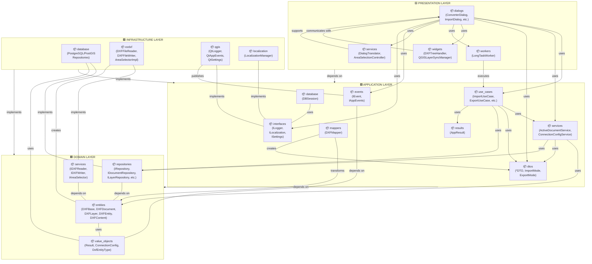
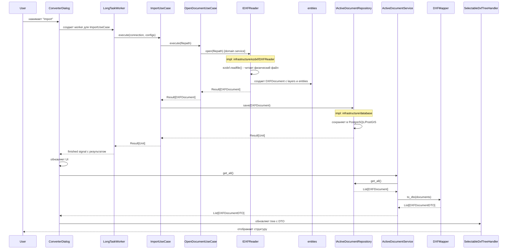
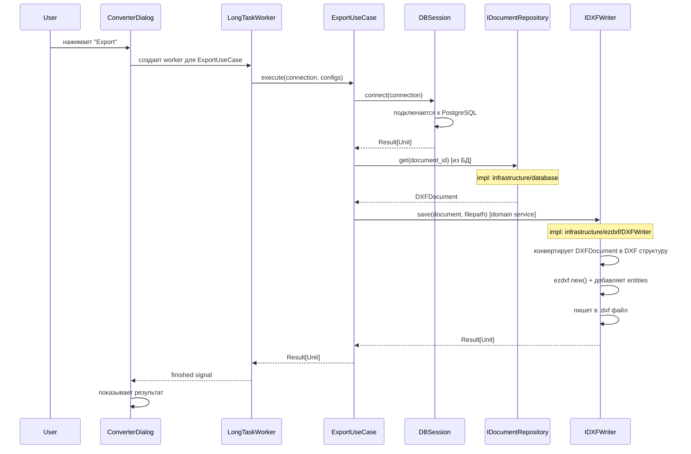
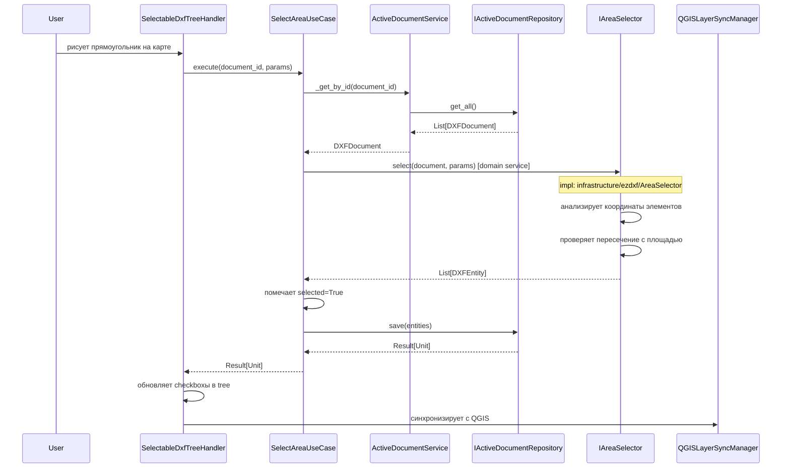
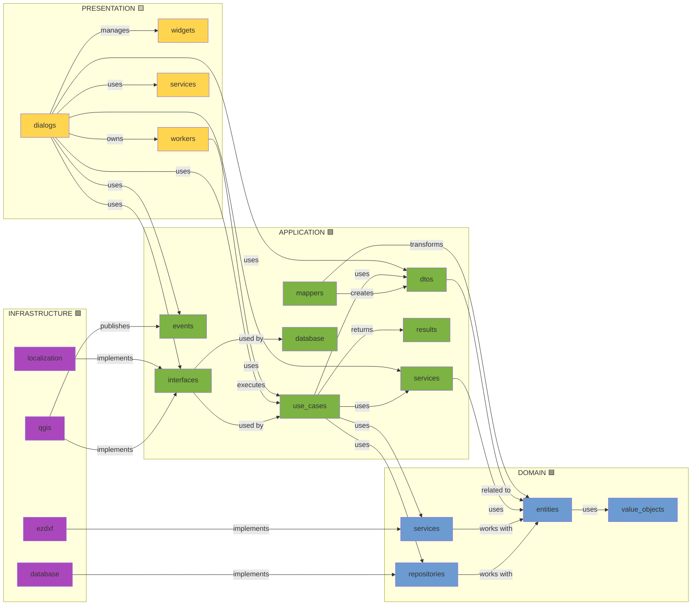

# Взаимодействие пакетов DXF-PostGIS Converter

Полное описание зависимостей и взаимодействия между всеми пакетами приложения.

---

## 1. Структура архитектуры

### 1.1 Domain Layer (src/domain/)
Содержит бизнес-логику и сущности предметной области:

| Пакет | Файлы | Назначение |
|-------|-------|-----------|
| **entities** | dxf_base.py, dxf_document.py, dxf_layer.py, dxf_entity.py, dxf_content.py | Основные сущности DXF (документы, слои, элементы) |
| **repositories** | i_*.py | Интерфейсы для доступа к данным (абстракции) |
| **services** | i_dxf_reader.py, i_dxf_writer.py, i_area_selector.py | Интерфейсы доменных сервисов |
| **value_objects** | result.py, connection_config.py, dxf_entity_type.py, area_selection.py | Неизменяемые объекты значений |

### 1.2 Application Layer (src/application/)
Бизнес-logic операции и orchestration:

| Пакет | Файлы | Назначение |
|-------|-------|-----------|
| **use_cases** | *_use_case.py | Варианты использования (Import, Export, Open, etc.) |
| **services** | active_document_service.py, connection_config_service.py | Прикладные сервисы управления |
| **mappers** | dxf_mapper.py | Преобразование Entity → DTO |
| **dtos** | *_dto.py | Data Transfer Objects для передачи данных |
| **events** | i_event.py, i_app_events.py | Интерфейсы событий приложения |
| **interfaces** | i_logger.py, i_localization.py, i_settings.py | Интерфейсы сервисов инфраструктуры |
| **results** | app_result.py | Результат выполнения операций |
| **database** | db_session.py | Сессия БД |

### 1.3 Presentation Layer (src/presentation/)
UI и взаимодействие с пользователем:

| Пакет | Файлы | Назначение |
|-------|-------|-----------|
| **dialogs** | *_dialog.py | Qt диалоги (основной интерфейс) |
| **widgets** | *_handler.py | Qt виджеты и компоненты UI |
| **workers** | long_task_worker.py | Фоновые потоки для долгих операций |
| **services** | dialog_translator.py, area_selection_controller.py | Сервисы для dialogs |

### 1.4 Infrastructure Layer (src/infrastructure/)
Реализация интерфейсов и технические детали:

| Пакет | Файлы | Назначение |
|-------|-------|-----------|
| **database** | active_document_repository.py, connection_factory.py, repository_factory.py, postgis/ | PostgreSQL/PostGIS хранилище |
| **ezdxf** | dxf_reader.py, dxf_writer.py, area_selector.py | Реализация DXF операций (чтение/запись) |
| **qgis** | logger.py, qt_app_events.py, qt_event.py, settings.py | Qt/QGIS интеграция |
| **localization** | localization.py | Локализация интерфейса |

---

## 2. Граф зависимостей по слоям



---

## 3. Взаимодействие пакетов в рамках слоев

### 3.1 DOMAIN LAYER

#### 3.1.1 entities ↔ repositories
**Направление:** Repositories работают с Entities

```
repositories (interfaces)
    ↓
    содержат методы для работы с:
    ├── IDocumentRepository.save(DXFDocument)
    ├── ILayerRepository.save(DXFLayer)
    ├── IEntityRepository.save(DXFEntity)
    └── IActiveDocumentRepository.get_all() → List[DXFDocument]

entities
    ↑
    используются как типы параметров и возвращаемых значений
```

#### 3.1.2 entities ↔ services (domain)
**Направление:** Domain Services работают с Entities

```
Entity Flow:
IDXFReader
    ├── open(filepath) → Result[DXFDocument]
    │   ↓
    │   Создает иерархию:
    │   DXFDocument
    │   ├── DXFContent (bytes)
    │   ├── DXFLayer (список)
    │   │   └── DXFEntity (список)
    │   └── DXFLayer...

IDXFWriter
    ├── save(DXFDocument, filepath) → Result[Unit]
    │   ↑
    │   Использует иерархию DXFDocument
    │   для сохранения в файл

IAreaSelector
    └── select(DXFDocument, params) → List[DXFEntity]
        ↑
        Работает с сущностями в документе
```

#### 3.1.3 value_objects использование
```
value_objects используются везде:
- Result[T]          → Обертка для результатов операций
- ConnectionConfig   → Конфиг подключения БД
- DxfEntityType      → Тип элемента DXF
- AreaSelectionParams → Параметры выбора по площади
- Unit              → Пустой результат
```

---

### 3.2 APPLICATION LAYER

#### 3.2.1 Зависимости entities + repositories
```
use_cases
    ↓
    import_use_case.py:
    ├── self._active_repo: IActiveDocumentRepository
    │   └── repo.get_all() → Result[List[DXFDocument]]
    ├── repo.save(DXFDocument)
    ├── repo.save(DXFLayer)
    └── repo.save(DXFEntity)
```

#### 3.2.2 dtos ↔ mappers
**Направление:** Mappers преобразуют Entities в DTOs

```
DXFMapper.to_dto(DXFBase) → DXFBaseDTO
├── DXFDocument → DXFDocumentDTO
├── DXFLayer → DXFLayerDTO
├── DXFEntity → DXFEntityDTO
└── DXFContent → (как часть в DTO)

Примечание: Маппер выполняет рекурсивное преобразование
иерархии объектов
```

#### 3.2.3 use_cases ↔ services (application)
```
use_cases
    ├── export_use_case --> DBSession (database)
    ├── import_use_case --> ActiveDocumentService
    ├── open_document_use_case --> IDXFReader (domain service)
    ├── select_entity_use_case --> ActiveDocumentService
    └── select_area_use_case --> IAreaSelector (domain service)

app_services
    ├── ActiveDocumentService
    │   ├── uses IActiveDocumentRepository
    │   ├── uses DXFMapper
    │   └── returns DTO objects
    └── ConnectionConfigService
        └── works with ConnectionConfigDTO
```

#### 3.2.4 events ↔ interfaces
```
events (interfaces)
    ├── IEvent[T]
    └── IAppEvents
        └── published by infrastructure/qgis

interfaces (for infrastructure)
    ├── ILogger (implemented in infrastructure/qgis)
    ├── ILocalization (implemented in infrastructure/localization)
    └── ISettings (implemented in infrastructure/qgis)
```

#### 3.2.5 results использование
```
AppResult[T]
    используется как возвращаемый тип во всех use_cases:
    ├── import_use_case → AppResult[Unit]
    ├── export_use_case → AppResult[Unit]
    ├── open_document_use_case → AppResult[DXFDocument]
    └── и т.д.
```

---

### 3.3 PRESENTATION LAYER

#### 3.3.1 dialogs (главная точка интеграции)
```
ConverterDialog (главный диалог)
    ├── @inject use_cases
    │   ├── OpenDocumentUseCase
    │   ├── ImportUseCase
    │   ├── ExportUseCase
    │   ├── SelectEntityUseCase
    │   └── SelectAreaUseCase
    ├── @inject app_services
    │   └── ActiveDocumentService
    ├── @inject interfaces
    │   ├── ILocalization
    │   ├── ILogger
    │   └── ISettings
    ├── @inject events
    │   └── IAppEvents
    ├── uses widgets
    │   └── SelectableDxfTreeHandler
    ├── uses workers
    │   └── LongTaskWorker
    └── uses presentation/services
        ├── DialogTranslator
        └── AreaSelectionController
```

#### 3.3.2 widgets ↔ dialogs
```
Widgets (UI компоненты):
    ├── SelectableDxfTreeHandler
    │   └── управляет древом документов в UI
    ├── ViewerDxfTreeHandler
    │   └── отображает DXF структуру
    ├── QGISLayerSyncManager
    │   └── синхронизирует состояние с QGIS
    └── PreviewComponents
        └── отображает предпросмотр

Взаимодействие:
    dialog → создает widgets
    widgets → генерируют сигналы
    dialog → обрабатывает сигналы → вызывает use_cases
```

#### 3.3.3 workers ↔ use_cases
```
LongTaskWorker (Qt QThread)
    ├── принимает функцию (use_case.execute)
    ├── запускает в отдельном потоке
    ├── emits progress signals
    ├── emits finished signal with result
    └── emits error signal

Использование:
    dialog → создает LongTaskWorker(use_case.execute)
    worker → runs in background
    dialog → обновляет UI по сигналам worker
```

#### 3.3.4 presentation/services
```
DialogTranslator
    └── подддерживает dialogs с локализацией

AreaSelectionController
    ├── управляет выбором по площади
    ├── работает с SelectAreaUseCase
    └── обновляет UI через dialogs
```

---

### 3.4 INFRASTRUCTURE LAYER

#### 3.4.1 database (PostgreSQL/PostGIS)
```
database/
    ├── repository_factory.py
    │   └── создает конкретные репозитории для DB
    ├── connection_factory.py
    │   └── создает соединения с БД
    ├── active_document_repository.py
    │   └── реализует IActiveDocumentRepository
    └── postgis/
        ├── DXF entity repository impl
        ├── Layer repository impl
        └── и т.д.

Реализация interfaces (repositories):
    IDocumentRepository → postgis.DocumentRepository
    ILayerRepository → postgis.LayerRepository
    IEntityRepository → postgis.EntityRepository
    и т.д.
```

#### 3.4.2 ezdxf (DXF file operations)
```
ezdxf/
    ├── dxf_reader.py (реализует IDXFReader)
    │   ├── читает физический DXF файл через ezdxf lib
    │   ├── создает domain entities
    │   └── отправляет Result[DXFDocument]
    ├── dxf_writer.py (реализует IDXFWriter)
    │   ├── получает DXFDocument
    │   ├── пишет физический DXF файл
    │   └── возвращает Result[Unit]
    └── area_selector.py (реализует IAreaSelector)
        ├── выбирает entities по площади
        └── возвращает список DXFEntity

Соединение с domain:
    Implements:
        IDXFReader ← DXFReader
        IDXFWriter ← DXFWriter
        IAreaSelector ← AreaSelector
```

#### 3.4.3 qgis (Qt/QGIS integration)
```
qgis/
    ├── logger.py
    │   └── QtLogger implements ILogger
    ├── qt_app_events.py
    │   └── QtAppEvents implements IAppEvents
    ├── qt_event.py
    │   └── QtEvent implements IEvent
    └── settings.py
        └── QtSettings implements ISettings

Роль:
    ├── Предоставляет конкретные реализации интерфейсов
    ├── Использует Qt для логирования, сигналов
    ├── Интегрирует с QGIS API
    └── Опубликовано events для приложения
```

#### 3.4.4 localization
```
localization/
    └── localization.py
        └── LocalizationManager implements ILocalization
            ├── загружает строки из i18n/ (en.py, ru.py)
            ├── предоставляет методы перевода
            └── поддерживает множественные языки
```

---

## 4. Диаграмма потока данных для ключевых операций

### 4.1 Операция импорта DXF файла



### 4.2 Операция экспорта DXF в файл



### 4.3 Выбор элементов по площади



---

## 5. Матрица зависимостей



---

## 6. Таблица межпакетных взаимодействий

| From | To | Type | Purpose | Data Passed |
|------|----|----|---------|------------|
| **use_cases** | repositories | import | доступ к данным | Entity objects |
| **use_cases** | domain/services | import | бизнес-операции | parameters |
| **use_cases** | dtos | import | результаты | DTO objects |
| **use_cases** | results | import | обертка результатов | Result[T] |
| **use_cases** | database | import | сессия БД | DBSession |
| **app/services** | entities | import | управление | Entity objects |
| **app/services** | dtos | import | преобразование | DTO objects |
| **app/services** | repositories | import | доступ | Entity objects |
| **mappers** | entities | import | трансформация | DXFBase (domain) |
| **mappers** | dtos | import | создание | DXFBaseDTO |
| **dialogs** | use_cases | import | вызов операций | parameters |
| **dialogs** | app/services | import | управление | Entity info |
| **dialogs** | widgets | composition | UI управление | QPySignal |
| **dialogs** | workers | composition | фон. потоки | lambda functions |
| **dialogs** | interfaces | import | сервисы | logger, settings, localization |
| **dialogs** | events | import | подписка | IAppEvents |
| **widgets** | dialogs | reference | обновления UI | signals |
| **workers** | use_cases | execution | фон. работа | execute() |
| **database** | repositories | implementation | PostgreSQL | SQL queries |
| **database** | entities | import | сохранение | Entity objects |
| **ezdxf** | domain/services | implementation | DXF операции | IDXFReader/Writer |
| **ezdxf** | entities | creation | объекты | DXFDocument |
| **qgis** | interfaces | implementation | QGIS интеграция | Qt signals/slots |
| **localization** | interfaces | implementation | i18n | translation strings |

---

## 7. Правила и паттерны

### 7.1 Направление зависимостей (SOLID)
```
✅ ПРАВИЛЬНО:
Presentation → Application → Domain
Presentation → Infrastructure (для интерфейсов)
Application → Domain
Infrastructure → Domain (implements)
Infrastructure → Application (implements)

❌ НЕПРАВИЛЬНО:
Domain → Application (circular)
Domain → Infrastructure (tight coupling)
Domain → Presentation
```

### 7.2 Трансляция данных между слоями
```
Domain entities  →  Mappers  →  Application DTOs
↓                                       ↓
(содержат бизнес-логику)        (структуры для передачи)

Exceptions: entities внутри одного слоя используются напрямую
```

### 7.3 Инъекция зависимостей (inject)
```python
@inject.autoparams(
    'open_doc_use_case',      # use_case
    'active_doc_service',      # app service
    'logger',                   # infrastructure
    'localization'             # infrastructure
)
def __init__(self, ...):
    # Spring-style IoC контейнер
    pass
```

### 7.4 Асинхронные операции
```
Долгие операции (import/export) запускаются в LongTaskWorker:
    · Не блокирует UI
    · Emit signals: progress, finished, error
    · Результат передается в основной поток
```

---

## 8. Ключевые точки интеграции

### 8.1 Граница Domain ↔ Application
```
Domain: entities, repositories, value_objects, domain/services
    ↓ (используются напрямую)
Application: use_cases, app/services
    ↓ (преобразуются в)
Application: dtos
```

### 8.2 Граница Application ↔ Presentation
```
Application: use_cases, app/services, interfaces, events
    ↓ (injected в)
Presentation: dialogs
    ↓ (результаты)
Presentation: dtos via mappers
    ↓ (отображаются в)
Presentation: widgets
```

### 8.3 Граница Infrastructure ↔ Domain/Application
```
Domain/Application: interfaces (IRepository, IDXFReader, ILogger)
    ↑ (реализуются)
Infrastructure: database/, ezdxf/, qgis/, localization/
```

---

## 9. Заключение

Архитектура приложения следует принципам **Clean Architecture** с четким разделением:

✅ **Domain** — чистая бизнес-логика, независимая от фреймворков
✅ **Application** — сценарии использования и оркестрация
✅ **Presentation** — UI, диалоги, виджеты Qt/QGIS
✅ **Infrastructure** — внешние сервисы: БД, DXF файлы, QGIS

Каждый слой имеет ясные границы и зависимости направлены внутрь → архитектура легко тестируется и расширяется.
