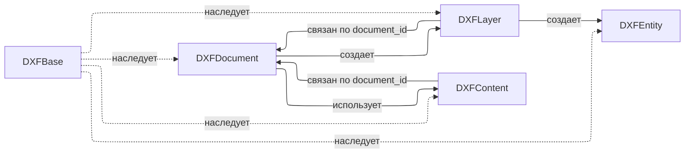
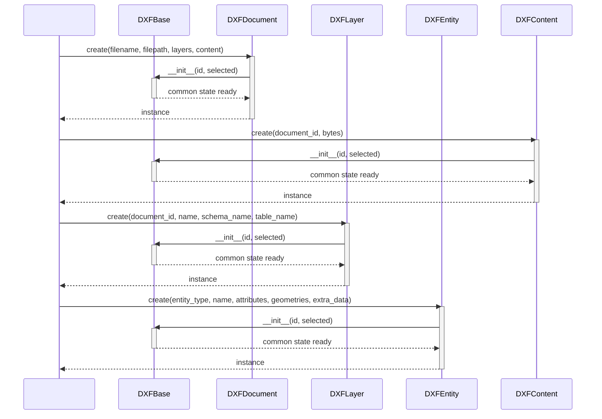
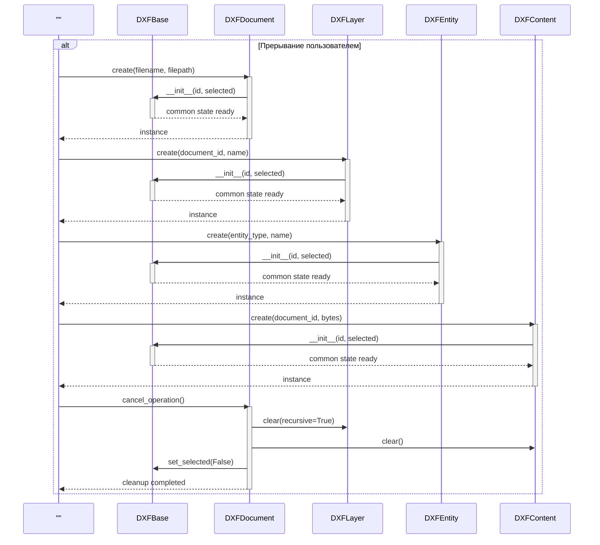
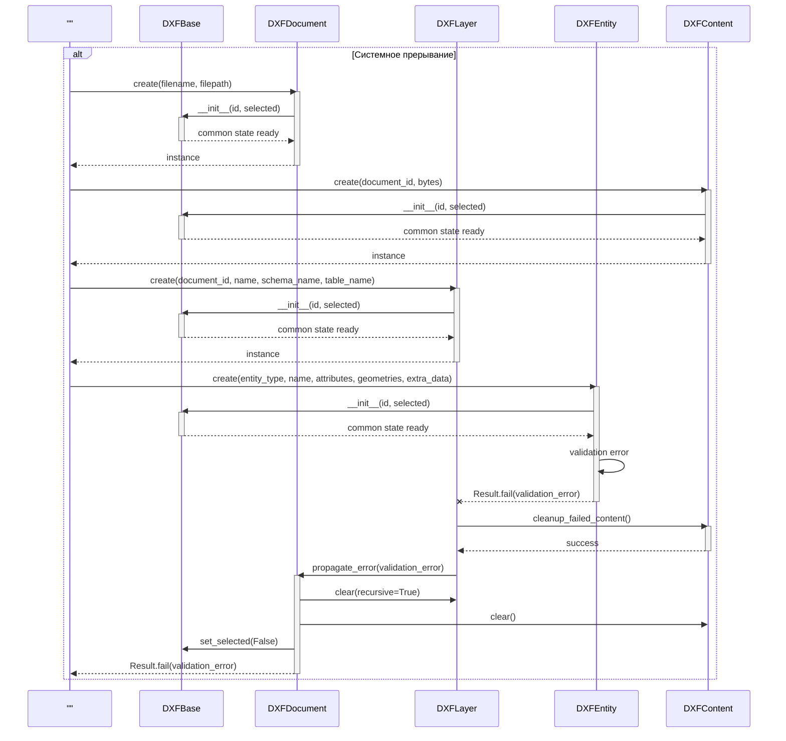
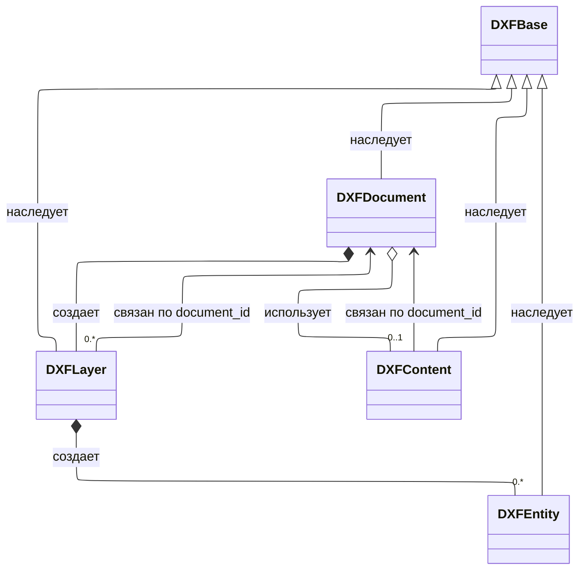
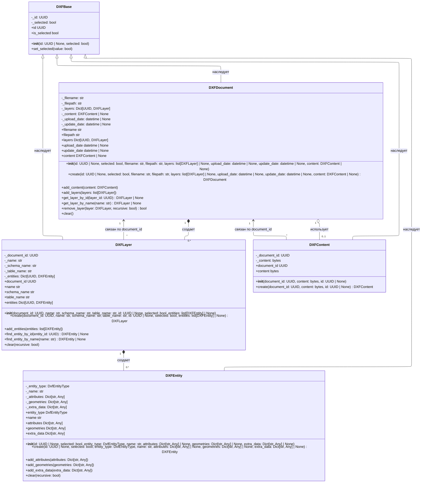

# 5.2.1. Проектирование классов пакета «entities»

Пакет «entities» содержит доменную модель DXF-документа: базовую сущность, сам документ, слой, элемент чертежа и бинарное содержимое.

## 5.2.1.1. Исходная диаграмма классов

Исходная диаграмма содержит только классы пакета `domain/entities`. Параметры классов не отображаются.

### Таблица 1. Описание классов пакета «entities»

| Класс | Описание |
|---|---|
| DXFBase | Базовый абстрактный класс для всех DXF-сущностей. |
| DXFDocument | Корневой объект DXF-документа. |
| DXFLayer | Слой DXF-документа. |
| DXFEntity | Элемент DXF-черчения. |
| DXFContent | Бинарное содержимое DXF-документа. |

## 5.2.1.2. Диаграммы последовательностей взаимодействия объектов классов

На диаграммах показано взаимодействие всех классов пакета. Внешние сущности не используются.

## 5.2.1.3. Уточненная диаграмма классов

Уточненная диаграмма показывает типы связей внутри пакета.

## 5.2.1.4. Детальная диаграмма классов

## 5.2.1.5. Таблицы полей и методов

Детальная диаграмма включает поля и методы всех классов пакета `entities`.

### Класс DXFBase

#### Описание полей класса

| Название | Тип | Описание |
|---|---|---|
| _id | UUID | Уникальный идентификатор объекта |
| _selected | bool | Флаг выделения объекта |

#### Описание методов класса

| Название | Параметры | Возвращает | Описание |
|---|---|---|---|
| __init__ | `id: UUID \| None`, `selected: bool` | None | Инициализирует базовое состояние объекта |
| id | - | `UUID` | Возвращает идентификатор объекта |
| is_selected | - | `bool` | Возвращает признак выделения |
| set_selected | `value: bool` | None | Изменяет признак выделения |

### Класс DXFDocument

#### Описание полей класса

| Название | Тип | Описание |
|---|---|---|
| _filename | str | Имя файла DXF |
| _filepath | str | Путь к файлу DXF |
| _layers | Dict[UUID, DXFLayer] | Набор слоев документа |
| _content | DXFContent \| None | Бинарное содержимое документа |
| _upload_date | datetime \| None | Дата загрузки |
| _update_date | datetime \| None | Дата обновления |

#### Описание методов класса

| Название | Параметры | Возвращает | Описание |
|---|---|---|---|
| __init__ | `id: UUID \| None`, `selected: bool`, `filename: str`, `filepath: str`, `layers: list[DXFLayer] \| None`, `upload_date: datetime \| None`, `update_date: datetime \| None`, `content: DXFContent \| None` | None | Инициализирует документ и коллекцию слоев |
| create | те же параметры, что и `__init__` | `DXFDocument` | Фабричный метод создания документа |
| filename | - | `str` | Возвращает имя файла |
| filepath | - | `str` | Возвращает путь к файлу |
| layers | - | `Dict[UUID, DXFLayer]` | Возвращает слои документа |
| upload_date | - | `datetime \| None` | Возвращает дату загрузки |
| update_date | - | `datetime \| None` | Возвращает дату обновления |
| content | - | `DXFContent \| None` | Возвращает содержимое документа |
| add_content | `content: DXFContent` | None | Связывает документ с содержимым |
| add_layers | `layers: list[DXFLayer]` | None | Добавляет слои в документ |
| get_layer_by_id | `layer_id: UUID` | `DXFLayer \| None` | Получает слой по идентификатору |
| get_layer_by_name | `name: str` | `DXFLayer \| None` | Получает слой по имени |
| remove_layer | `layer: DXFLayer`, `recursive: bool = False` | `bool` | Удаляет слой из документа |
| clear | - | None | Очищает документ |

### Класс DXFLayer

#### Описание полей класса

| Название | Тип | Описание |
|---|---|---|
| _document_id | UUID | Идентификатор документа-владельца |
| _name | str | Имя слоя |
| _schema_name | str | Имя схемы БД |
| _table_name | str | Имя таблицы БД |
| _entities | Dict[UUID, DXFEntity] | Набор сущностей слоя |

#### Описание методов класса

| Название | Параметры | Возвращает | Описание |
|---|---|---|---|
| __init__ | `document_id: UUID`, `name: str`, `schema_name: str`, `table_name: str`, `id: UUID \| None`, `selected: bool`, `entities: list[DXFEntity] \| None` | None | Инициализирует слой и набор сущностей |
| create | те же параметры, что и `__init__` | `DXFLayer` | Фабричный метод создания слоя |
| document_id | - | `UUID` | Возвращает идентификатор документа |
| name | - | `str` | Возвращает имя слоя |
| schema_name | - | `str` | Возвращает имя схемы |
| table_name | - | `str` | Возвращает имя таблицы |
| entities | - | `Dict[UUID, DXFEntity]` | Возвращает сущности слоя |
| add_entities | `entities: list[DXFEntity]` | None | Добавляет сущности в слой |
| find_entity_by_id | `entity_id: UUID` | `DXFEntity \| None` | Получает сущность по идентификатору |
| find_entity_by_name | `name: str` | `DXFEntity \| None` | Получает сущность по имени |
| clear | `recursive: bool = True` | None | Очищает слой |

### Класс DXFEntity

#### Описание полей класса

| Название | Тип | Описание |
|---|---|---|
| _entity_type | DxfEntityType | Тип DXF-сущности |
| _name | str | Имя сущности |
| _attributes | Dict[str, Any] | Атрибуты сущности |
| _geometries | Dict[str, Any] | Геометрия сущности |
| _extra_data | Dict[str, Any] | Дополнительные данные сущности |

#### Описание методов класса

| Название | Параметры | Возвращает | Описание |
|---|---|---|---|
| __init__ | `id: UUID \| None`, `selected: bool`, `entity_type: DxfEntityType`, `name: str`, `attributes: Dict[str, Any] \| None`, `geometries: Dict[str, Any] \| None`, `extra_data: Dict[str, Any] \| None` | None | Инициализирует элемент чертежа |
| create | те же параметры, что и `__init__` | `DXFEntity` | Фабричный метод создания сущности |
| entity_type | - | `DxfEntityType` | Возвращает тип сущности |
| name | - | `str` | Возвращает имя сущности |
| attributes | - | `Dict[str, Any]` | Возвращает атрибуты сущности |
| geometries | - | `Dict[str, Any]` | Возвращает геометрию сущности |
| extra_data | - | `Dict[str, Any]` | Возвращает дополнительные данные |
| add_attributes | `attributes: Dict[str, Any]` | None | Дополняет атрибуты сущности |
| add_geometries | `geometries: Dict[str, Any]` | None | Дополняет геометрию сущности |
| add_extra_data | `extra_data: Dict[str, Any]` | None | Дополняет дополнительные данные |
| clear | `recursive: bool = True` | None | Очищает сущность |

### Класс DXFContent

#### Описание полей класса

| Название | Тип | Описание |
|---|---|---|
| _document_id | UUID | Идентификатор документа-владельца |
| _content | bytes | Бинарное содержимое файла |

#### Описание методов класса

| Название | Параметры | Возвращает | Описание |
|---|---|---|---|
| __init__ | `document_id: UUID`, `content: bytes`, `id: UUID \| None` | None | Инициализирует объект бинарного содержимого |
| create | `document_id: UUID`, `content: bytes`, `id: UUID \| None` | `DXFContent` | Фабричный метод создания содержимого |
| document_id | - | `UUID` | Возвращает идентификатор документа |
| content | - | `bytes` | Возвращает бинарное содержимое |
