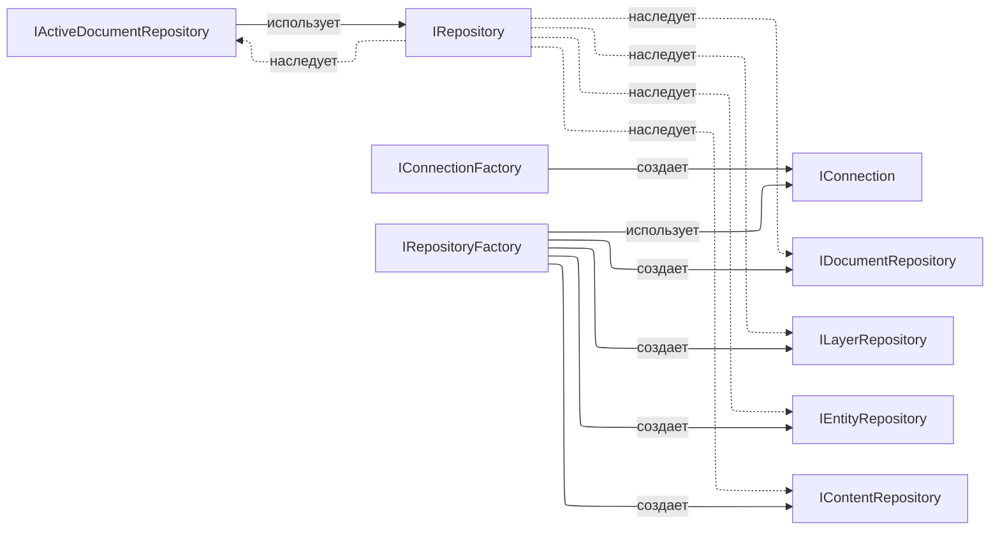
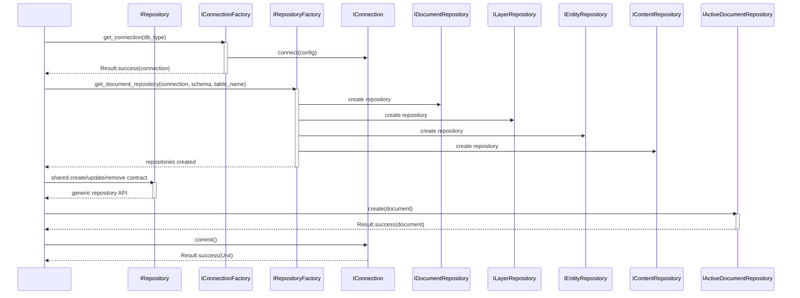
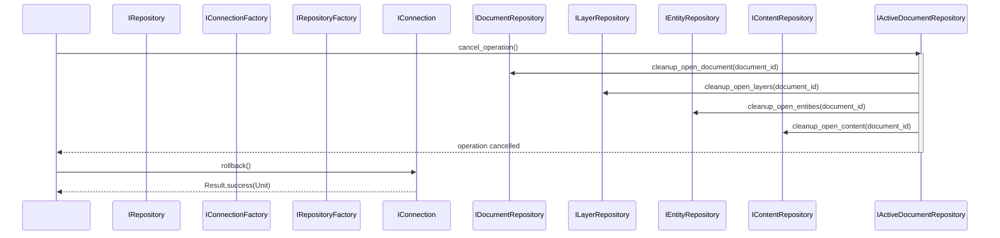
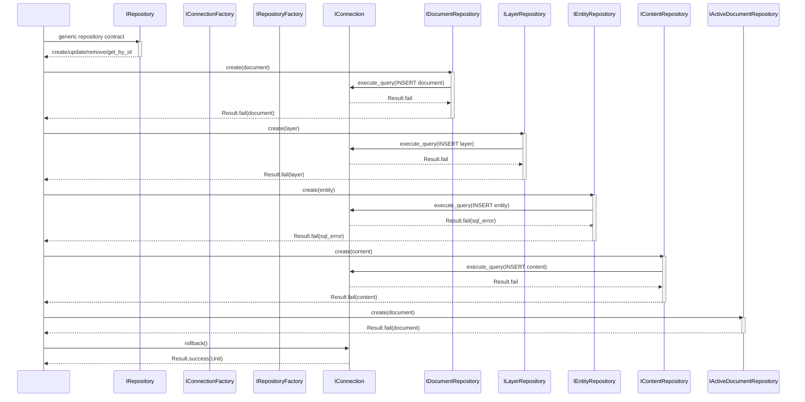
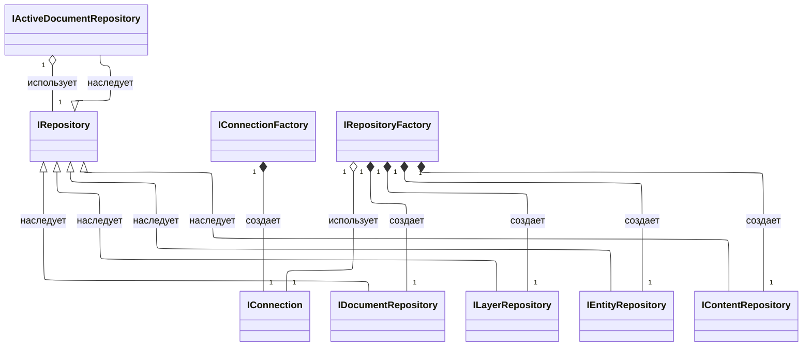

# 5.2.4. Проектирование классов пакета «repositories»

Пакет «repositories» определяет доменные контракты доступа к DXF-данным: базовый CRUD-интерфейс, репозитории документов, слоев, сущностей, содержимого, активных документов, а также фабрики подключения и создания репозиториев.

## 5.2.4.1. Исходная диаграмма классов

Исходная диаграмма содержит только классы пакета `domain/repositories`. Параметры классов не отображаются.

### Таблица 1. Описание классов пакета «repositories»

| Класс | Описание |
|---|---|
| IRepository | Базовый CRUD-контракт для всех репозиториев. |
| IConnection | Контракт управления подключением к БД. |
| IConnectionFactory | Контракт фабрики соединений. |
| IRepositoryFactory | Контракт фабрики репозиториев. |
| IDocumentRepository | Контракт доступа к документам DXF. |
| ILayerRepository | Контракт доступа к слоям DXF. |
| IEntityRepository | Контракт доступа к сущностям DXF. |
| IContentRepository | Контракт доступа к бинарному содержимому DXF. |
| IActiveDocumentRepository | Контракт доступа к активным документам в памяти. |

## 5.2.4.2. Диаграммы последовательностей взаимодействия объектов классов

На диаграммах показано взаимодействие всех классов пакета. Внешние сущности не используются.

## 5.2.4.3. Уточненная диаграмма классов

Уточненная диаграмма показывает типы связей внутри пакета.

## 5.2.4.4. Детальная диаграмма классов

```mermaid
---
config:
    layout: elk
---
classDiagram
    class IRepository {
        +create(entity: T) Result~T~
        +update(entity: T) Result~T~
        +remove(id: UUID) Result~Unit~
        +get_by_id(id: UUID) Result~Optional~T~~
    }

    class IConnection {
        +db_type str
        +is_connected bool
        +connect(config: ConnectionConfig) Result~Unit~
        +close() Result~Unit~
        +commit() Result~Unit~
        +rollback() Result~Unit~
        +get_schemas() Result~list~str~~
        +schema_exists(schema_name: str) Result~bool~
        +create_schema(schema_name: str) Result~Unit~
        +drop_schema(schema_name: str, cascade: bool) Result~Unit~
        +get_tables(schema_name: str) Result~list~str~~
    }

    class IConnectionFactory {
        +register_connection(connection_class: Type~IConnection~) Result~Unit~
        +get_supported_databases() list~str~
        +get_connection(cls, db_type: str) Result~IConnection~
    }

    class IRepositoryFactory {
        +get_document_repository(connection: IConnection, schema: str, table_name: str) Result~IDocumentRepository~
        +get_content_repository(connection: IConnection, schema: str, table_name: str) Result~IContentRepository~
        +get_layer_repository(connection: IConnection, schema: str, table_name: str) Result~ILayerRepository~
        +get_entity_repository(connection: IConnection, schema: str, table_name: str) Result~IEntityRepository~
    }

    class IDocumentRepository {
        +create(entity: DXFDocument) Result~DXFDocument~
        +update(entity: DXFDocument) Result~DXFDocument~
        +remove(id: UUID) Result~Unit~
        +get_by_id(id: UUID) Result~DXFDocument | None~
        +get_by_filename(filename: str) Result~DXFDocument | None~
        +get_all() Result~list~DXFDocument~~
        +count() Result~int~
        +exists(filename: str) Result~bool~
    }

    class ILayerRepository {
        +create(entity: DXFLayer) Result~DXFLayer~
        +update(entity: DXFLayer) Result~DXFLayer~
        +remove(id: UUID) Result~Unit~
        +get_by_id(id: UUID) Result~DXFLayer | None~
        +get_by_document_id_and_layer_name(document_id: UUID, layer_name: str) Result~DXFLayer | None~
        +get_all_by_document_id(document_id: UUID) Result~list~DXFLayer~~
        +get_all() Result~list~DXFLayer~~
    }

    class IEntityRepository {
        +create(entity: DXFEntity) Result~DXFEntity~
        +update(entity: DXFEntity) Result~DXFEntity~
        +remove(id: UUID) Result~Unit~
        +get_by_id(id: UUID) Result~DXFEntity | None~
        +get_by_name_and_type(name: str, type: DxfEntityType) Result~DXFEntity | None~
        +get_all() list~DXFEntity~
    }

    class IContentRepository {
        +create(entity: DXFContent) Result~DXFContent~
        +update(entity: DXFContent) Result~DXFContent~
        +remove(id: UUID) Result~Unit~
        +get_by_id(id: UUID) Result~DXFContent | None~
        +get_by_document_id(document_id: UUID) Result~DXFContent | None~
    }

    class IActiveDocumentRepository {
        +create(entity: DXFDocument) Result~DXFDocument~
        +update(entity: DXFDocument) Result~DXFDocument~
        +remove(id: UUID) Result~Unit~
        +get_by_id(id: UUID) Result~DXFDocument | None~
        +get_by_filename(filename: str) Result~DXFDocument | None~
        +get_all() Result~list~DXFDocument~~
        +count() Result~int~
    }

    IRepository <|-- IDocumentRepository : наследует
    IRepository <|-- ILayerRepository : наследует
    IRepository <|-- IEntityRepository : наследует
    IRepository <|-- IContentRepository : наследует
    IRepository <|-- IActiveDocumentRepository : наследует

    IConnectionFactory "1" *-- "1" IConnection : создает
    IRepositoryFactory "1" o-- "1" IConnection : использует
    IRepositoryFactory "1" *-- "1" IDocumentRepository : создает
    IRepositoryFactory "1" *-- "1" ILayerRepository : создает
    IRepositoryFactory "1" *-- "1" IEntityRepository : создает
    IRepositoryFactory "1" *-- "1" IContentRepository : создает
    IActiveDocumentRepository "1" o-- "1" IRepository : использует
```

## 5.2.4.5. Таблицы полей и методов

Детальная диаграмма включает методы всех интерфейсов пакета `repositories`.

### Интерфейс IRepository

#### Описание методов интерфейса

| Название | Параметры | Возвращает | Описание |
|---|---|---|---|
| create | `entity: T` | `Result[T]` | Создает сущность |
| update | `entity: T` | `Result[T]` | Обновляет сущность |
| remove | `id: UUID` | `Result[Unit]` | Удаляет сущность |
| get_by_id | `id: UUID` | `Result[Optional[T]]` | Получает сущность по идентификатору |

### Интерфейс IConnection

#### Описание методов интерфейса

| Название | Параметры | Возвращает | Описание |
|---|---|---|---|
| db_type | - | `str` | Возвращает тип БД |
| is_connected | - | `bool` | Проверяет активность соединения |
| connect | `config: ConnectionConfig` | `Result[Unit]` | Устанавливает соединение |
| close | - | `Result[Unit]` | Закрывает соединение |
| commit | - | `Result[Unit]` | Подтверждает транзакцию |
| rollback | - | `Result[Unit]` | Откатывает транзакцию |
| get_schemas | - | `Result[list[str]]` | Возвращает список схем |
| schema_exists | `schema_name: str` | `Result[bool]` | Проверяет существование схемы |
| create_schema | `schema_name: str` | `Result[Unit]` | Создает схему |
| drop_schema | `schema_name: str`, `cascade: bool = False` | `Result[Unit]` | Удаляет схему |
| get_tables | `schema_name: str` | `Result[list[str]]` | Возвращает список таблиц в схеме |

### Интерфейс IConnectionFactory

#### Описание методов интерфейса

| Название | Параметры | Возвращает | Описание |
|---|---|---|---|
| register_connection | `connection_class: Type[IConnection]` | `Result[Unit]` | Регистрирует класс соединения |
| get_supported_databases | - | `list[str]` | Возвращает список поддерживаемых БД |
| get_connection | `cls, db_type: str` | `Result[IConnection]` | Создает соединение по типу БД |

### Интерфейс IRepositoryFactory

#### Описание методов интерфейса

| Название | Параметры | Возвращает | Описание |
|---|---|---|---|
| get_document_repository | `connection: IConnection`, `schema: str = "file_schema"`, `table_name: str = "files"` | `Result[IDocumentRepository]` | Создает репозиторий документов |
| get_content_repository | `connection: IConnection`, `schema: str = "file_schema"`, `table_name: str = "content"` | `Result[IContentRepository]` | Создает репозиторий контента |
| get_layer_repository | `connection: IConnection`, `schema: str = "file_schema"`, `table_name: str = "layers"` | `Result[ILayerRepository]` | Создает репозиторий слоев |
| get_entity_repository | `connection: IConnection`, `schema: str = "layer_schema"`, `table_name: str = "layer_name"` | `Result[IEntityRepository]` | Создает репозиторий сущностей |

### Интерфейс IDocumentRepository

#### Описание методов интерфейса

| Название | Параметры | Возвращает | Описание |
|---|---|---|---|
| create | `entity: DXFDocument` | `Result[DXFDocument]` | Сохраняет документ |
| update | `entity: DXFDocument` | `Result[DXFDocument]` | Обновляет документ |
| remove | `id: UUID` | `Result[Unit]` | Удаляет документ |
| get_by_id | `id: UUID` | `Result[DXFDocument \| None]` | Получает документ по идентификатору |
| get_by_filename | `filename: str` | `Result[DXFDocument \| None]` | Получает документ по имени файла |
| get_all | - | `Result[list[DXFDocument]]` | Возвращает все документы |
| count | - | `Result[int]` | Возвращает количество документов |
| exists | `filename: str` | `Result[bool]` | Проверяет наличие документа |

### Интерфейс ILayerRepository

#### Описание методов интерфейса

| Название | Параметры | Возвращает | Описание |
|---|---|---|---|
| create | `entity: DXFLayer` | `Result[DXFLayer]` | Сохраняет слой |
| update | `entity: DXFLayer` | `Result[DXFLayer]` | Обновляет слой |
| remove | `id: UUID` | `Result[Unit]` | Удаляет слой |
| get_by_id | `id: UUID` | `Result[DXFLayer \| None]` | Получает слой по идентификатору |
| get_by_document_id_and_layer_name | `document_id: UUID`, `layer_name: str` | `Result[DXFLayer \| None]` | Получает слой по документу и имени |
| get_all_by_document_id | `document_id: UUID` | `Result[list[DXFLayer]]` | Возвращает слои документа |
| get_all | - | `Result[list[DXFLayer]]` | Возвращает все слои |

### Интерфейс IEntityRepository

#### Описание методов интерфейса

| Название | Параметры | Возвращает | Описание |
|---|---|---|---|
| create | `entity: DXFEntity` | `Result[DXFEntity]` | Сохраняет сущность |
| update | `entity: DXFEntity` | `Result[DXFEntity]` | Обновляет сущность |
| remove | `id: UUID` | `Result[Unit]` | Удаляет сущность |
| get_by_id | `id: UUID` | `Result[DXFEntity \| None]` | Получает сущность по идентификатору |
| get_by_name_and_type | `name: str`, `type: DxfEntityType` | `Result[DXFEntity \| None]` | Получает сущность по имени и типу |
| get_all | - | `list[DXFEntity]` | Возвращает все сущности |

### Интерфейс IContentRepository

#### Описание методов интерфейса

| Название | Параметры | Возвращает | Описание |
|---|---|---|---|
| create | `entity: DXFContent` | `Result[DXFContent]` | Сохраняет содержимое |
| update | `entity: DXFContent` | `Result[DXFContent]` | Обновляет содержимое |
| remove | `id: UUID` | `Result[Unit]` | Удаляет содержимое |
| get_by_id | `id: UUID` | `Result[DXFContent \| None]` | Получает содержимое по идентификатору |
| get_by_document_id | `document_id: UUID` | `Result[DXFContent \| None]` | Получает содержимое по документу |

### Интерфейс IActiveDocumentRepository

#### Описание методов интерфейса

| Название | Параметры | Возвращает | Описание |
|---|---|---|---|
| create | `entity: DXFDocument` | `Result[DXFDocument]` | Добавляет активный документ |
| update | `entity: DXFDocument` | `Result[DXFDocument]` | Обновляет активный документ |
| remove | `id: UUID` | `Result[Unit]` | Удаляет активный документ |
| get_by_id | `id: UUID` | `Result[DXFDocument \| None]` | Получает активный документ по идентификатору |
| get_by_filename | `filename: str` | `Result[DXFDocument \| None]` | Получает активный документ по имени файла |
| get_all | - | `Result[list[DXFDocument]]` | Возвращает все активные документы |
| count | - | `Result[int]` | Возвращает количество активных документов |
