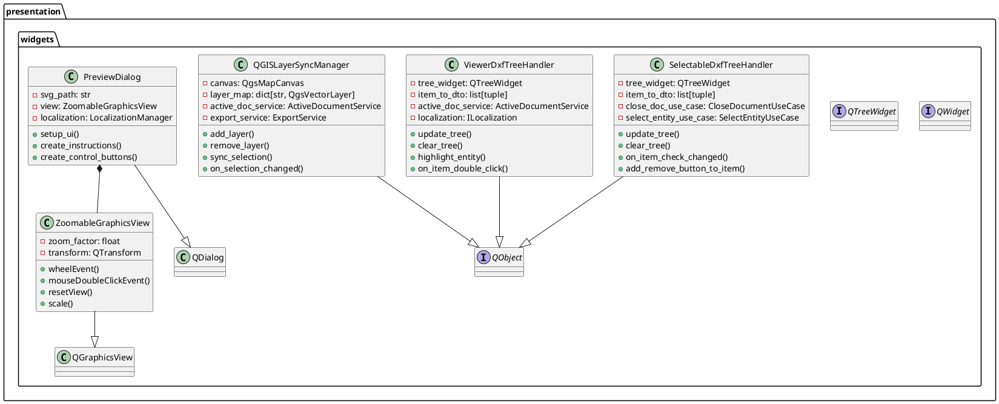
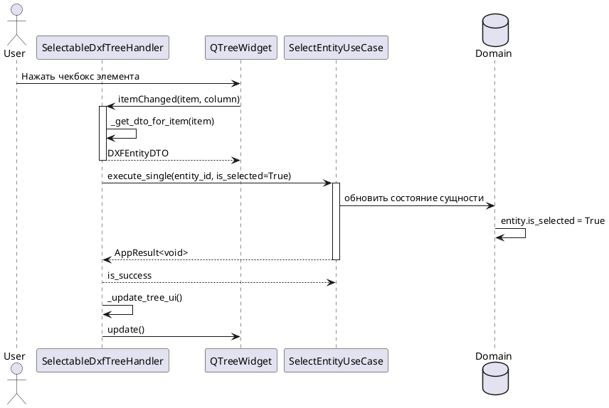
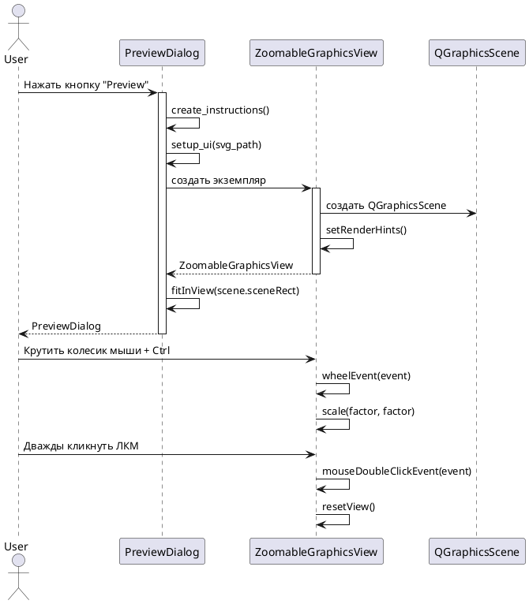
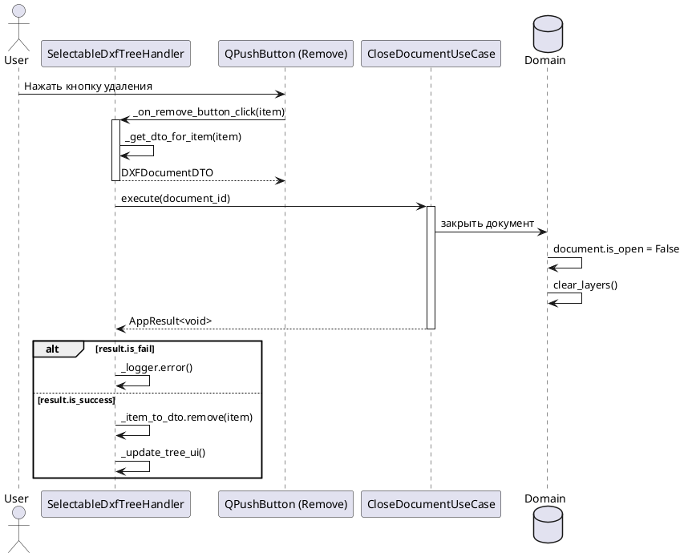
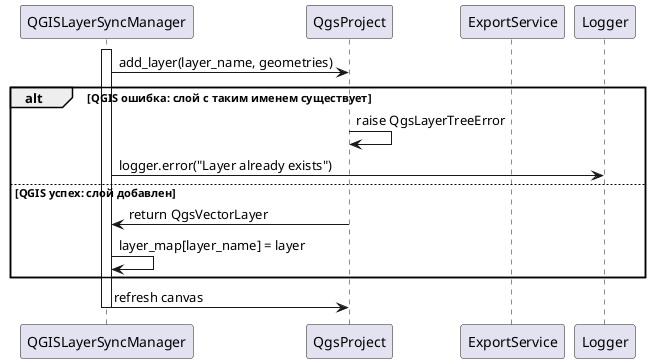
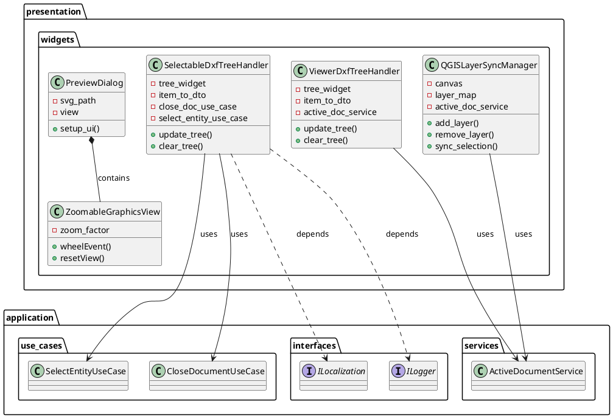
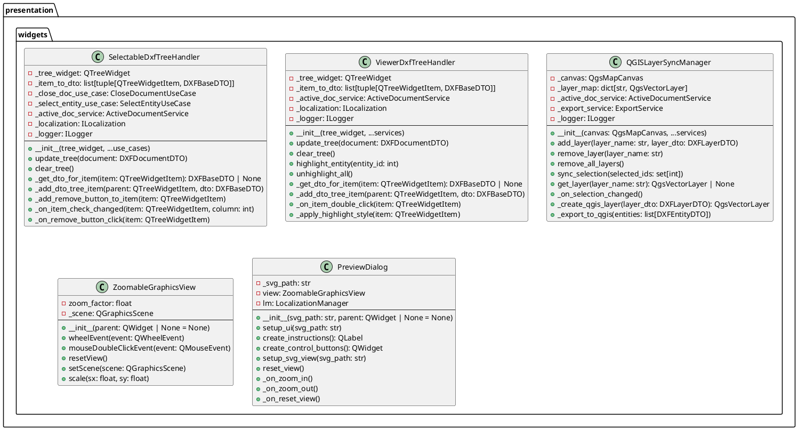

# Проектирование пакета widgets

**Пакет**: `presentation/widgets`

**Назначение**: UI компоненты для представления и взаимодействия с DXF структурами, включая виджеты дерева, синхронизацию слоев QGIS и компоненты предпросмотра.

**Расположение**: `src/presentation/widgets/`

---

## 1. Исходная диаграмма классов (внутренние отношения)

---

## 2. Таблица описания классов

| Класс | Назначение | Тип |
|-------|-----------|-----|
| **SelectableDxfTreeHandler** | Обработчик дерева DXF с поддержкой выбора сущностей и ленивую загрузков | Handler |
| **ViewerDxfTreeHandler** | Обработчик дерева DXF в режиме просмотра с подсветкой выбранных элементов | Handler |
| **QGISLayerSyncManager** | Менеджер синхронизации слоев между DXF структурой и QGIS canvas | Manager |
| **ZoomableGraphicsView** | Qt Graphics View с поддержкой масштабирования и навигации | Component |
| **PreviewDialog** | Диалог с предпросмотром SVG файлов в масштабируемом представлении | Dialog |

---

## 3. Диаграммы последовательности

### 3.1 Нормальный ход: Выбор сущности в дереве

### 3.2 Альтернативный нормальный ход: Открытие предпросмотра

### 3.3 Сценарий прерывания пользователем: Закрытие документа

### 3.4 Сценарий системного прерывания: Ошибка синхронизации слоев

---

## 4. Уточненная диаграмма классов (с типами связей)

---

## 5. Детальная диаграмма классов (со всеми полями и методами)

---

## 6. Таблицы описания полей и методов

### 6.1 SelectableDxfTreeHandler

#### Поля

| Название | Тип | Модификатор | Описание |
|----------|-----|-------------|---------|
| `_tree_widget` | QTreeWidget | private | виджет дерева для отображения структуры DXF |
| `_item_to_dto` | list[tuple] | private | отображение элементов дерева на DTO сущностей |
| `_close_doc_use_case` | CloseDocumentUseCase | private | use case для закрытия документов |
| `_select_entity_use_case` | SelectEntityUseCase | private | use case для выбора сущностей |
| `_active_doc_service` | ActiveDocumentService | private | сервис активного документа |
| `_localization` | ILocalization | private | локализация интерфейса |
| `_logger` | ILogger | private | логирование ошибок и событий |

#### Методы

| Название | Параметры | Возвращает | Описание |
|----------|-----------|-----------|---------|
| `__init__()` | tree_widget, use_cases, services | void | инициализирует обработчик дерева |
| `update_tree()` | document: DXFDocumentDTO | void | обновляет дерево с новыми данными |
| `clear_tree()` | - | void | очищает дерево от всех элементов |
| `_get_dto_for_item()` | item: QTreeWidgetItem | DXFBaseDTO \| None | находит DTO для элемента |
| `_add_dto_tree_item()` | parent: QTreeWidgetItem, dto: DXFBaseDTO | void | добавляет элемент в дерево |
| `_add_remove_button_to_item()` | item: QTreeWidgetItem | void | добавляет кнопку удаления |
| `_on_item_check_changed()` | item, column | void | обработчик изменения чекбокса |
| `_on_remove_button_click()` | item: QTreeWidgetItem | void | обработчик нажатия кнопки удаления |

### 6.2 ViewerDxfTreeHandler

#### Поля

| Название | Тип | Модификатор | Описание |
|----------|-----|-------------|---------|
| `_tree_widget` | QTreeWidget | private | виджет дерева для отображения |
| `_item_to_dto` | list[tuple] | private | сопоставление элементов и DTO |
| `_active_doc_service` | ActiveDocumentService | private | сервис активного документа |
| `_localization` | ILocalization | private | локализация |
| `_logger` | ILogger | private | логирование |
| `_highlighted_item` | QTreeWidgetItem \| None | private | текущий выделенный элемент |

#### Методы

| Название | Параметры | Возвращает | Описание |
|----------|-----------|-----------|---------|
| `__init__()` | tree_widget, services | void | инициализирует в режиме просмотра |
| `update_tree()` | document: DXFDocumentDTO | void | обновляет дерево |
| `clear_tree()` | - | void | очищает дерево |
| `highlight_entity()` | entity_id: int | void | выделяет сущность в дереве |
| `unhighlight_all()` | - | void | убирает подсветку со всех |
| `_on_item_double_click()` | item: QTreeWidgetItem | void | двойной клик по элементу |
| `_apply_highlight_style()` | item: QTreeWidgetItem | void | применяет стиль подсветки |

### 6.3 QGISLayerSyncManager

#### Поля

| Название | Тип | Модификатор | Описание |
|----------|-----|-------------|---------|
| `_canvas` | QgsMapCanvas | private | canvas для отображения слоев QGIS |
| `_layer_map` | dict[str, QgsVectorLayer] | private | слои по имени слоя |
| `_active_doc_service` | ActiveDocumentService | private | сервис активного документа |
| `_export_service` | ExportService | private | экспорт в QGIS |
| `_logger` | ILogger | private | логирование |

#### Методы

| Название | Параметры | Возвращает | Описание |
|----------|-----------|-----------|---------|
| `__init__()` | canvas, services | void | инициализирует менеджер синхронизации |
| `add_layer()` | layer_name, layer_dto | void | добавляет слой в QGIS |
| `remove_layer()` | layer_name: str | void | удаляет слой из QGIS |
| `remove_all_layers()` | - | void | удаляет все слои синхронизации |
| `sync_selection()` | selected_ids: set \| None | void | синхронизирует выбранные сущности |
| `get_layer()` | layer_name: str | QgsVectorLayer \| None | получает слой по имени |
| `_on_selection_changed()` | - | void | обработчик изменения выбора |
| `_create_qgis_layer()` | layer_dto | QgsVectorLayer | создает слой QGIS |

### 6.4 ZoomableGraphicsView

#### Поля

| Название | Тип | Модификатор | Описание |
|----------|-----|-------------|---------|
| `zoom_factor` | float | public | множитель масштабирования при скролле |
| `_scene` | QGraphicsScene | private | сцена для отражения содержимого |

#### Методы

| Название | Параметры | Возвращает | Описание |
|----------|-----------|-----------|---------|
| `__init__()` | parent: QWidget \| None | void | инициализирует представление |
| `wheelEvent()` | event: QWheelEvent | void | обрабатывает скролл для масштабирования |
| `mouseDoubleClickEvent()` | event: QMouseEvent | void | двойной клик сбрасывает вид |
| `resetView()` | - | void | сбрасывает масштаб и позицию |
| `setScene()` | scene: QGraphicsScene | void | устанавливает сцену |
| `scale()` | sx, sy: float | void | масштабирует содержимое |

### 6.5 PreviewDialog

#### Поля

| Название | Тип | Модификатор | Описание |
|----------|-----|-------------|---------|
| `_svg_path` | str | private | путь к SVG файлу |
| `view` | ZoomableGraphicsView | public | масштабируемое представление |
| `lm` | LocalizationManager | private | менеджер локализации |

#### Методы

| Название | Параметры | Возвращает | Описание |
|----------|-----------|-----------|---------|
| `__init__()` | svg_path, parent | void | инициализирует диалог предпросмотра |
| `setup_ui()` | svg_path: str | void | настраивает пользовательский интерфейс |
| `create_instructions()` | - | QLabel | создает метку с инструкциями |
| `create_control_buttons()` | - | QWidget | создает панель кнопок управления |
| `setup_svg_view()` | svg_path: str | void | загружает и отображает SVG |
| `reset_view()` | - | void | сбрасывает вид в исходное состояние |
| `_on_zoom_in()` | - | void | увеличить масштаб |
| `_on_zoom_out()` | - | void | уменьшить масштаб |
| `_on_reset_view()` | - | void | сбросить вид |

---

## 7. Взаимодействие с другими пакетами

### Входящие зависимости (другие пакеты используют widgets)

- **presentation/dialogs** → SelectableDxfTreeHandler, ViewerDxfTreeHandler
  - Диалоги используют обработчики дерева для отображения структур

- **presentation/services** (если есть) → QGISLayerSyncManager, PreviewDialog
  - Сервисы управляют синхронизацией слоев

### Исходящие зависимости (widgets использует)

- **application/use_cases** (SelectEntityUseCase, CloseDocumentUseCase)
  - Обработчики дерева делегируют бизнес-логику
  
- **application/services** (ActiveDocumentService)
  - Получение текущего документа и его состояния
  
- **application/interfaces** (ILocalization, ILogger)
  - Локализация текстов и логирование

- **application/dtos** (DXFDocumentDTO, DXFLayerDTO, DXFEntityDTO)
  - Работа со структурированными данными

- **infrastructure/qgis** (QgsMapCanvas, QgsVectorLayer)
  - QGIS интеграция для отображения и синхронизации

---

## 8. Правила и ограничения пакета

### Архитектурные правила

1. **Слой**: widgets представляет **Presentation Layer** на архитектурной диаграмме
2. **Зависимости**: только ВНИЗ (к Application и Domain слоям)
3. **Инъекция**: использует `@inject.autoparams()` для внедрения зависимостей
4. **Интерфейсы**: работает через интерфейсы (ILocalization, ILogger, ISettings)

### Паттерны проектирования

- **Handler Pattern**: SelectableDxfTreeHandler, ViewerDxfTreeHandler
  - инкапсулируют логику работы с QTreeWidget
  
- **Manager Pattern**: QGISLayerSyncManager
  - управляет состоянием слоев и синхронизацией
  
- **Component Pattern**: ZoomableGraphicsView, PreviewDialog
  - переиспользуемые UI компоненты

### Правила кодирования

1. Все сигналы/слоты PyQt5 документированы
2. Обработке ошибок - логирование через ILogger
3. Локализация - через ILocalization.tr()
4. Тред-безопасность: SelectableDxfTreeHandler использует QSignalBlocker
5. Ленивая загрузка элементов дерева при большом объеме данных

---

## 9. Состояние проектирования

✅ **Завершено**: все классы описаны, диаграммы созданы, методы задокументированы.

**Готово к использованию в диплому**: полная документация архитектуры виджетов и их взаимодействия с бизнес-логикой приложения.
