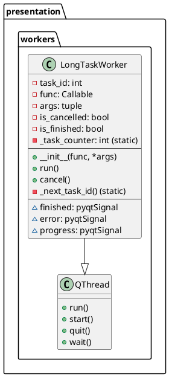
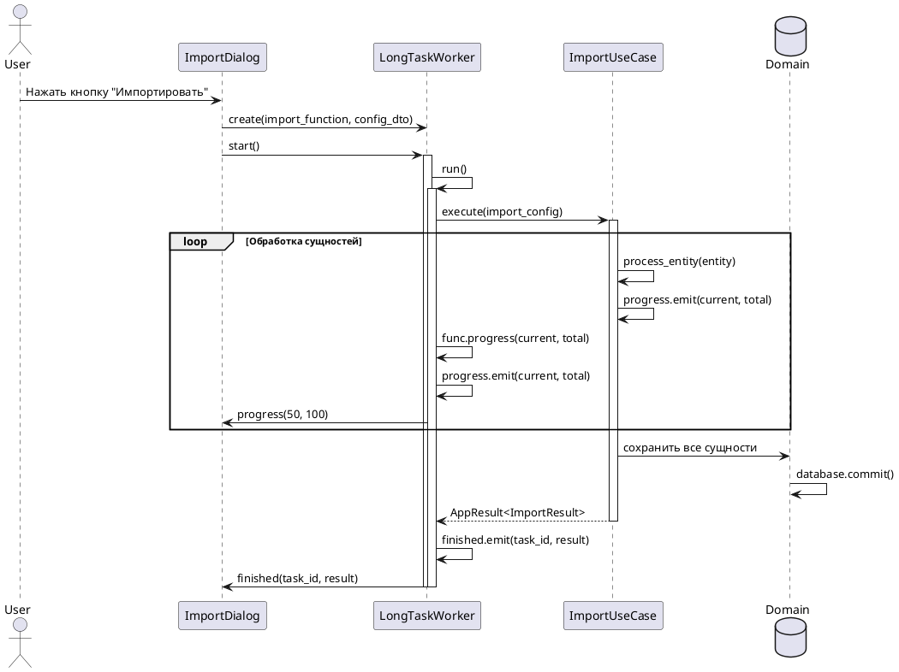
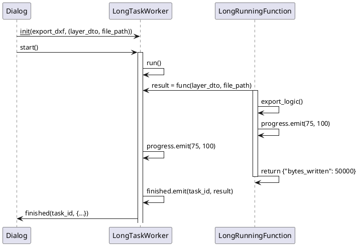
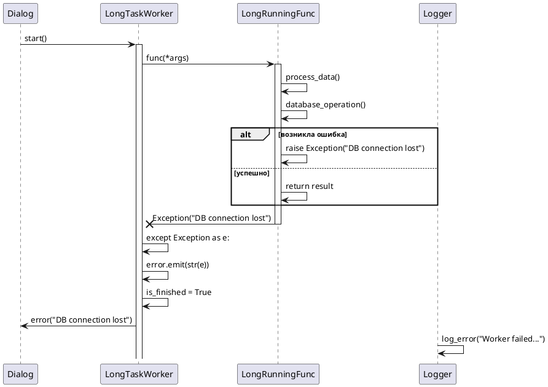
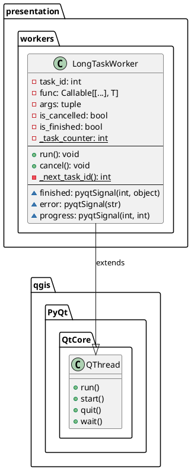
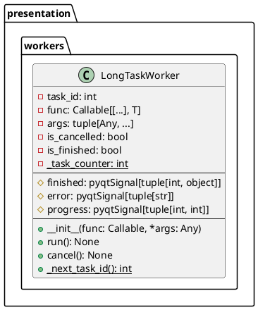

# Проектирование пакета workers

**Пакет**: `presentation/workers`

**Назначение**: Фоновые потоки (workers) для выполнения длительных операций без блокировки пользовательского интерфейса. Использует архитектуру QThread для асинхронного выполнения задач.

**Расположение**: `src/presentation/workers/`

---

## 1. Исходная диаграмма классов (внутренние отношения)



---

## 2. Таблица описания классов

| Класс | Назначение | Тип |
|-------|-----------|-----|
| **LongTaskWorker** | Рабочий поток для выполнения длительных операций с поддержкой отмены, прогресса и обработки ошибок | Worker Thread |

---

## 3. Диаграммы последовательности

### 3.1 Нормальный ход: Выполнение задачи импорта с прогрессом



### 3.2 Альтернативный нормальный ход: Успешное выполнение с return значением



### 3.3 Сценарий прерывания пользователем: Отмена задачи

```plantuml
@startuml workers_user_interruption

actor User
participant "Dialog" as Dialog
participant "CancelButton" as Button
participant "LongTaskWorker" as Worker
participant "LongRunningFunc" as Func

Dialog -> Worker: start()
activate Worker

Worker -> Func: func() [выполняется длительная операция]
activate Func

User -> Button: Нажать "Отмена"
Button -> Worker: cancel()
Worker -> Worker: is_cancelled = True

loop检查отмены в функции
    Func -> Func: if worker.is_cancelled: break
    Func -> Func: process_next_batch()
end

Func -> Func: return прерванный результат
deactivate Func

alt is_cancelled проверена
    Worker -> Worker: if not is_cancelled: finished.emit()
else отмена прошла
    Worker -> Worker: [signal не отправляется]
end

Dialog -> Dialog: on_cancel_pressed()
deactivate Worker

@enduml
```

### 3.4 Сценарий системного прерывания: Исключение в функции



---

## 4. Уточненная диаграмма классов (с типами связей)



---

## 5. Детальная диаграмма классов (со всеми полями и методами)



---

## 6. Таблицы описания полей и методов

### 6.1 LongTaskWorker

#### Поля

| Название | Тип | Модификатор | Описание |
|----------|-----|-------------|---------|
| `task_id` | int | public | уникальный идентификатор задачи |
| `func` | Callable | private | функция для выполнения в отдельном потоке |
| `args` | tuple | private | аргументы для передачи функции |
| `is_cancelled` | bool | public | флаг отмены задачи пользователем |
| `is_finished` | bool | public | флаг завершения выполнения |
| `_task_counter` | int (static) | private | счетчик для генерации уникальных ID |

#### Сигналы (PyQt)

| Сигнал | Параметры | Описание |
|--------|-----------|---------|
| `finished` | task_id: int, result: object | испускается при успешном завершении |
| `error` | message: str | испускается при возникновении исключения |
| `progress` | current: int, total: int | испускается для обновления прогресса |

#### Методы

| Название | Параметры | Возвращает | Описание |
|----------|-----------|-----------|---------|
| `__init__()` | func: Callable, *args | void | инициализирует worker с функцией и аргументами |
| `run()` | - | void | вход в рабочий поток (переопределяет QThread.run) |
| `cancel()` | - | void | устанавливает флаг отмены (не прядильное) |
| `_next_task_id()` | - | int (static) | возвращает следующий уникальный ID задачи |

---

## 7. Подробное описание работы

### 7.1 Жизненный цикл LongTaskWorker

```
1. Создание (Construction)
   └> LongTaskWorker(func, arg1, arg2, ...)
      ├> task_id = _next_task_id()
      ├> self.func = func
      ├> self.args = (arg1, arg2, ...)
      ├> is_cancelled = False
      └> is_finished = False

2. Запуск (Startup)
   └> worker.start() [вызывает QThread.start()]
      └> Запускается новый OS поток
         └> QThread вызывает run()

3. Выполнение (Execution)
   └> run()
      ├> Проверка: hasattr(func, 'progress')
      ├>   if да: func.progress = progress.emit
      ├>   if нет: func выполняется как обычно
      ├> result = func(*args)
      ├> Проверка: not is_cancelled
      └> finished.emit(task_id, result)

4. Отмена (Cancellation) - вариант
   └> cancel() вызывается из главного потока
      └> is_cancelled = True
      └> [функция должна проверять is_cancelled]

5. Обработка ошибок (Error Handling)
   └> try-except в run()
      ├> except Exception as e:
      ├>   error.emit(str(e))
      └> is_finished = True

6. Завершение (Completion)
   └> is_finished = True
      └> OS поток завершает выполнение
```

### 7.2 Взаимодействие с функциями приложения

#### Функция БЕЗ поддержки прогресса

```python
def import_dxf_simple(config: ImportConfigDTO) -> dict:
    # Выполняет импорт без обновления прогресса
    entities = parse_dxf(config.file_path)
    import_result = save_entities(entities)
    return {"count": len(entities)}

worker = LongTaskWorker(import_dxf_simple, config_dto)
worker.finished.connect(lambda id, result: print(f"Готово: {result}"))
worker.start()
```

#### Функция С поддержкой прогресса

```python
def import_dxf_with_progress(config: ImportConfigDTO) -> dict:
    # Выполняет импорт с обновлением прогресса
    entities = parse_dxf(config.file_path)
    
    for i, entity in enumerate(entities):
        save_entity(entity)
        # Отправляет прогресс через progress сигнал
        if hasattr(import_dxf_with_progress, 'progress'):
            import_dxf_with_progress.progress(i, len(entities))
    
    return {"count": len(entities)}

worker = LongTaskWorker(import_dxf_with_progress, config_dto)
worker.progress.connect(lambda cur, tot: progress_bar.setValue(cur))
worker.finished.connect(lambda id, result: on_import_done(result))
worker.start()
```

---

## 8. Взаимодействие с другими пакетами

### Входящие зависимости (другие пакеты используют workers)

- **presentation/dialogs**
  - ConverterDialog, ImportDialog, ExportDialog используют LongTaskWorker
  - для выполнения длительных операций (импорт, экспорт, обработка)

- **presentation/services** (если есть)
  - может использовать LongTaskWorker для фоновых синхронизаций

### Исходящие зависимости (workers использует)

- **qgis.PyQt.QtCore**
  - наследует от QThread
  - использует pyqtSignal для сигналов

- **Python standard library**
  - встроенные Callable, Any, None типы
  - встроенный Exception для обработки ошибок

---

## 9. Правила проектирования и ограничения

### Архитектурные правила

1. **Слой**: workers представляет **Presentation Layer** (поддерживающая инфраструктура)
2. **Парадигма**: асинхронное выполнение через OS потоки (threading)
3. **Сигналы**: использует методологию сигналов/слотов PyQt5
4. **Инъекция**: не использует внедрение зависимостей (pure threading)

### Паттерны проектирования

- **Worker Pattern**: LongTaskWorker
  - инкапсулирует выполнение функции в отдельном потоке
  
- **Observer Pattern** (через PyQt сигналы)
  - finished, error, progress - наблюдаемые события

- **Factory Pattern** (статический)
  - `_next_task_id()` - генерирует уникальные ID

### Правила кодирования и безопасности

1. **Генерация ID**: каждому worker присваивается уникальный task_id
2. **Отмена**: `is_cancelled` флаг проверяется ВНУТРИ функции
3. **Прогресс**: функция должна иметь атрибут `progress` для отправки сигналов
4. **Обработка ошибок**: все исключения логируются через сигнал `error`
5. **Тред-безопасность**: результаты передаются через сигналы (thread-safe в PyQt)
6. **Статический счетчик**: `_task_counter` защищен private доступом

### Рекомендации по использованию

✓ **Рекомендуется** использовать для:
- Импорта/экспорта больших файлов DXF
- Пакетной обработки геометрии
- Запросов к БД долгого выполнения
- Генерации преобразований

✗ **НЕ рекомендуется** использовать для:
- Быстрых операций (< 50 мс)
- Синхронной логики с гарантией порядка
- Операций требующих блокировок

---

## 10. Состояние проектирования

✅ **Завершено**: полная документация архитектуры асинхронных рабочих потоков.

**Готово к использованию в диплому**: LongTaskWorker хорошо документирован как ключевой компонент для асинхронной обработки в presentation слое.
