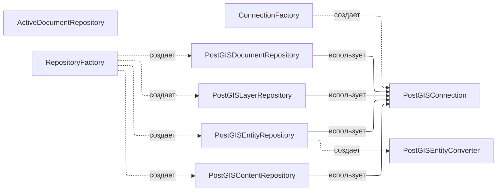
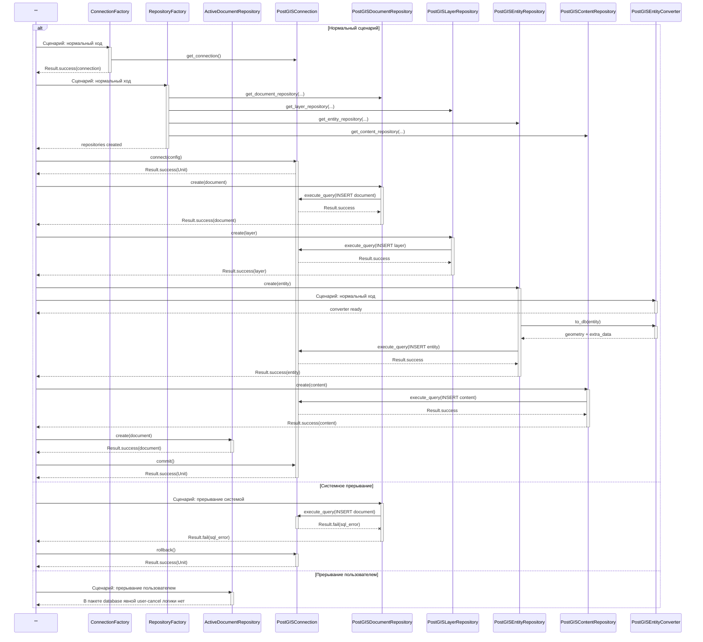
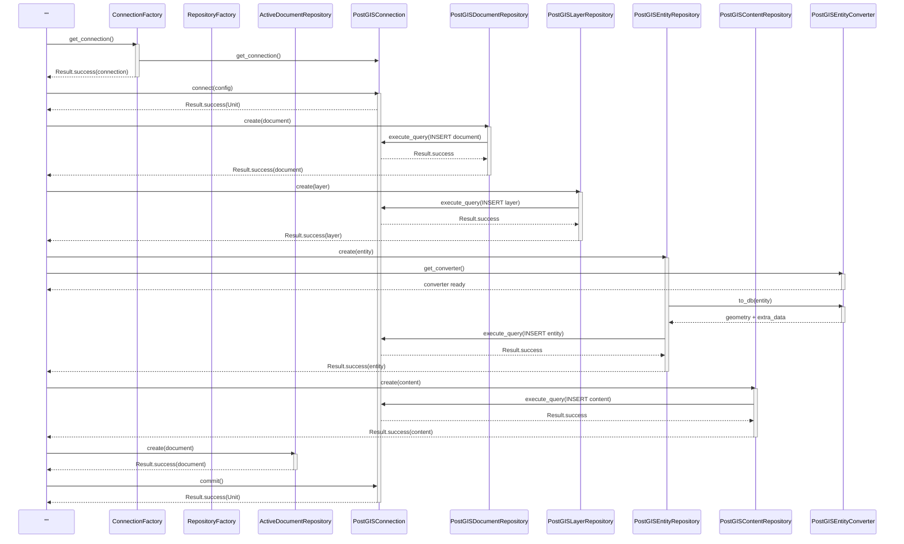
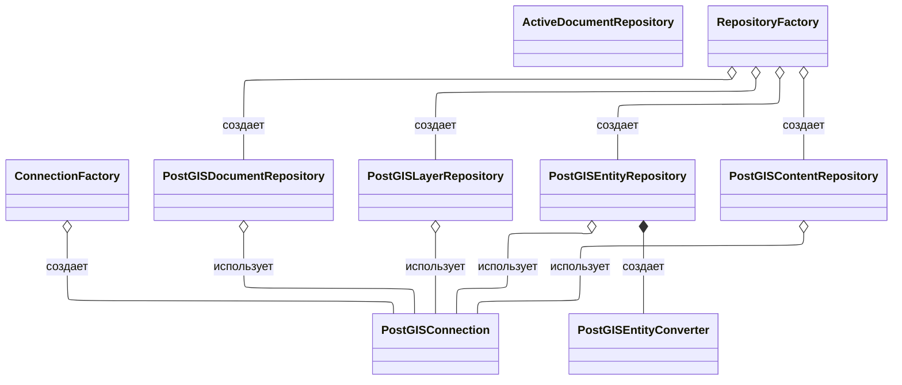
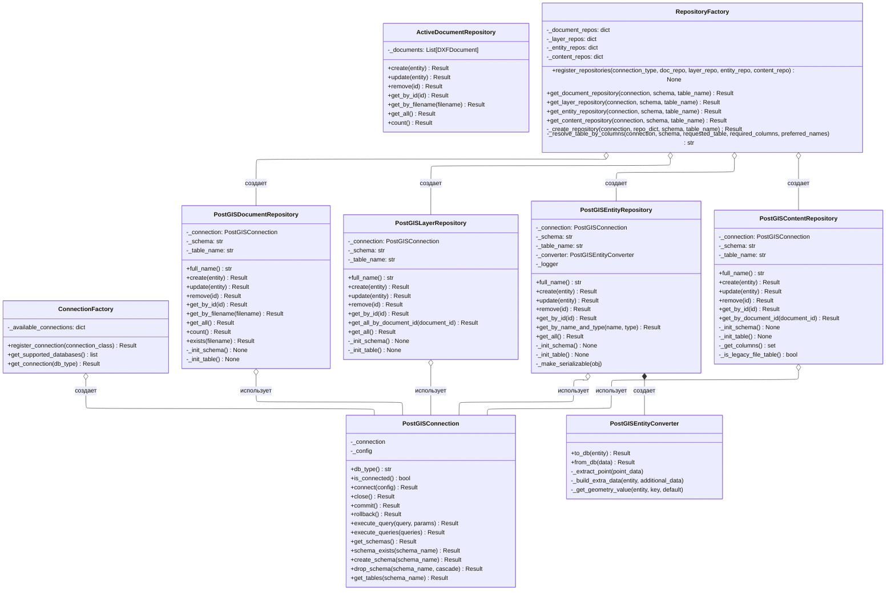

# 5.2.9. Проектирование классов пакета «database»

Пакет «database» реализует инфраструктурный слой хранения DXF-данных в PostgreSQL/PostGIS и in-memory хранилище активных документов.

## 5.2.9.1. Исходная диаграмма классов

Исходная диаграмма содержит только классы пакета `infrastructure/database` и `infrastructure/database/postgis`. Параметры классов не отображаются.

### Таблица 1. Описание классов пакета «database»

| Класс | Описание |
|---|---|
| ActiveDocumentRepository | Репозиторий активных документов в памяти |
| ConnectionFactory | Фабрика соединений с БД |
| RepositoryFactory | Фабрика инфраструктурных репозиториев |
| PostGISConnection | Подключение и SQL-операции PostgreSQL/PostGIS |
| PostGISDocumentRepository | CRUD документов DXF |
| PostGISLayerRepository | CRUD слоев DXF |
| PostGISEntityRepository | CRUD сущностей DXF в таблице слоя |
| PostGISContentRepository | CRUD бинарного контента DXF |
| PostGISEntityConverter | Конвертация DXFEntity в PostGIS-представление |

## 5.2.9.2. Диаграмма последовательностей взаимодействия объектов классов

На одной диаграмме показано взаимодействие всех классов пакета. Первый блок намеренно без названия и играет роль общего инициатора сценариев. Внешние сущности не используются.

В ветке пользовательского прерывания показано, что явная отмена на уровне класса инфраструктуры отсутствует и управляется верхними слоями.

## 5.2.9.3. Уточненная диаграмма классов

Уточненная диаграмма показывает типы связей внутри пакета (агрегация/композиция/создание).

## 5.2.9.4. Детальная диаграмма классов

Детальная диаграмма включает поля и методы только классов пакета `database`.

### Таблица 2. Ключевые поля классов пакета «database»

| Класс | Поле | Описание |
|---|---|---|
| ActiveDocumentRepository | _documents | Список открытых документов в памяти |
| ConnectionFactory | _available_connections | Реестр классов соединений по `db_type` |
| RepositoryFactory | _document_repos/_layer_repos/_entity_repos/_content_repos | Реестр реализаций репозиториев |
| PostGISConnection | _connection/_config | Нативное соединение и его конфигурация |
| PostGISEntityRepository | _converter | Объект конвертера в PostGIS формат |

### Таблица 3. Ключевые методы классов пакета «database»

| Класс | Метод | Назначение |
|---|---|---|
| ConnectionFactory | get_connection | Создание экземпляра соединения для выбранного типа БД |
| RepositoryFactory | get_*_repository | Фабричное создание нужного репозитория |
| PostGISConnection | connect/commit/rollback | Управление соединением и транзакцией |
| PostGISDocumentRepository | create/get_by_filename/get_all | Операции с документами DXF |
| PostGISLayerRepository | create/get_all_by_document_id | Операции со слоями DXF |
| PostGISEntityRepository | create/get_by_name_and_type | Операции с сущностями DXF |
| PostGISContentRepository | create/get_by_document_id | Операции с бинарным контентом DXF |
| PostGISEntityConverter | to_db | Преобразование сущности в геометрию/атрибуты БД |

## 5.2.9.5. Подробные таблицы полей и методов классов

### Класс ActiveDocumentRepository

#### Описание полей класса

| Название | Тип | Описание |
|---|---|---|
| _documents | List[DXFDocument] | Коллекция активных документов в памяти |

#### Описание методов класса

| Название | Параметры | Возвращает | Описание |
|---|---|---|---|
| __init__ | - | None | Инициализирует пустой список документов |
| create | entity: DXFDocument | Result[DXFDocument] | Добавляет документ в память |
| update | entity: DXFDocument | Result[DXFDocument] | Обновляет документ по идентификатору |
| remove | id: UUID | Result[Unit] | Удаляет документ по идентификатору |
| get_by_id | id: UUID | Result с документом или ошибкой | Возвращает документ по id |
| get_by_filename | filename: str | Result с документом или ошибкой | Возвращает документ по имени файла |
| get_all | - | Result[List[DXFDocument]] | Возвращает копию списка документов |
| count | - | Result[int] | Возвращает число активных документов |

### Класс ConnectionFactory

#### Описание полей класса

| Название | Тип | Описание |
|---|---|---|
| _available_connections | dict[str, Type[IConnection]] | Реестр поддерживаемых типов подключений |

#### Описание методов класса

| Название | Параметры | Возвращает | Описание |
|---|---|---|---|
| __init__ | connection_classes: list[Type[IConnection]] | None | Регистрирует переданные классы подключений |
| register_connection | connection_class: Type[IConnection] | Result[Unit] | Добавляет класс подключения в реестр |
| get_supported_databases | - | list[str] | Возвращает список поддерживаемых db_type |
| get_connection | db_type: str | Result[IConnection] | Создает экземпляр подключения по db_type |

### Класс RepositoryFactory

#### Описание полей класса

| Название | Тип | Описание |
|---|---|---|
| _document_repos | Dict[Type[IConnection], Type[IDocumentRepository]] | Реестр реализаций репозиториев документов |
| _layer_repos | Dict[Type[IConnection], Type[ILayerRepository]] | Реестр реализаций репозиториев слоев |
| _entity_repos | Dict[Type[IConnection], Type[IEntityRepository]] | Реестр реализаций репозиториев сущностей |
| _content_repos | Dict[Type[IConnection], Type[IContentRepository]] | Реестр реализаций репозиториев контента |

#### Описание методов класса

| Название | Параметры | Возвращает | Описание |
|---|---|---|---|
| __init__ | - | None | Инициализирует пустые реестры репозиториев |
| register_repositories | connection_type, document_repo_class, layer_repo_class, entity_repo_class, content_repo_class | None | Регистрирует классы репозиториев для типа соединения |
| _create_repository | connection, repo_dict, schema, table_name | Result[IRepository] | Унифицированное создание репозитория |
| _resolve_table_by_columns | connection, schema, requested_table, required_columns, preferred_names | str | Подбирает совместимую таблицу по обязательным колонкам |
| get_document_repository | connection, schema, table_name | Result[IDocumentRepository] | Создает репозиторий документов |
| get_layer_repository | connection, schema, table_name | Result[ILayerRepository] | Создает репозиторий слоев |
| get_entity_repository | connection, schema, table_name | Result[IEntityRepository] | Создает репозиторий сущностей |
| get_content_repository | connection, schema, table_name | Result[IContentRepository] | Создает репозиторий контента |

### Класс PostGISConnection

#### Описание полей класса

| Название | Тип | Описание |
|---|---|---|
| _connection | pg_connection или None | Нативное соединение psycopg2 |
| _config | ConnectionConfig или None | Текущая конфигурация подключения |

#### Описание методов класса

| Название | Параметры | Возвращает | Описание |
|---|---|---|---|
| __init__ | - | None | Инициализирует объект подключения |
| db_type | - | str | Возвращает тип БД |
| is_connected | - | bool | Проверяет активность соединения |
| connect | config: ConnectionConfig | Result[Unit] | Устанавливает соединение и включает PostGIS |
| close | - | Result[Unit] | Закрывает соединение |
| commit | - | Result[Unit] | Подтверждает транзакцию |
| rollback | - | Result[Unit] | Откатывает транзакцию |
| get_connection | - | pg_connection или None | Возвращает нативное соединение |
| execute_query | query: str, params: tuple | Result[list] | Выполняет SQL-запрос |
| execute_queries | queries: list[tuple[str, Any]] | Result[Unit] | Выполняет пакет запросов в транзакции |
| get_schemas | - | Result[list[str]] | Возвращает список схем |
| schema_exists | schema_name: str | Result[bool] | Проверяет существование схемы |
| create_schema | schema_name: str | Result[Unit] | Создает схему |
| drop_schema | schema_name: str, cascade: bool | Result[Unit] | Удаляет схему |
| get_tables | schema_name: str | Result[list[str]] | Возвращает таблицы схемы |
| __enter__ | - | PostGISConnection | Контекстный менеджер входа |
| __exit__ | exc_type, exc_val, exc_tb | None | Контекстный менеджер выхода |

### Класс PostGISDocumentRepository

#### Описание полей класса

| Название | Тип | Описание |
|---|---|---|
| _connection | PostGISConnection | Соединение с БД |
| _schema | str | Имя схемы |
| _table_name | str | Имя таблицы документов |

#### Описание методов класса

| Название | Параметры | Возвращает | Описание |
|---|---|---|---|
| __init__ | connection, schema, table_name | None | Инициализирует репозиторий и таблицу |
| full_name | - | str | Возвращает полное имя schema.table |
| _init_schema | - | None | Создает схему при отсутствии |
| _init_table | - | None | Создает таблицу документов |
| create | entity: DXFDocument | Result[DXFDocument] | Сохраняет документ |
| update | entity: DXFDocument | Result[DXFDocument] | Обновляет документ |
| remove | id: UUID | Result[Unit] | Удаляет документ |
| get_by_id | id: UUID | Result с документом или None | Получает документ по id |
| get_by_filename | filename: str | Result с документом или None | Получает документ по имени файла |
| get_all | - | Result[list[DXFDocument]] | Возвращает все документы |
| count | - | Result[int] | Возвращает количество документов |
| exists | filename: str | Result[bool] | Проверяет существование документа |

### Класс PostGISLayerRepository

#### Описание полей класса

| Название | Тип | Описание |
|---|---|---|
| _connection | PostGISConnection | Соединение с БД |
| _schema | str | Имя схемы |
| _table_name | str | Имя таблицы слоев |

#### Описание методов класса

| Название | Параметры | Возвращает | Описание |
|---|---|---|---|
| __init__ | connection, schema, table_name | None | Инициализирует репозиторий и таблицу |
| full_name | - | str | Возвращает полное имя schema.table |
| _init_schema | - | None | Создает схему при отсутствии |
| _init_table | - | None | Создает таблицу слоев |
| create | entity: DXFLayer | Result[DXFLayer] | Сохраняет слой |
| update | entity: DXFLayer | Result[DXFLayer] | Обновляет слой |
| remove | id: UUID | Result[Unit] | Удаляет слой |
| get_by_id | id: UUID | Result с объектом или ошибкой | Получает слой по id |
| get_all_by_document_id | document_id: UUID | Result[list[DXFLayer]] | Возвращает все слои документа |
| get_all | - | Result[list[DXFLayer]] | Возвращает все слои |

### Класс PostGISEntityRepository

#### Описание полей класса

| Название | Тип | Описание |
|---|---|---|
| _connection | PostGISConnection | Соединение с БД |
| _schema | str | Имя схемы |
| _table_name | str | Имя таблицы сущностей |
| _converter | PostGISEntityConverter | Конвертер DXFEntity в DB-представление |
| _logger | ILogger или None | Логгер для предупреждений и диагностики |

#### Описание методов класса

| Название | Параметры | Возвращает | Описание |
|---|---|---|---|
| __init__ | connection, schema, table_name | None | Инициализирует репозиторий, конвертер и таблицу |
| full_name | - | str | Возвращает экранированное имя таблицы |
| _init_schema | - | None | Создает схему при отсутствии |
| _init_table | - | None | Создает таблицу сущностей |
| _make_serializable | obj: Any | Any | Нормализует значения для JSON сериализации |
| create | entity: DXFEntity | Result[DXFEntity] | Конвертирует и сохраняет сущность |
| update | entity: DXFEntity | Result[DXFEntity] | Конвертирует и обновляет сущность |
| remove | id: UUID | Result[Unit] | Удаляет сущность |
| get_by_id | id: UUID | Result с объектом или None | Получает сущность по id |
| get_by_name_and_type | name: str, type: DxfEntityType | Result с объектом или None | Ищет сущность по имени и типу |
| get_all | - | Result[list[DXFEntity]] | Возвращает все сущности таблицы |

### Класс PostGISContentRepository

#### Описание полей класса

| Название | Тип | Описание |
|---|---|---|
| _connection | PostGISConnection | Соединение с БД |
| _schema | str | Имя схемы |
| _table_name | str | Имя таблицы контента |

#### Описание методов класса

| Название | Параметры | Возвращает | Описание |
|---|---|---|---|
| __init__ | connection, schema, table_name | None | Инициализирует репозиторий и таблицу |
| full_name | - | str | Возвращает полное имя schema.table |
| _init_schema | - | None | Создает схему при отсутствии |
| _init_table | - | None | Создает таблицу контента |
| _get_columns | - | set[str] | Возвращает набор колонок таблицы |
| _is_legacy_file_table | - | bool | Проверяет legacy-структуру файла |
| create | entity: DXFContent | Result[DXFContent] | Сохраняет контент |
| update | entity: DXFContent | Result[DXFContent] | Обновляет контент |
| remove | id: UUID | Result[Unit] | Удаляет контент |
| get_by_id | id: UUID | Result с объектом или None | Возвращает контент по id |
| get_by_document_id | document_id: UUID | Result с объектом или None | Возвращает контент по document_id |

### Класс PostGISEntityConverter

#### Описание полей класса

| Название | Тип | Описание |
|---|---|---|
| _CONVERSION_FUNCTIONS | Dict[str, str] | Карта DXF-типа в имя функции конвертации |

#### Описание методов класса

| Название | Параметры | Возвращает | Описание |
|---|---|---|---|
| to_db | entity: DXFEntity | Result с WKT и extra_data | Основная конвертация сущности в DB формат |
| from_db | data: Dict[str, Any] | Result[DXFEntity] | Обратная конвертация (зарезервировано) |
| _extract_point | point_data | Tuple[float, float, float] | Нормализует представление точки |
| _build_extra_data | entity: DXFEntity, additional_data: Dict | Dict[str, Any] | Формирует дополнительный payload |
| _get_geometry_value | entity: DXFEntity, key: str, default | Any | Безопасно читает geometry-поля |
| _get_attribute_value | entity: DXFEntity, key: str, default | Any | Безопасно читает attribute-поля |
