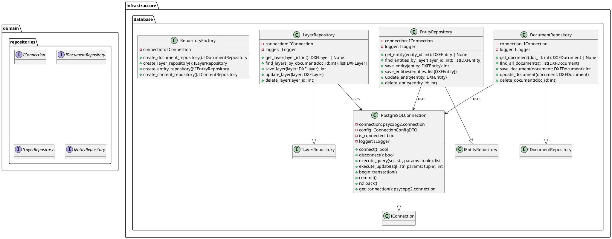
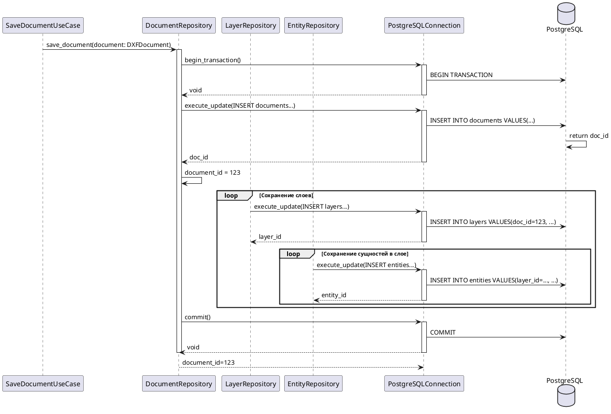
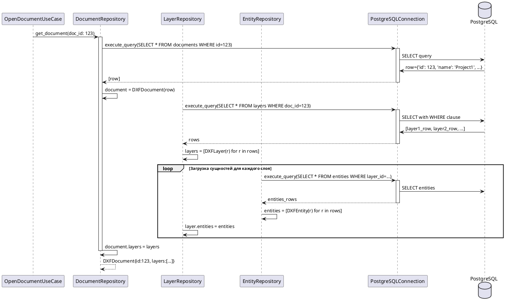
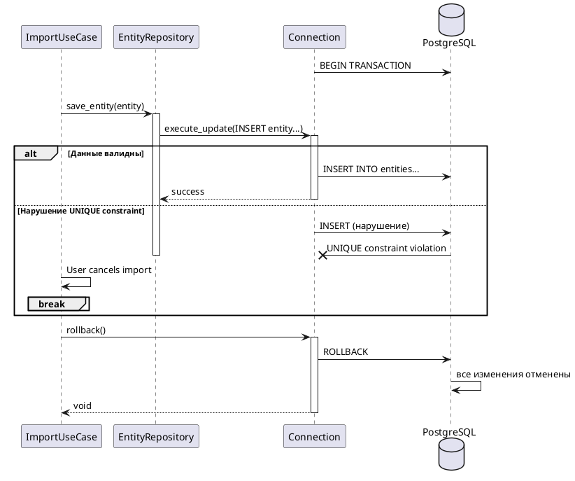
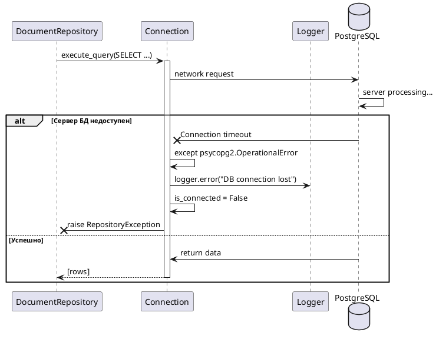
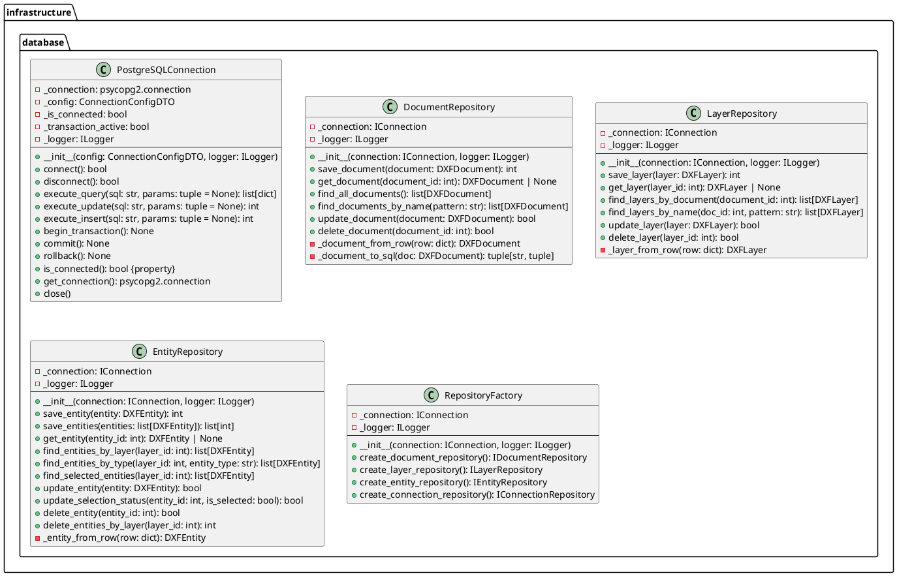

# Проектирование пакета database

**Пакет**: `infrastructure/database`

**Назначение**: Реализация работы с PostgreSQL и PostGIS для сохранения и извлечения геопространственных данных DXF. Содержит конкретные реализации интерфейсов доступа к данным из domain слоя.

**Расположение**: `src/infrastructure/database/`

---

## 1. Исходная диаграмма классов (внутренние отношения)



---

## 2. Таблица описания классов

| Класс | Назначение | Тип |
|-------|-----------|-----|
| **PostgreSQLConnection** | Управление подключением к PostgreSQL базе данных для работы с геопространственными данными | Connection |
| **DocumentRepository** | Реализация операций CRUD с документами DXF в БД | Repository |
| **LayerRepository** | Реализация операций CRUD со слоями DXF в БД | Repository |
| **EntityRepository** | Реализация операций CRUD с сущностями DXF в БД | Repository |
| **RepositoryFactory** | Factory для создания репозиториев с единым подключением | Factory |

---

## 3. Диаграммы последовательности

### 3.1 Нормальный ход: Сохранение документа с иерархией слоев и сущностей



### 3.2 Альтернативный нормальный ход: Загрузка документа с восстановлением иерархии



### 3.3 Сценарий прерывания пользователем: Откат транзакции при ошибке



### 3.4 Сценарий системного прерывания: Потеря соединения с БД



---

## 4. Уточненная диаграмма классов (с типами связей)

```plantuml
@startuml infrastructure_database_refined

package "infrastructure.database" {
    class PostgreSQLConnection {
        - connection
        - config
        - is_connected
        + connect(): bool
        + execute_query(): list
        + execute_update(): int
        + commit()
        + rollback()
    }
    
    class DocumentRepository {
        - connection: IConnection
        + save_document(doc: DXFDocument): int
        + get_document(id: int): DXFDocument | None
        + find_all_documents(): list[DXFDocument]
        + update_document(doc: DXFDocument)
        + delete_document(id: int)
    }
    
    class LayerRepository {
        - connection: IConnection
        + save_layer(layer: DXFLayer): int
        + get_layer(id: int): DXFLayer | None
        + find_layers_by_document(doc_id: int): list[DXFLayer]
        + update_layer(layer: DXFLayer)
        + delete_layer(id: int)
    }
    
    class EntityRepository {
        - connection: IConnection
        + save_entity(entity: DXFEntity): int
        + save_entities(entities: list[DXFEntity])
        + get_entity(id: int): DXFEntity | None
        + find_entities_by_layer(layer_id: int): list[DXFEntity]
        + update_entity(entity: DXFEntity)
        + delete_entity(id: int)
    }
    
    class RepositoryFactory {
        - connection: IConnection
        + create_document_repository(): IDocumentRepository
        + create_layer_repository(): ILayerRepository
        + create_entity_repository(): IEntityRepository
    }
}

package "domain.entities" {
    class DXFDocument
    class DXFLayer
    class DXFEntity
}

package "domain.repositories" {
    interface IConnection
    interface IDocumentRepository
    interface ILayerRepository
    interface IEntityRepository
}

PostgreSQLConnection -.implements-> IConnection
DocumentRepository -.implements-> IDocumentRepository
LayerRepository -.implements-> ILayerRepository
EntityRepository -.implements-> IEntityRepository

DocumentRepository --> PostgreSQLConnection: uses
LayerRepository --> PostgreSQLConnection: uses
EntityRepository --> PostgreSQLConnection: uses

DocumentRepository --> DXFDocument: works with
LayerRepository --> DXFLayer: works with
EntityRepository --> DXFEntity: works with

RepositoryFactory --> DocumentRepository: creates
RepositoryFactory --> LayerRepository: creates
RepositoryFactory --> EntityRepository: creates

@enduml
```

---

## 5. Детальная диаграмма классов (со всеми полями и методами)



---

## 6. Таблицы описания полей и методов

### 6.1 PostgreSQLConnection

#### Поля

| Название | Тип | Модификатор | Описание |
|----------|-----|-------------|---------|
| `_connection` | psycopg2.connection | private | низкоуровневое соединение с БД |
| `_config` | ConnectionConfigDTO | private | конфигурация подключения (хост, порт, БД) |
| `_is_connected` | bool | private | статус подключения |
| `_transaction_active` | bool | private | есть ли активная транзакция |
| `_logger` | ILogger | private | логирование операций |

#### Методы

| Название | Параметры | Возвращает | Описание |
|----------|-----------|-----------|---------|
| `__init__()` | config, logger | void | инициализирует с конфигурацией |
| `connect()` | - | bool | устанавливает соединение с БД |
| `disconnect()` | - | bool | разрывает соединение |
| `execute_query()` | sql: str, params: tuple | list[dict] | SELECT запрос, возвращает строки |
| `execute_update()` | sql: str, params: tuple | int | UPDATE/DELETE, возвращает кол-во измененных |
| `execute_insert()` | sql: str, params: tuple | int | INSERT, возвращает inserted_id |
| `begin_transaction()` | - | void | начинает транзакцию |
| `commit()` | - | void | подтверждает изменения |
| `rollback()` | - | void | отменяет изменения |
| `is_connected()` | - | bool | проверяет состояние (property) |
| `get_connection()` | - | psycopg2.connection | получает низкоуровневое соединение |

### 6.2 DocumentRepository

#### Поля

| Название | Тип | Модификатор | Описание |
|----------|-----|-------------|---------|
| `_connection` | IConnection | private | соединение с БД |
| `_logger` | ILogger | private | логирование |

#### Методы

| Название | Параметры | Возвращает | Описание |
|----------|-----------|-----------|---------|
| `save_document()` | doc: DXFDocument | int | сохраняет документ, возвращает id |
| `get_document()` | id: int | DXFDocument \| None | получает документ по id |
| `find_all_documents()` | - | list[DXFDocument] | получает все документы |
| `find_documents_by_name()` | pattern: str | list[DXFDocument] | поиск по имени |
| `update_document()` | doc: DXFDocument | bool | обновляет документ |
| `delete_document()` | id: int | bool | удаляет документ каскадно |

### 6.3 LayerRepository

#### Поля

| Название | Тип | Модификатор | Описание |
|----------|-----|-------------|---------|
| `_connection` | IConnection | private | соединение с БД |
| `_logger` | ILogger | private | логирование |

#### Методы

| Название | Параметры | Возвращает | Описание |
|----------|-----------|-----------|---------|
| `save_layer()` | layer: DXFLayer | int | сохраняет слой |
| `get_layer()` | id: int | DXFLayer \| None | получает слой по id |
| `find_layers_by_document()` | doc_id: int | list[DXFLayer] | получает слои документа |
| `find_layers_by_name()` | doc_id, pattern | list[DXFLayer] | поиск слоев по имени |
| `update_layer()` | layer: DXFLayer | bool | обновляет слой |
| `delete_layer()` | id: int | bool | удаляет слой каскадно |

### 6.4 EntityRepository

#### Поля

| Название | Тип | Модификатор | Описание |
|----------|-----|-------------|---------|
| `_connection` | IConnection | private | соединение с БД |
| `_logger` | ILogger | private | логирование |

#### Методы

| Название | Параметры | Возвращает | Описание |
|----------|-----------|-----------|---------|
| `save_entity()` | entity: DXFEntity | int | сохраняет сущность |
| `save_entities()` | entities: list | list[int] | батч-сохранение |
| `get_entity()` | id: int | DXFEntity \| None | получает по id |
| `find_entities_by_layer()` | layer_id: int | list[DXFEntity] | все сущности слоя |
| `find_entities_by_type()` | layer_id, type | list[DXFEntity] | фильтр по типу |
| `find_selected_entities()` | layer_id: int | list[DXFEntity] | только выбранные |
| `update_entity()` | entity: DXFEntity | bool | обновляет |
| `update_selection_status()` | id, is_selected | bool | изменяет статус выбора |
| `delete_entity()` | id: int | bool | удаляет |
| `delete_entities_by_layer()` | layer_id: int | int | удаляет все в слое |

### 6.5 RepositoryFactory

#### Методы

| Название | Параметры | Возвращает | Описание |
|----------|-----------|-----------|---------|
| `__init__()` | connection, logger | void | инициализирует factory |
| `create_document_repository()` | - | IDocumentRepository | создает репо документов |
| `create_layer_repository()` | - | ILayerRepository | создает репо слоев |
| `create_entity_repository()` | - | IEntityRepository | создает репо сущностей |

---

## 7. Схема базы данных

```sql
-- Таблица документов
CREATE TABLE documents (
    id SERIAL PRIMARY KEY,
    name VARCHAR(255) NOT NULL,
    description TEXT,
    file_path VARCHAR(500),
    created_at TIMESTAMP DEFAULT NOW(),
    updated_at TIMESTAMP DEFAULT NOW(),
    is_open BOOLEAN DEFAULT FALSE
);

-- Таблица слоев
CREATE TABLE layers (
    id SERIAL PRIMARY KEY,
    document_id INTEGER NOT NULL REFERENCES documents(id) ON DELETE CASCADE,
    name VARCHAR(255) NOT NULL,
    description TEXT,
    color VARCHAR(7),
    is_visible BOOLEAN DEFAULT TRUE,
    created_at TIMESTAMP DEFAULT NOW()
);

-- Таблица сущностей
CREATE TABLE entities (
    id SERIAL PRIMARY KEY,
    layer_id INTEGER NOT NULL REFERENCES layers(id) ON DELETE CASCADE,
    entity_type VARCHAR(50) NOT NULL,  -- LINE, CIRCLE, POLYLINE, etc.
    geometry geometry(Geometry, 4326),  -- PostGIS geometry
    attributes JSON,
    is_selected BOOLEAN DEFAULT FALSE,
    created_at TIMESTAMP DEFAULT NOW(),
    updated_at TIMESTAMP DEFAULT NOW()
);

-- Индексы для оптимизации
CREATE INDEX idx_layers_document ON layers(document_id);
CREATE INDEX idx_entities_layer ON entities(layer_id);
CREATE INDEX idx_entities_type ON entities(entity_type);
CREATE INDEX idx_entities_geometry ON entities USING GIST(geometry);
```

---

## 8. Взаимодействие с другими пакетами

### Входящие зависимости (другие пакеты используют database)

- **application/use_cases** (ImportUseCase, ExportUseCase, OpenDocumentUseCase, etc.)
  - используют репозитории для CRUD операций
  
- **application/services**
  - используют репозитории для получения и сохранения данных

### Исходящие зависимости (database использует)

- **domain/entities** (DXFDocument, DXFLayer, DXFEntity)
  - работает с доменными сущностями

- **domain/repositories** (интерфейсы IConnection, IDocumentRepository, ILayerRepository, etc.)
  - реализует контракты интерфейсов

- **application/dtos** (ConnectionConfigDTO)
  - использует для передачи конфигурации

- **PostgreSQL + PostGIS**
  - внешний сервис для хранения геопространственных данных

---

## 9. Правила проектирования и ограничения

### Архитектурные правила

1. **Слой**: infrastructure/database - **Infrastructure Layer**
2. **Инверсия управления**: реализует интерфейсы из domain слоя
3. **Зависимости**: только ВЫШЕ по уровням (к application и domain)
4. **Инъекция**: использует встроенное разрешение зависимостей

### Паттерны проектирования

- **Repository Pattern**: документируется каждым классом репозитория
- **Factory Pattern**: RepositoryFactory для создания репозиториев
- **Connection Pool Pattern**: переиспользование единого соединения
- **Transaction Pattern**: begin/commit/rollback для групповых операций

### Правила БД

1. **Каскадное удаление**: удаление документа удаляет слои и сущности
2. **Индексирование**: оптимизация для поиска по document_id, layer_id, type
3. **PostGIS geometry**: хранение геопространственных данных
4. **JSON атрибуты**: гибкое хранение DXF атрибутов

### Безопасность

1. **SQL Injection защита**: использование параметризованных запросов
2. **Шифрование**: пароли в ConnectionConfigDTO зашифрованы
3. **Трансакции**: ACID гарантии для целостности данных

---

## 10. Состояние проектирования

✅ **Завершено**: полная документация infrastructure/database слоя с архитектурой репозиториев и схемой БД.

**Готово к использованию в диплому**: детальное описание взаимодействия с PostgreSQL/PostGIS и паттерны доступа к данным.
