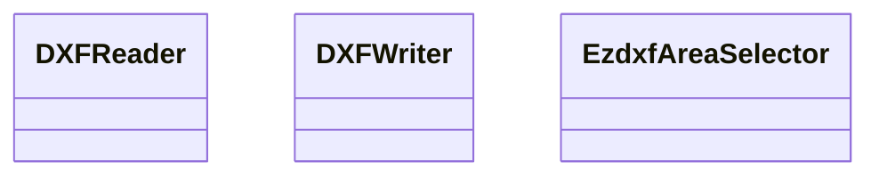
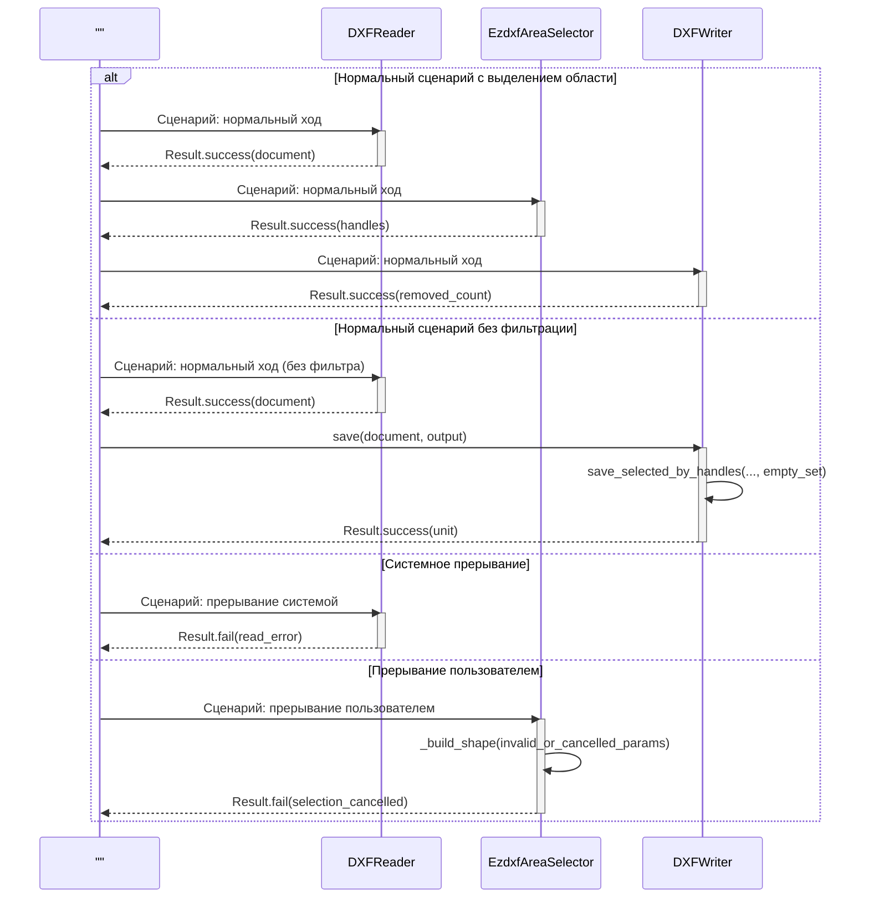
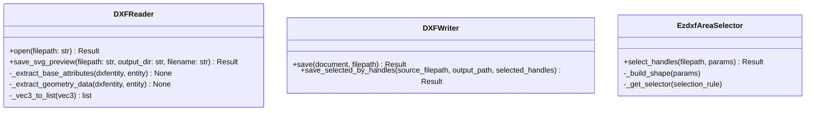

# 5.2.10. Проектирование классов пакета «ezdxf»

Пакет «ezdxf» реализует инфраструктурную работу с DXF-файлами: чтение, выбор handle в области и запись результата.

## 5.2.10.1. Исходная диаграмма классов

Диаграмма содержит только классы пакета `infrastructure/ezdxf`. Внутрипакетные связи в коде между этими классами отсутствуют, что допустимо.

### Таблица 1. Описание классов пакета «ezdxf»

| Класс | Описание |
|---|---|
| DXFReader | Чтение DXF и построение структуры документа |
| DXFWriter | Сохранение DXF (полное или по выбранным handle) |
| EzdxfAreaSelector | Пространственный выбор handle по области |

## 5.2.10.2. Диаграмма последовательностей взаимодействия объектов классов

На одной диаграмме показаны все классы пакета. Первый блок намеренно без названия и служит единым инициатором сценариев. Внешние сущности на диаграмме не используются.

## 5.2.10.3. Уточненная диаграмма классов

Внутрипакетная агрегация/композиция между классами `DXFReader`, `DXFWriter`, `EzdxfAreaSelector` отсутствует.

## 5.2.10.4. Детальная диаграмма классов

Детальная диаграмма отражает методы только классов пакета `ezdxf`.

### Таблица 2. Ключевые методы классов пакета «ezdxf»

| Класс | Метод | Назначение |
|---|---|---|
| DXFReader | open | Чтение DXF и формирование результата |
| DXFReader | save_svg_preview | Построение SVG-превью DXF |
| DXFWriter | save | Сохранение DXF без фильтрации handle |
| DXFWriter | save_selected_by_handles | Сохранение DXF только по выбранным handle |
| EzdxfAreaSelector | select_handles | Возврат handle внутри заданной области |

## 5.2.10.5. Подробные таблицы полей и методов классов

### Класс DXFReader

#### Описание полей класса

| Название | Тип | Описание |
|---|---|---|
| Нет собственных полей состояния | - | Класс работает как stateless-reader на основе входного файла |

#### Описание методов класса

| Название | Параметры | Возвращает | Описание |
|---|---|---|---|
| open | filepath: str | Result[DXFDocument] | Читает DXF и формирует модель документа |
| save_svg_preview | filepath: str, output_dir: str, filename: str | Result[str] | Сохраняет SVG-превью для визуальной проверки |
| _extract_base_attributes | dxfentity, entity | None | Извлекает базовые атрибуты (имя, handle, слой и т.д.) |
| _extract_geometry_data | dxfentity, entity | None | Извлекает геометрии по типу сущности |
| _vec3_to_list | vec3 | list[float] | Преобразует вектор ezdxf к сериализуемому списку |

### Класс DXFWriter

#### Описание полей класса

| Название | Тип | Описание |
|---|---|---|
| Нет собственных полей состояния | - | Класс выполняет запись на основе входных параметров |

#### Описание методов класса

| Название | Параметры | Возвращает | Описание |
|---|---|---|---|
| save | document: DXFDocument, filepath: str | Result[Unit] | Полностью сохраняет документ без фильтрации |
| save_selected_by_handles | source_filepath: str, output_path: str, selected_handles: set[str] | Result[int] | Сохраняет копию DXF с выбранными сущностями |

### Класс EzdxfAreaSelector

#### Описание полей класса

| Название | Тип | Описание |
|---|---|---|
| Нет собственных полей состояния | - | Класс использует геометрические селекторы без сохранения состояния |

#### Описание методов класса

| Название | Параметры | Возвращает | Описание |
|---|---|---|---|
| select_handles | filepath: str, params: SelectionParamsDTO | Result[set[str]] | Возвращает handle сущностей, попавших в область выбора |
| _build_shape | params: SelectionParamsDTO | shapely geometry | Строит геометрию области выбора |
| _get_selector | selection_rule: SelectionRule | IGeometrySelector | Возвращает стратегию пересечения/включения |
