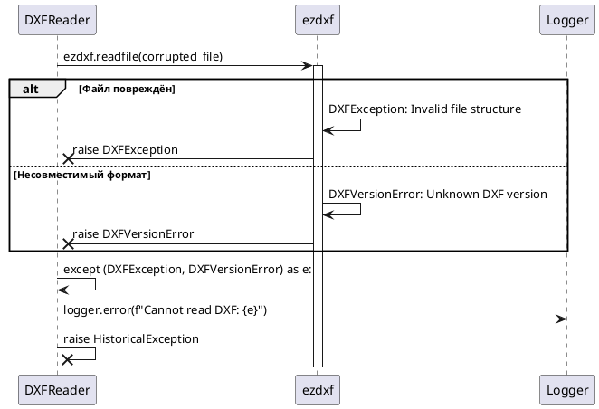
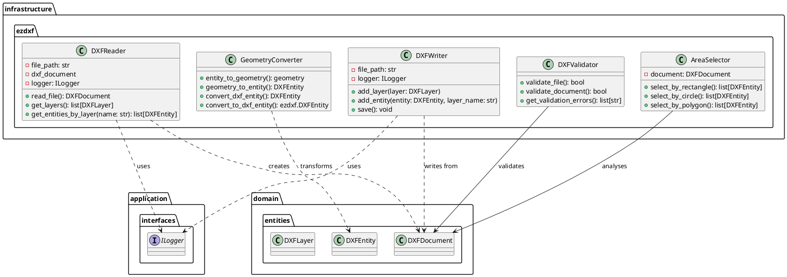
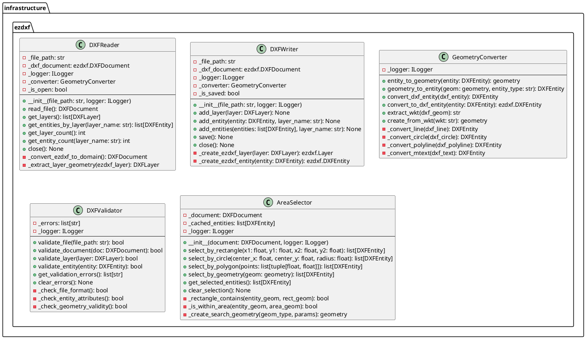

# Проектирование пакета ezdxf

**Пакет**: `infrastructure/ezdxf`

**Назначение**: Работа с DXF файлами через библиотеку ezdxf для чтения, записи и преобразования геометрии. Интегрирует стандартный формат DXF с внутренним представлением приложения.

**Расположение**: `src/infrastructure/ezdxf/`

---

## 1. Исходная диаграмма классов (внутренние отношения)

```plantuml
@startuml infrastructure_ezdxf_original

package "infrastructure.ezdxf" {
    
    class DXFReader {
        - file_path: str
        - dxf_document: ezdxf.DXFDocument
        - logger: ILogger
        --
        + __init__(file_path: str, logger: ILogger)
        + read_file(): DXFDocument
        + get_layers(): list[DXFLayer]
        + get_entities_by_layer(layer_name: str): list[DXFEntity]
        + close()
    }
    
    class DXFWriter {
        - file_path: str
        - dxf_document: ezdxf.DXFDocument
        - logger: ILogger
        --
        + __init__(file_path: str, logger: ILogger)
        + write_file(document: DXFDocument)
        + add_layer(layer: DXFLayer)
        + add_entity(entity: DXFEntity, layer_name: str)
        + save()
        + close()
    }
    
    class GeometryConverter {
        --
        + entity_to_geometry(entity: DXFEntity): geometry
        + geometry_to_entity(geometry: geometry, entity_type: str): DXFEntity
        + convert_dxf_entity(dxf_entity): DXFEntity
        + convert_to_dxf_entity(entity: DXFEntity): ezdxf.DXFEntity
    }
    
    class DXFValidator {
        --
        + validate_file(file_path: str): bool
        + validate_document(document: DXFDocument): bool
        + validate_layer(layer: DXFLayer): bool
        + validate_entity(entity: DXFEntity): bool
        + get_validation_errors(): list[str]
    }
    
    class AreaSelector {
        - document: DXFDocument
        - selected_area: Geometry
        --
        + __init__(document: DXFDocument)
        + select_by_rectangle(x1: float, y1: float, x2: float, y2: float): list[DXFEntity]
        + select_by_circle(center_x: float, center_y: float, radius: float): list[DXFEntity]
        + select_by_polygon(points: list[tuple]): list[DXFEntity]
        + get_selected_entities(): list[DXFEntity]
    }
    
    DXFValidator --> DXFDocument
    AreaSelector --> DXFDocument
    GeometryConverter --> DXFEntity
}

package "domain.entities" {
    class DXFDocument
    class DXFEntity
    class DXFLayer
}

@enduml
```



---

## 2. Таблица описания классов

| Класс | Назначение | Тип |
|-------|-----------|-----|
| **DXFReader** | Чтение DXF файлов и преобразование в доменные сущности | Reader |
| **DXFWriter** | Запись доменных сущностей в DXF файлы | Writer |
| **GeometryConverter** | Преобразование геометрии между DXF форматом и PostGIS | Converter |
| **DXFValidator** | Валидация DXF файлов и доменных сущностей | Validator |
| **AreaSelector** | Выбор сущностей по геометрическим областям (прямоугольник, круг, полигон) | Selector |

---

## 3. Диаграммы последовательности

### 3.1 Нормальный ход: Импорт DXF файла

```plantuml
@startuml ezdxf_normal_flow

participant "ImportUseCase" as UseCase
participant "DXFReader" as Reader
participant "GeometryConverter" as Converter
participant "EntityRepository" as Repo
participant "ezdxf.DXFDocument" as EzDxf
database "DXF File"

UseCase -> Reader: __init__(config.file_path)
Reader -> EzDxf: ezdxf.readfile(file_path)
activate EzDxf
EzDxf -> DXF File: read binary
return DXFDocument

activate Reader

Reader -> Reader: self.dxf_document = parsed_doc

UseCase -> Reader: read_file()
activate Reader

Reader -> Reader: layers = dxf_document.layers

loop Обработка каждого слоя
    Reader -> Reader: get_entities_by_layer(layer_name)
    activate Reader
    
    loop Обработка каждой сущности
        Reader -> EzDxf: get layer entities
        return dxf_entities
        
        Reader -> Converter: convert_dxf_entity(dxf_entity)
        activate Converter
        Converter -> Converter: geometry = extract_geometry()
        Converter -> Converter: attributes = extract_attributes()
        Converter -> Converter: return DXFEntity
        deactivate Converter
        
        Reader -> Reader: entities.append(entity)
    end
    
    Reader -> Reader: DXFLayer(name, entities)
    deactivate Reader
    
    UseCase -> Repo: save_entities(entities)
    activate Repo
    Repo -> Repo: bulk INSERT into DB
    return [entity_ids]
    deactivate Repo
end

UseCase -> Reader: close()
Reader -> EzDxf: close file handle
return void

@enduml
```

### 3.2 Альтернативный нормальный ход: Экспорт в DXF файл

```plantuml
@startuml ezdxf_alt_normal_flow

participant "ExportUseCase" as UseCase
participant "DXFWriter" as Writer
participant "GeometryConverter" as Converter
participant "ezdxf" as EzDxf
database "Output DXF"

UseCase -> Writer: __init__(output_path)
Writer -> EzDxf: ezdxf.new()
return new_dxf_doc

activate Writer

UseCase -> UseCase: get selected entities from DB

loop Для каждого слоя
    UseCase -> Writer: add_layer(layer)
    activate Writer
    
    Writer -> EzDxf: msp.add_layer(layer_name)
    return void
    
    loop Для каждой сущности в слое
        UseCase -> Converter: convert_to_dxf_entity(app_entity)
        activate Converter
        Converter -> Converter: dxf_geometry = from PostGIS()
        Converter -> Converter: dxf_attributes = entity.attributes
        Converter -> Converter: return ezdxf.DXFEntity
        deactivate Converter
        
        UseCase -> Writer: add_entity(dxf_entity, layer_name)
        activate Writer
        Writer -> EzDxf: msp.add_entity(dxf_entity)
        Writer -> Writer: (handle creation, attributes set)
        deactivate Writer
    end
    
    deactivate Writer
end

UseCase -> Writer: save()
activate Writer
Writer -> EzDxf: dxf_document.saveas(file_path)
EzDxf -> Output DXF: write binary
return void

Writer -> Writer: is_saved = True
deactivate Writer

@enduml
```

### 3.3 Сценарий прерывания пользователем: Отмена импорта при ошибке валидации

```plantuml
@startuml ezdxf_user_interruption

participant "ImportUseCase" as UseCase
participant "DXFValidator" as Validator
participant "DXFReader" as Reader
participant "Logger" as Log

UseCase -> Validator: validate_file(file_path)
activate Validator

Validator -> Validator: open file
Validator -> Validator: check format version
Validator -> Validator: validate layer structure
Validator -> Validator: collect errors

alt Файл невалиден
    Validator -> Validator: validation_errors = [...]
    Validator -> Log: logger.warning("Invalid DXF")
    return False
    
    UseCase -> UseCase: User sees error message
    UseCase -> UseCase: Cancel import
else Файл валиден
    return True
    
    UseCase -> Reader: read_file()
    Reader -> Reader: import normally
end

@enduml
```

### 3.4 Сценарий системного прерывания: Файл повреждён или несовместимый формат



---

## 4. Уточненная диаграмма классов (с типами связей)



---

## 5. Детальная диаграмма классов (со всеми полями и методами)



---

## 6. Таблицы описания полей и методов

### 6.1 DXFReader

#### Поля

| Название | Тип | Модификатор | Описание |
|----------|-----|-------------|---------|
| `_file_path` | str | private | путь к DXF файлу |
| `_dxf_document` | ezdxf.DXFDocument | private | загруженный документ ezdxf |
| `_logger` | ILogger | private | логирование операций |
| `_converter` | GeometryConverter | private | преобразование геометрии |
| `_is_open` | bool | private | статус открытия файла |

#### Методы

| Название | Параметры | Возвращает | Описание |
|----------|-----------|-----------|---------|
| `__init__()` | file_path, logger | void | инициализирует reader |
| `read_file()` | - | DXFDocument | читает файл и возвращает доменный объект |
| `get_layers()` | - | list[DXFLayer] | получает все слои |
| `get_entities_by_layer()` | layer_name | list[DXFEntity] | получает сущности слоя |
| `get_layer_count()` | - | int | количество слоев |
| `get_entity_count()` | layer_name | int | количество сущностей в слое |
| `close()` | - | void | закрывает файл |

### 6.2 DXFWriter

#### Поля

| Название | Тип | Модификатор | Описание |
|----------|-----|-------------|---------|
| `_file_path` | str | private | путь для сохранения |
| `_dxf_document` | ezdxf.DXFDocument | private | новый документ ezdxf |
| `_logger` | ILogger | private | логирование |
| `_converter` | GeometryConverter | private | преобразование |
| `_is_saved` | bool | private | статус сохранения |

#### Методы

| Название | Параметры | Возвращает | Описание |
|----------|-----------|-----------|---------|
| `__init__()` | file_path, logger | void | инициализирует writer |
| `add_layer()` | layer: DXFLayer | void | добавляет слой |
| `add_entity()` | entity, layer_name | void | добавляет сущность |
| `add_entities()` | entities, layer_name | void | добавляет несколько |
| `save()` | - | void | сохраняет в файл |
| `close()` | - | void | закрывает документ |

### 6.3 GeometryConverter

#### Методы

| Название | Параметры | Возвращает | Описание |
|----------|-----------|-----------|---------|
| `entity_to_geometry()` | entity | geometry | преобразует DXFEntity в PostGIS |
| `geometry_to_entity()` | geom, type | DXFEntity | преобразует обратно |
| `convert_dxf_entity()` | dxf_entity | DXFEntity | преобразует ezdxf в доменный |
| `convert_to_dxf_entity()` | entity | ezdxf.DXFEntity | преобразует доменный в ezdxf |
| `extract_wkt()` | geometry | str | WKT представление |
| `create_from_wkt()` | wkt | geometry | из WKT |

### 6.4 DXFValidator

#### Поля

| Название | Тип | Модификатор | Описание |
|----------|-----|-------------|---------|
| `_errors` | list[str] | private | список ошибок валидации |
| `_logger` | ILogger | private | логирование |

#### Методы

| Название | Параметры | Возвращает | Описание |
|----------|-----------|-----------|---------|
| `validate_file()` | file_path | bool | валидирует файл |
| `validate_document()` | doc | bool | валидирует документ |
| `validate_layer()` | layer | bool | валидирует слой |
| `validate_entity()` | entity | bool | валидирует сущность |
| `get_validation_errors()` | - | list[str] | список ошибок |
| `clear_errors()` | - | void | очищает ошибки |

### 6.5 AreaSelector

#### Поля

| Название | Тип | Модификатор | Описание |
|----------|-----|-------------|---------|
| `_document` | DXFDocument | private | документ для поиска |
| `_cached_entities` | list[DXFEntity] | private | кэш результатов |
| `_logger` | ILogger | private | логирование |

#### Методы

| Название | Параметры | Возвращает | Описание |
|----------|-----------|-----------|---------|
| `__init__()` | document, logger | void | инициализирует селектор |
| `select_by_rectangle()` | x1, y1, x2, y2 | list[DXFEntity] | выбрать в прямоугольнике |
| `select_by_circle()` | center_x, y, radius | list[DXFEntity] | выбрать в круге |
| `select_by_polygon()` | points | list[DXFEntity] | выбрать в многоугольнике |
| `select_by_geometry()` | geom | list[DXFEntity] | выбрать по геометрии |
| `get_selected_entities()` | - | list[DXFEntity] | получить выбранные |
| `clear_selection()` | - | void | очистить выбор |

---

## 7. Типы сущностей DXF

Поддерживаемые типы DXF:

| Тип | Описание | Поле geometry | Пример |
|-----|---------|---------------|--------|
| **LINE** | Прямая линия | LINESTRING | от (0,0) до (10,10) |
| **CIRCLE** | Окружность | POLYGON/POINT | центр (5,5), радиус 2 |
| **POLYLINE** | Полилиния | LINESTRING | последовательность точек |
| **LWPOLYLINE** | Облегчённая полилиния | LINESTRING | улучшенная полилиния |
| **TEXT** | Текст | POINT | (5,5) с текстом "Label" |
| **MTEXT** | Мультилиния | POINT | усовершенствованный текст |
| **HATCH** | Штриховка | POLYGON | заполненная область |
| **ARC** | Дуга | LINESTRING | дуга между двумя точками |
| **ELLIPSE** | Эллипс | POLYGON | трансформированная окружность |

---

## 8. Взаимодействие с другими пакетами

### Входящие зависимости (другие пакеты используют ezdxf)

- **application/use_cases** (ImportUseCase, ExportUseCase)
  - используют DXFReader для импорта
  - используют DXFWriter для экспорта
  
- **application/use_cases** (SelectAreaUseCase)
  - использует AreaSelector для выделения

### Исходящие зависимости (ezdxf использует)

- **domain/entities** (DXFDocument, DXFEntity, DXFLayer)
  - работает с доменными сущностями

- **infrastructure/database**
  - сохраняет конвертированные сущности через репозитории

- **ezdxf library** (внешняя)
  - работа с DXF форматом

- **PostGIS/WKT** (стандарт)
  - преобразование геометрии в стандартный формат

---

## 9. Правила проектирования и ограничения

### Архитектурные правила

1. **Слой**: infrastructure/ezdxf - **Infrastructure Layer**
2. **Ответственность**: конвертирует между DXF и доменными сущностями
3. **Зависимости**: только ВЫШЕ (к domain и application слоям)
4. **Интеграция**: работает с внешней library ezdxf и PostGIS

### Паттерны проектирования

- **Reader/Writer Pattern**: DXFReader и DXFWriter для I/O
- **Converter Pattern**: GeometryConverter для трансформаций
- **Validator Pattern**: DXFValidator для проверки
- **Selector Pattern**: AreaSelector для spatial queries

### Правила кодирования

1. **Валидация**: все файлы валидируются перед чтением
2. **Ошибки**: ездxf исключения обрабатываются и логируются
3. **Производительность**: большие файлы читаются потокозависимым DXFReader
4. **Геometry**: все координаты преобразуются в PostGIS WKT формат

---

## 10. Состояние проектирования

✅ **Завершено**: полная документация infrastructure/ezdxf слоя для работы с DXF файлами.

**Готово к использованию в диплому**: детальное описание интеграции с ezdxf библиотекой и преобразованием геометрии.
