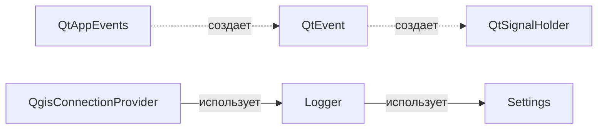
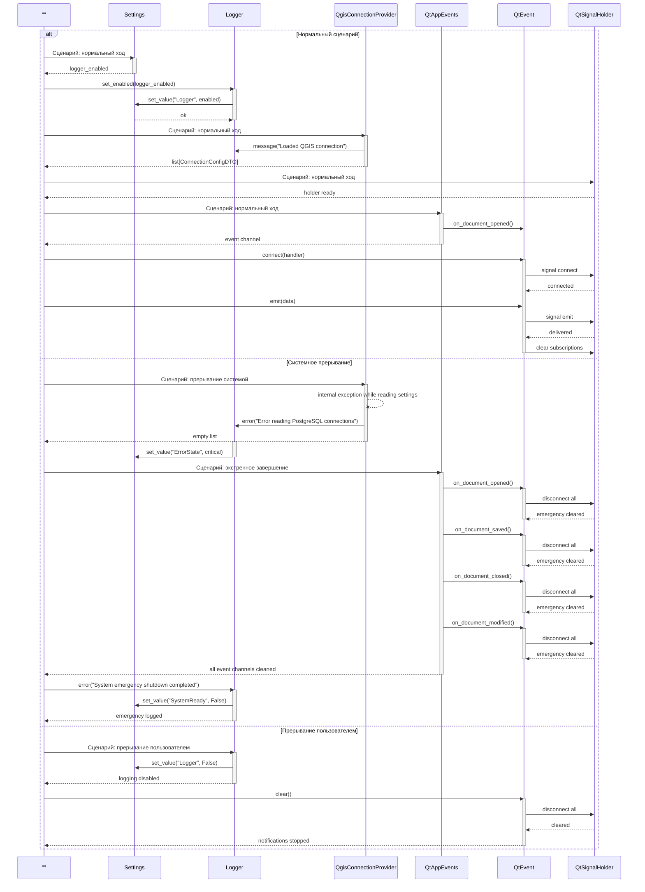
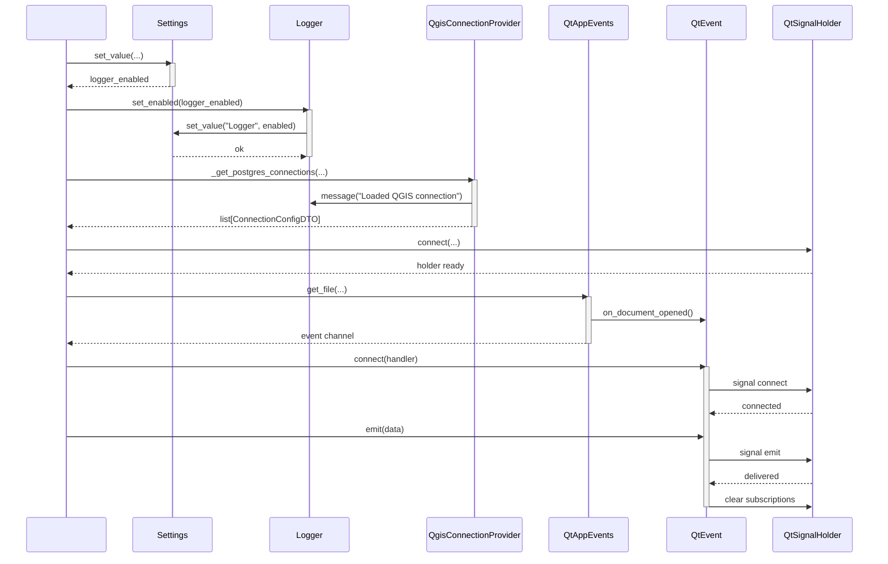
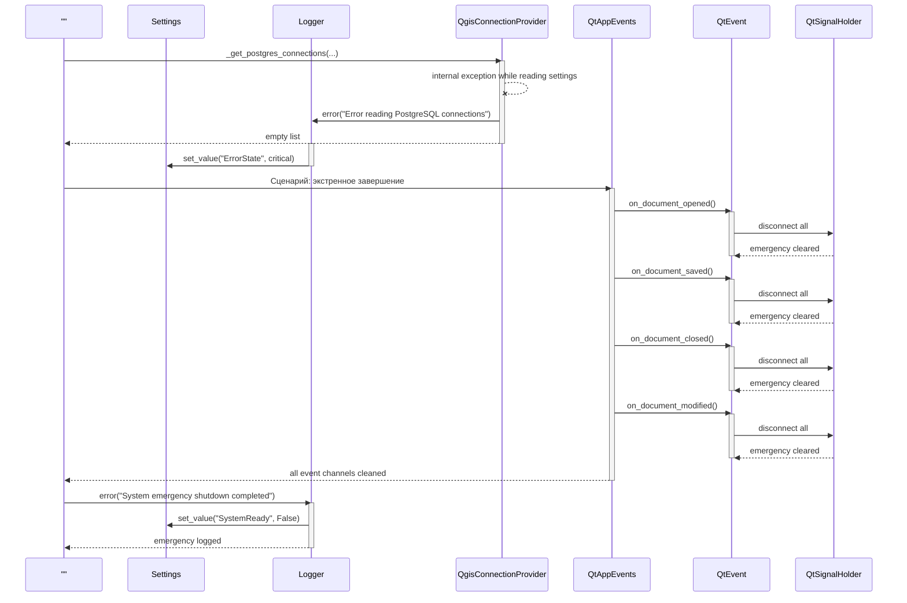
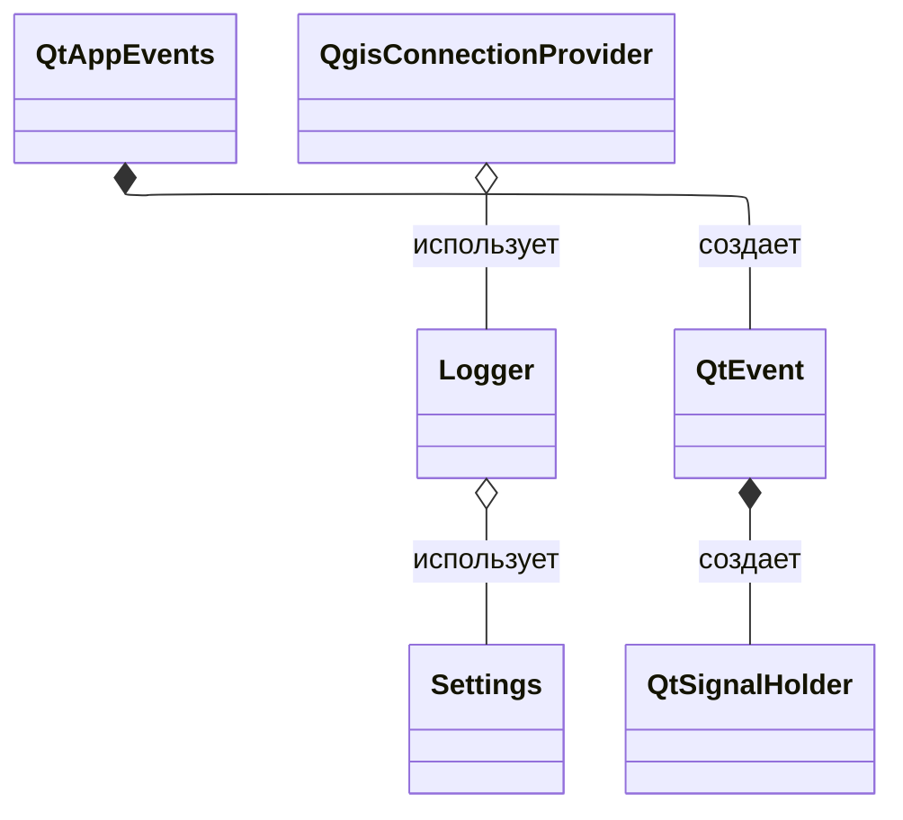
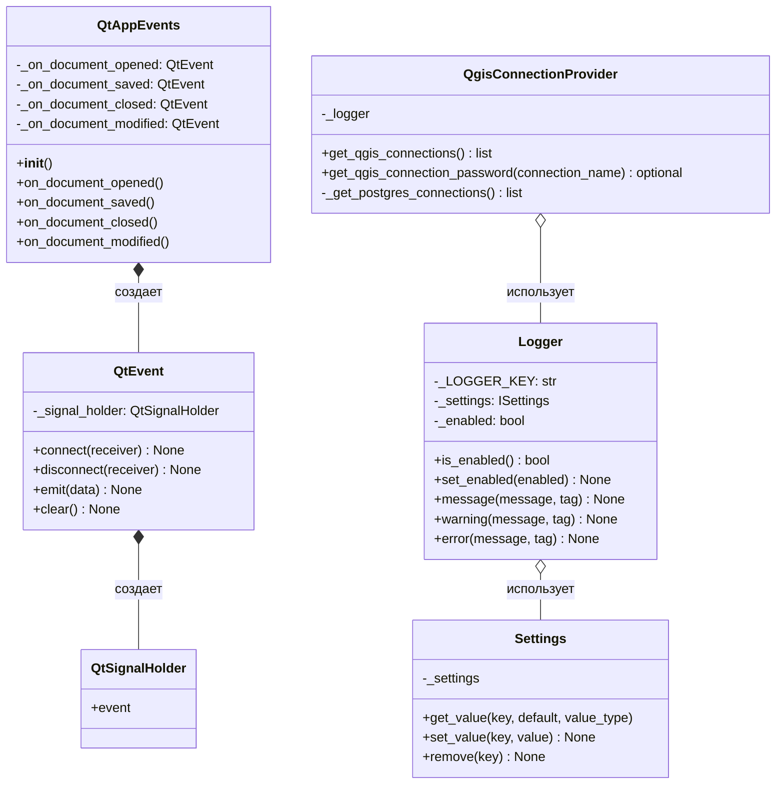

# 5.2.11. Проектирование классов пакета «qgis»

Пакет «qgis» реализует инфраструктурную интеграцию с QGIS API: логирование, настройки, событийную шину и чтение конфигураций подключений.

## 5.2.11.1. Исходная диаграмма классов

Диаграмма содержит только классы пакета `infrastructure/qgis`.

### Таблица 1. Описание классов пакета «qgis»

| Класс | Описание |
|---|---|
| Logger | Запись сообщений в `QgsMessageLog`, управление флагом enabled |
| Settings | Адаптер над `QgsSettings` |
| QtEvent | Обертка над Qt-сигналом с connect/disconnect/emit/clear |
| QtSignalHolder | Внутренний QObject с `pyqtSignal(object)` |
| QtAppEvents | Контейнер доменных событий приложения на базе `QtEvent` |
| QgisConnectionProvider | Получение PostgreSQL подключений из `QSettings` QGIS |

## 5.2.11.2. Диаграмма последовательностей взаимодействия объектов классов

На одной диаграмме показано взаимодействие всех классов пакета. Первый блок намеренно без названия и используется как общий инициатор сценариев. Внешние объекты QGIS на диаграмме не отображаются.

## 5.2.11.3. Уточненная диаграмма классов

## 5.2.11.4. Детальная диаграмма классов

### Таблица 2. Ключевые поля классов пакета «qgis»

| Класс | Поле | Описание |
|---|---|---|
| Logger | _settings | Доступ к persistent настройкам |
| Logger | _enabled | Флаг включенности логирования |
| Settings | _settings | Объект `QgsSettings` |
| QtEvent | _signal_holder | Держатель `pyqtSignal` |
| QtAppEvents | _on_document_* | Набор событий приложения |
| QgisConnectionProvider | _logger | Логирование чтения и ошибок |

### Таблица 3. Ключевые методы классов пакета «qgis»

| Класс | Метод | Назначение |
|---|---|---|
| Logger | set_enabled | Переключение логгера и запись состояния в Settings |
| Logger | message/warning/error | Вывод сообщений в QGIS log |
| Settings | get_value/set_value/remove | Работа с `QgsSettings` |
| QtEvent | connect/disconnect | Управление подписками |
| QtEvent | emit/clear | Публикация и очистка обработчиков |
| QtAppEvents | on_document_opened/... | Выдача каналов событий |
| QgisConnectionProvider | get_qgis_connections | Получение списка подключений |
| QgisConnectionProvider | get_qgis_connection_password | Получение пароля подключения |

## 5.2.11.5. Подробные таблицы полей и методов классов

### Класс Logger

#### Описание полей класса

| Название | Тип | Описание |
|---|---|---|
| _LOGGER_KEY | str | Ключ настройки, включающей/отключающей логирование |
| _settings | ISettings | Адаптер доступа к persistent-настройкам |
| _enabled | bool | Текущее состояние логирования |

#### Описание методов класса

| Название | Параметры | Возвращает | Описание |
|---|---|---|---|
| is_enabled | - | bool | Возвращает текущее состояние логирования |
| set_enabled | enabled: bool | None | Устанавливает флаг и сохраняет его в Settings |
| message | message: str, tag: str | None | Пишет информационное сообщение в журнал QGIS |
| warning | message: str, tag: str | None | Пишет предупреждение в журнал QGIS |
| error | message: str, tag: str | None | Пишет ошибку в журнал QGIS |

### Класс Settings

#### Описание полей класса

| Название | Тип | Описание |
|---|---|---|
| _settings | QgsSettings | Объект QGIS для хранения пользовательских параметров |

#### Описание методов класса

| Название | Параметры | Возвращает | Описание |
|---|---|---|---|
| get_value | key: str, default: Any, value_type: type | Any | Возвращает значение настройки с типизацией |
| set_value | key: str, value: Any | None | Сохраняет значение настройки |
| remove | key: str | None | Удаляет настройку |

### Класс QtSignalHolder

#### Описание полей класса

| Название | Тип | Описание |
|---|---|---|
| event | pyqtSignal(object) | Qt-сигнал для публикации событий с payload |

#### Описание методов класса

| Название | Параметры | Возвращает | Описание |
|---|---|---|---|
| Нет публичных методов | - | - | Класс используется как holder сигнала внутри QtEvent |

### Класс QtEvent

#### Описание полей класса

| Название | Тип | Описание |
|---|---|---|
| _signal_holder | QtSignalHolder | Владеет объектом Qt-сигнала |

#### Описание методов класса

| Название | Параметры | Возвращает | Описание |
|---|---|---|---|
| connect | receiver: Callable[[Any], None] | None | Подписывает обработчик на событие |
| disconnect | receiver: Callable[[Any], None] | None | Отписывает обработчик |
| emit | data: Any | None | Публикует событие подписчикам |
| clear | - | None | Очищает все подписки |

### Класс QtAppEvents

#### Описание полей класса

| Название | Тип | Описание |
|---|---|---|
| _on_document_opened | QtEvent | Канал события открытия документа |
| _on_document_saved | QtEvent | Канал события сохранения документа |
| _on_document_closed | QtEvent | Канал события закрытия документа |
| _on_document_modified | QtEvent | Канал события изменения документа |
| _on_language_changed | QtEvent | Канал события смены языка |

#### Описание методов класса

| Название | Параметры | Возвращает | Описание |
|---|---|---|---|
| on_document_opened | - | QtEvent | Возвращает канал открытия документа |
| on_document_saved | - | QtEvent | Возвращает канал сохранения документа |
| on_document_closed | - | QtEvent | Возвращает канал закрытия документа |
| on_document_modified | - | QtEvent | Возвращает канал изменения документа |
| on_language_changed | - | QtEvent | Возвращает канал смены языка |

### Класс QgisConnectionProvider

#### Описание полей класса

| Название | Тип | Описание |
|---|---|---|
| _logger | ILogger | Логгер операций чтения подключений и ошибок |

#### Описание методов класса

| Название | Параметры | Возвращает | Описание |
|---|---|---|---|
| _get_postgres_connections | - | list[ConnectionConfigDTO] | Читает и парсит подключения PostgreSQL из QSettings |
| get_qgis_connections | - | list[ConnectionConfigDTO] | Публичный API получения подключений |
| get_qgis_connection_password | connection_name: str | Optional[str] | Возвращает пароль выбранного подключения |
