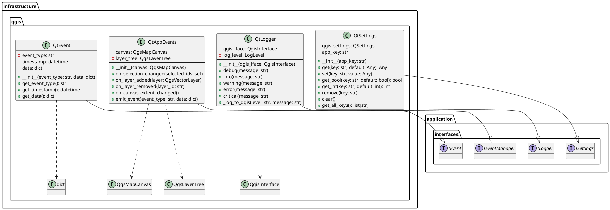
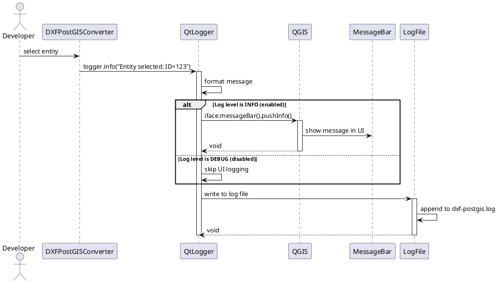
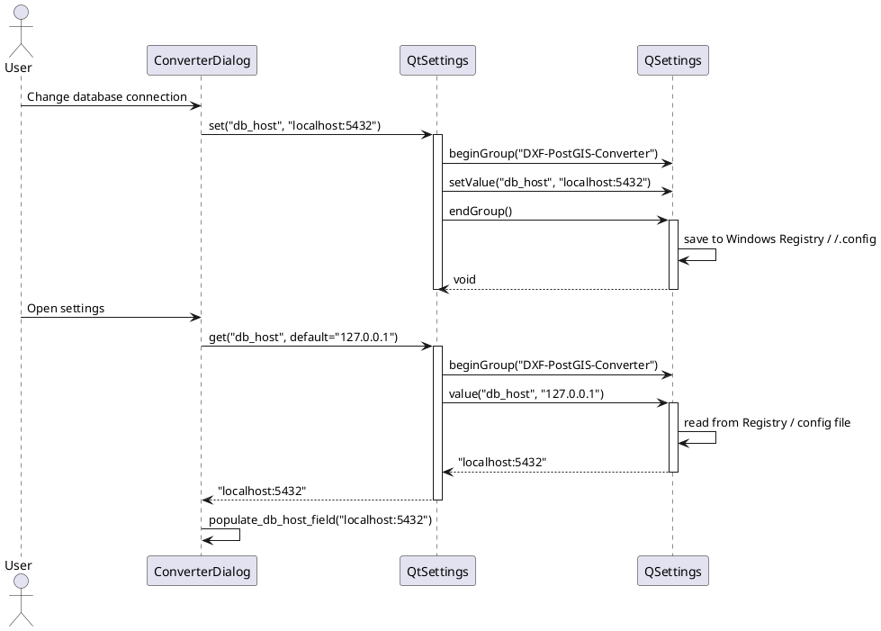
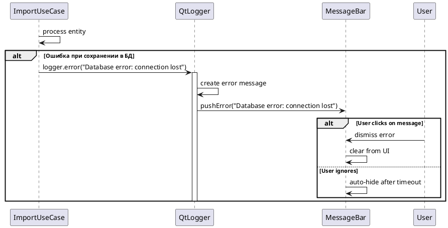
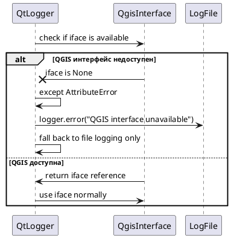
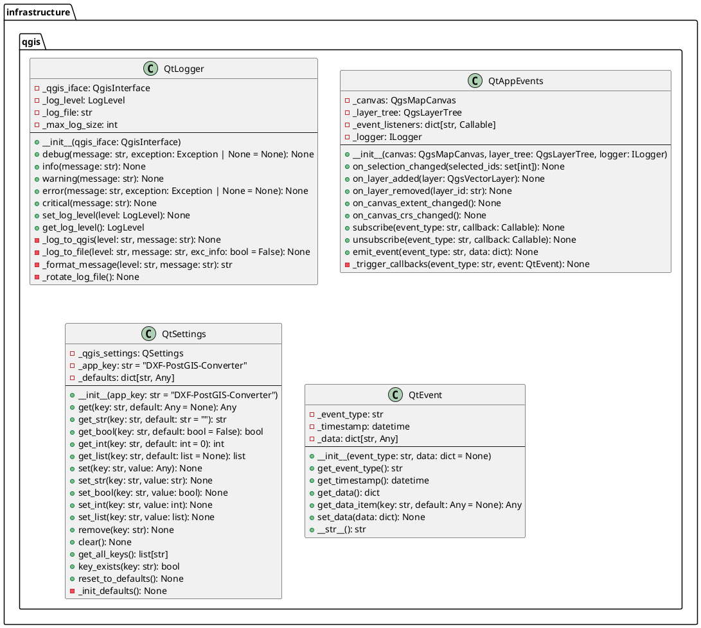

# Проектирование пакета qgis

**Пакет**: `infrastructure/qgis`

**Назначение**: Интеграция с QGIS фреймворком через Qt/PyQt5, включая логирование, управление событиями, хранение настроек и локализацию через QGIS API.

**Расположение**: `src/infrastructure/qgis/`

---

## 1. Исходная диаграмма классов (внутренние отношения)



---

## 2. Таблица описания классов

| Класс | Назначение | Тип |
|-------|-----------|-----|
| **QtLogger** | Логирование в QGIS Message Bar и лог файлы | Logger |
| **QtAppEvents** | Управление событиями приложения через QGIS сигналы | Event Manager |
| **QtSettings** | Хранение настроек приложения в QSettings | Settings Provider |
| **QtEvent** | Представление события приложения с типом и данными | Event |

---

## 3. Диаграммы последовательности

### 3.1 Нормальный ход: Логирование события в QGIS



### 3.2 Альтернативный нормальный ход: Изменение настроек и сохранение



### 3.3 Сценарий прерывания пользователем: Обработка ошибки логирования



### 3.4 Сценарий системного прерывания: QGIS недоступна



---

## 4. Уточненная диаграмма классов (с типами связей)

```plantuml
@startuml infrastructure_qgis_refined

package "infrastructure.qgis" {
    class QtLogger {
        + debug(message: str)
        + info(message: str)
        + warning(message: str)
        + error(message: str)
    }
    
    class QtAppEvents {
        + on_selection_changed(ids: set)
        + on_layer_added(layer)
        + on_canvas_extent_changed()
    }
    
    class QtSettings {
        + get(key: str): Any
        + set(key: str, value: Any)
        + get_bool(key: str): bool
        + get_int(key: str): int
    }
    
    class QtEvent {
        + get_event_type(): str
        + get_data(): dict
    }
}

package "application.interfaces" {
    interface ILogger {
        + debug()
        + info()
        + warning()
        + error()
    }
    
    interface ISettings {
        + get()
        + set()
    }
}

QtLogger -.implements-> ILogger
QtSettings -.implements-> ISettings
QtAppEvents --> QtEvent: emits

@enduml
```

---

## 5. Детальная диаграмма классов (со всеми полями и методами)



---

## 6. Таблицы описания полей и методов

### 6.1 QtLogger

#### Поля

| Название | Тип | Модификатор | Описание |
|----------|-----|-------------|---------|
| `_qgis_iface` | QgisInterface | private | QGIS интерфейс для доступа к UI |
| `_log_level` | LogLevel | private | минимальный уровень логирования |
| `_log_file` | str | private | путь к файлу логирования |
| `_max_log_size` | int | private | максимальный размер файла логирования |

#### Методы

| Название | Параметры | Возвращает | Описание |
|----------|-----------|-----------|---------|
| `__init__()` | qgis_iface | void | инициализирует с QGIS интерфейсом |
| `debug()` | message, exception | void | логирует на уровне DEBUG |
| `info()` | message | void | логирует информационное сообщение |
| `warning()` | message | void | логирует предупреждение |
| `error()` | message, exception | void | логирует ошибку с исключением |
| `critical()` | message | void | логирует критическую ошибку |
| `set_log_level()` | level: LogLevel | void | устанавливает минимальный уровень |
| `get_log_level()` | - | LogLevel | получает текущий уровень |
| `_log_to_qgis()` | level, message | void | отправляет в QGIS Message Bar |
| `_log_to_file()` | level, message, exc_info | void | записывает в файл логирования |

### 6.2 QtAppEvents

#### Поля

| Название | Тип | Модификатор | Описание |
|----------|-----|-------------|---------|
| `_canvas` | QgsMapCanvas | private | QGIS canvas для работы с картой |
| `_layer_tree` | QgsLayerTree | private | дерево слоев QGIS |
| `_event_listeners` | dict | private | подписчики на события |
| `_logger` | ILogger | private | логирование |

#### Методы

| Название | Параметры | Возвращает | Описание |
|----------|-----------|-----------|---------|
| `__init__()` | canvas, layer_tree, logger | void | инициализирует менеджер событий |
| `on_selection_changed()` | selected_ids: set | void | обработчик изменения выбора |
| `on_layer_added()` | layer: QgsVectorLayer | void | обработчик добавления слоя |
| `on_layer_removed()` | layer_id: str | void | обработчик удаления слоя |
| `on_canvas_extent_changed()` | - | void | обработчик изменения extent |
| `on_canvas_crs_changed()` | - | void | обработчик изменения CRS |
| `subscribe()` | event_type, callback | void | подписаться на событие |
| `unsubscribe()` | event_type, callback | void | отписаться от события |
| `emit_event()` | event_type, data | void | испустить событие |

### 6.3 QtSettings

#### Поля

| Название | Тип | Модификатор | Описание |
|----------|-----|-------------|---------|
| `_qgis_settings` | QSettings | private | Qt настройки (Registry/config) |
| `_app_key` | str | private | префикс для ключей приложения |
| `_defaults` | dict | private | значения по умолчанию |

#### Методы

| Название | Параметры | Возвращает | Описание |
|----------|-----------|-----------|---------|
| `get()` | key, default | Any | получить значение |
| `get_str()` | key, default | str | получить строку |
| `get_bool()` | key, default | bool | получить логическое значение |
| `get_int()` | key, default | int | получить целое число |
| `get_list()` | key, default | list | получить список |
| `set()` | key, value | void | установить значение |
| `set_str()` | key, value | void | установить строку |
| `set_bool()` | key, value | void | установить логическое значение |
| `set_int()` | key, value | void | установить целое число |
| `set_list()` | key, value | void | установить список |
| `remove()` | key | void | удалить значение |
| `clear()` | - | void | очистить все настройки |
| `get_all_keys()` | - | list[str] | получить все ключи |
| `key_exists()` | key | bool | проверить наличие ключа |
| `reset_to_defaults()` | - | void | вернуть значения по умолчанию |

### 6.4 QtEvent

#### Поля

| Название | Тип | Модификатор | Описание |
|----------|-----|-------------|---------|
| `_event_type` | str | private | тип события (строковый идентификатор) |
| `_timestamp` | datetime | private | время возникновения события |
| `_data` | dict | private | данные события |

#### Методы

| Название | Параметры | Возвращает | Описание |
|----------|-----------|-----------|---------|
| `__init__()` | event_type, data | void | инициализирует событие |
| `get_event_type()` | - | str | получить тип события |
| `get_timestamp()` | - | datetime | получить время события |
| `get_data()` | - | dict | получить данные события |
| `get_data_item()` | key, default | Any | получить значение из данных |
| `set_data()` | data | void | установить данные |
| `__str__()` | - | str | строковое представление |

---

## 7. Типы событий приложения

| Тип события | Данные | Описание |
|-------------|--------|---------|
| `document_opened` | {doc_id, doc_name} | Документ открыт |
| `document_closed` | {doc_id} | Документ закрыт |
| `import_started` | {file_path, layer_count} | Импорт начат |
| `import_completed` | {doc_id, entities_imported} | Импорт завершен |
| `selections_changed` | {selected_ids, layer_id} | Выбор изменился |
| `layer_added` | {layer_id, layer_name} | Слой добавлен в QGIS |
| `layer_removed` | {layer_id, layer_name} | Слой удалён из QGIS |
| `export_started` | {doc_id, file_path} | Экспорт начат |
| `export_completed` | {file_path, entities_exported} | Экспорт завершен |

---

## 8. Пространство хранения настроек

### Ключи QSettings (Windows Registry)

```
HKEY_CURRENT_USER
└── Software
    └── DXF-PostGIS-Converter
        ├── db_host: "localhost"
        ├── db_port: 5432
        ├── db_name: "dxf_postgis"
        ├── db_user: "postgres"
        ├── last_opened_file: "/path/to/file.dxf"
        ├── last_export_dir: "/path/to/exports"
        ├── auto_sync_qgis: true
        ├── import_mode: "MERGE_WITH_EXISTING"
        ├── export_mode: "WITH_ATTRIBUTES"
        ├── language: "en"
        ├── window_geometry: {...}
        └── recent_files: ["file1.dxf", "file2.dxf", ...]
```

### Аналог на Linux (~/.config)

```
~/.config/DXF-PostGIS-Converter/DXF-PostGIS-Converter.conf
[General]
db_host=localhost
db_port=5432
db_name=dxf_postgis
language=en
```

---

## 9. Взаимодействие с другими пакетами

### Входящие зависимости (другие пакеты используют qgis)

- **application/use_cases**
  - используют QtLogger для логирования
  - используют QtSettings для получения конфигурации
  
- **presentation/dialogs, widgets**
  - используют QtLogger для ошибок
  - используют QtAppEvents для синхронизации с QGIS

### Исходящие зависимости (qgis использует)

- **application/interfaces** (ILogger, ISettings, IEventManager)
  - реализует контракты интерфейсов

- **QGIS Python API** (PyQGIS)
  - QgisInterface, QgsMapCanvas, QgsLayerTree, QSettings

- **Python standard library**
  - datetime, logging, json

---

## 10. Правила проектирования и ограничения

### Архитектурные правила

1. **Слой**: infrastructure/qgis - **Infrastructure Layer**
2. **Framework Integration**: тесно интегрирована с QGIS API
3. **Зависимости**: только ВЫШЕ к application и domain
4. **Инверсия управления**: реализует интерфейсы из application слоя

### Паттерны проектирования

- **Adapter Pattern** (QtLogger, QtSettings, QtEvent)
  - адаптирует QGIS API к приложению

- **Observer Pattern** (QtAppEvents)
  - управление событиями и подписками
  
- **Singleton Pattern** (QtSettings)
  - единый доступ к хранилищу настроек

### Правила безопасности

1. **Валидация настроек**: типы проверяются при get/set
2. **Логирование**: чувствительные данные не логируются
3. **Изоляция**: QGIS api обёрнута в классы приложения
4. **Обработка ошибок**: исключения QGIS перехватываются

### Рекомендации

✓ используйте QtLogger вместо встроенного print()
✓ подписывайте на события QtAppEvents для синхронизации
✓ сохраняйте пользовательские настройки через QtSettings
✗ не обращайтесь к QGIS API напрямую, используйте wrapper классы

---

## 11. Состояние проектирования

✅ **Завершено**: полная документация infrastructure/qgis интеграции.

**Готово к использованию в диплому**: детальное описание взаимодействия с QGIS фреймворком, логирование, события и управление настройками.
