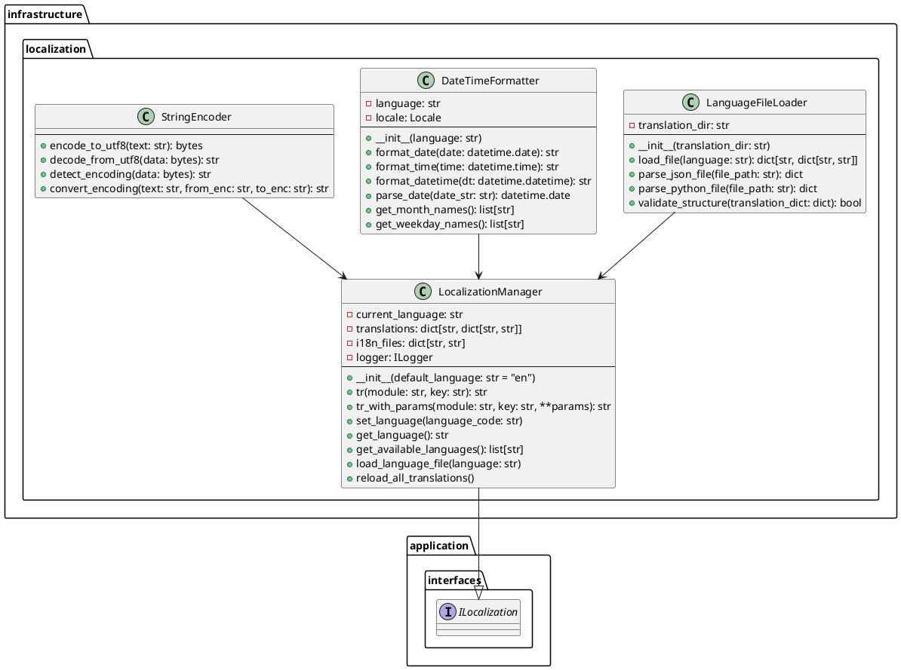
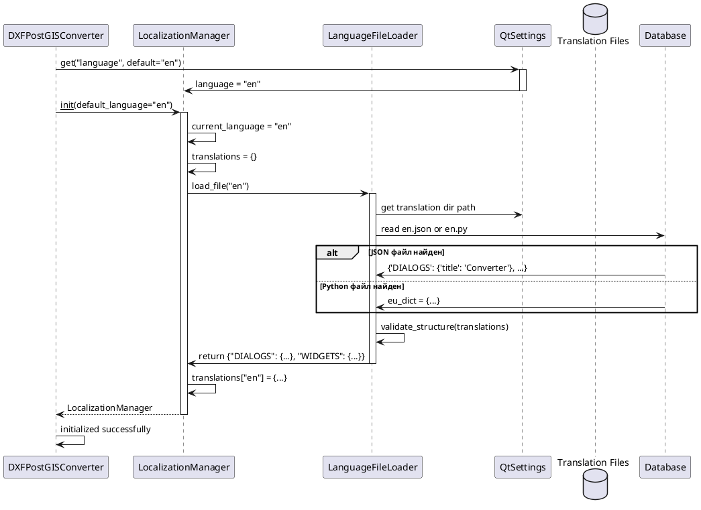
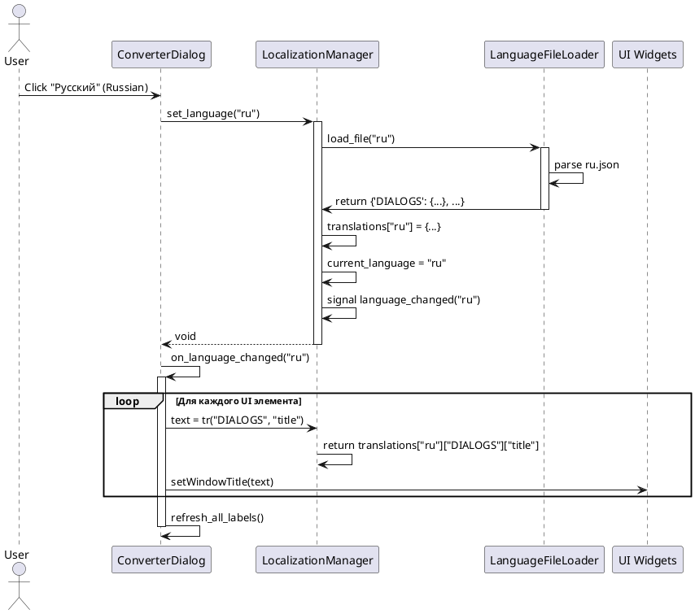
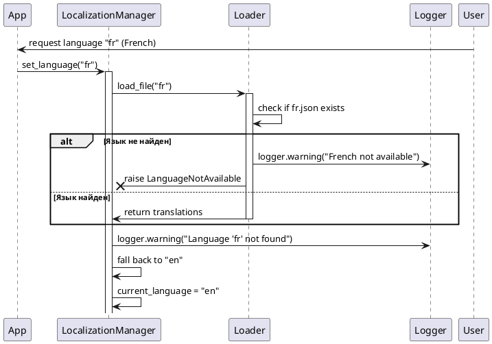
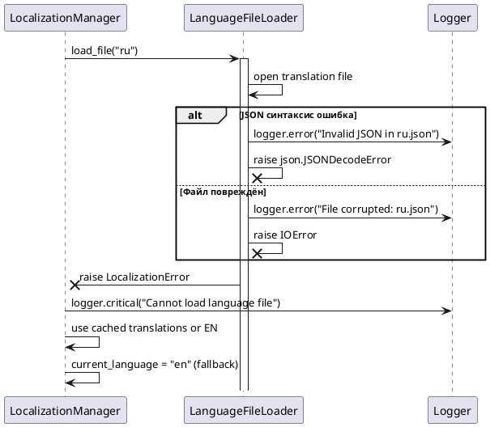
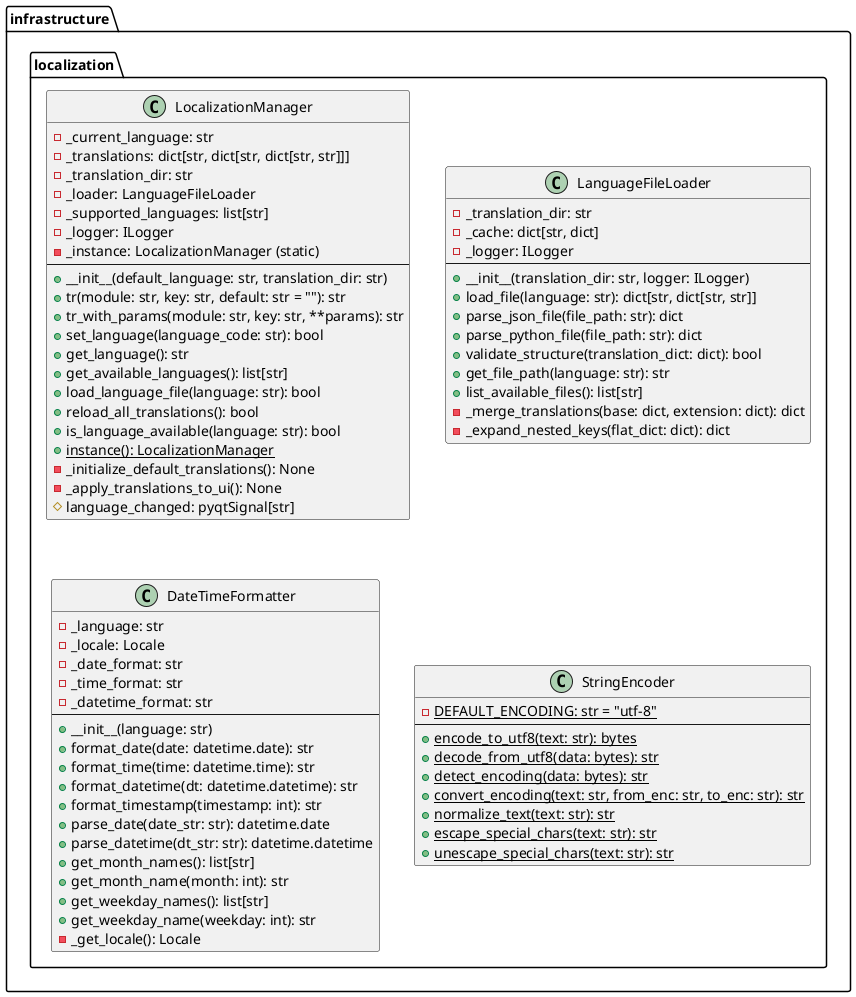

# Проектирование пакета localization

**Пакет**: `infrastructure/localization`

**Назначение**: Многоязычная поддержка интерфейса приложения через локализацию строк, форматирование дат/времени и работа с кодировками для разных языков.

**Расположение**: `src/infrastructure/localization/`

---

## 1. Исходная диаграмма классов (внутренние отношения)



---

## 2. Таблица описания классов

| Класс | Назначение | Тип |
|-------|-----------|-----|
| **LocalizationManager** | Управление переводами строк, языками и локализацией интерфейса | Manager |
| **LanguageFileLoader** | Загрузка и парсирование файлов переводов (JSON, Python) | Loader |
| **DateTimeFormatter** | Форматирование дат и времени в соответствии с текущим языком | Formatter |
| **StringEncoder** | Работа с кодировками и преобразование текста между форматами | Encoder |

---

## 3. Диаграммы последовательности

### 3.1 Нормальный ход: Инициализация локализации при запуске приложения



### 3.2 Альтернативный нормальный ход: Изменение языка во время работы



### 3.3 Сценарий прерывания пользователем: Недоступный язык



### 3.4 Сценарий системного прерывания: Файл перевода повреждён



---

## 4. Уточненная диаграмма классов (с типами связей)

```plantuml
@startuml infrastructure_localization_refined

package "infrastructure.localization" {
    class LocalizationManager {
        + tr(module, key): str
        + set_language(lang): void
        + get_available_languages(): list
    }
    
    class LanguageFileLoader {
        + load_file(language): dict
        + validate_structure(): bool
    }
    
    class DateTimeFormatter {
        + format_date(): str
        + format_datetime(): str
    }
    
    class StringEncoder {
        + encode_to_utf8(): bytes
        + detect_encoding(): str
    }
}

package "application.interfaces" {
    interface ILocalization
}

LocalizationManager -.implements-> ILocalization
LocalizationManager --> LanguageFileLoader: uses
LocalizationManager --> DateTimeFormatter: uses
LocalizationManager --> StringEncoder: uses

@enduml
```

---

## 5. Детальная диаграмма классов (со всеми полями и методами)



---

## 6. Таблицы описания полей и методов

### 6.1 LocalizationManager

#### Поля

| Название | Тип | Модификатор | Описание |
|----------|-----|-------------|---------|
| `_current_language` | str | private | текущий язык (en, ru, etc) |
| `_translations` | dict | private | вложенный словарь переводов |
| `_translation_dir` | str | private | директория с файлами переводов |
| `_loader` | LanguageFileLoader | private | загрузчик файлов |
| `_supported_languages` | list[str] | private | список поддерживаемых языков |
| `_logger` | ILogger | private | логирование |
| `_instance` | LocalizationManager (static) | private | singleton экземпляр |

#### Сигналы

| Сигнал | Параметры | Описание |
|--------|-----------|---------|
| `language_changed` | language: str | испускается при смене языка |

#### Методы

| Название | Параметры | Возвращает | Описание |
|----------|-----------|-----------|---------|
| `__init__()` | default_language, path | void | инициализирует менеджер |
| `tr()` | module, key, default | str | получить перевод строки |
| `tr_with_params()` | module, key, **params | str | получить с параметрами |
| `set_language()` | language_code | bool | установить язык |
| `get_language()` | - | str | получить текущий язык |
| `get_available_languages()` | - | list[str] | список доступных |
| `load_language_file()` | language | bool | загрузить файл |
| `reload_all_translations()` | - | bool | перезагрузить все |
| `is_language_available()` | language | bool | проверить наличие |
| `instance()` | - (static) | LocalizationManager | получить singleton |

### 6.2 LanguageFileLoader

#### Поля

| Название | Тип | Модификатор | Описание |
|----------|-----|-------------|---------|
| `_translation_dir` | str | private | директория переводов |
| `_cache` | dict | private | кэш загруженных файлов |
| `_logger` | ILogger | private | логирование |

#### Методы

| Название | Параметры | Возвращает | Описание |
|----------|-----------|-----------|---------|
| `__init__()` | dir, logger | void | инициализирует |
| `load_file()` | language | dict | загрузить файл языка |
| `parse_json_file()` | file_path | dict | парсер JSON |
| `parse_python_file()` | file_path | dict | парсер Python (exec) |
| `validate_structure()` | translation_dict | bool | валидация структуры |
| `get_file_path()` | language | str | получить путь файла |
| `list_available_files()` | - | list[str] | список файлов |

### 6.3 DateTimeFormatter

#### Поля

| Название | Тип | Модификатор | Описание |
|----------|-----|-------------|---------|
| `_language` | str | private | текущий язык |
| `_locale` | Locale | private | locale объект |
| `_date_format` | str | private | формат даты |
| `_time_format` | str | private | формат времени |
| `_datetime_format` | str | private | формат даты-времени |

#### Методы

| Название | Параметры | Возвращает | Описание |
|----------|-----------|-----------|---------|
| `__init__()` | language | void | инициализирует |
| `format_date()` | date | str | форматированная дата |
| `format_time()` | time | str | форматированное время |
| `format_datetime()` | dt | str | форматированные дата-время |
| `format_timestamp()` | timestamp | str | из timestamp |
| `parse_date()` | date_str | date | парсить дату |
| `parse_datetime()` | dt_str | datetime | парсить дату-время |
| `get_month_names()` | - | list[str] | названия месяцев |
| `get_month_name()` | month | str | название месяца |
| `get_weekday_names()` | - | list[str] | названия дней недели |
| `get_weekday_name()` | weekday | str | название дня недели |

### 6.4 StringEncoder

#### Методы (все static)

| Название | Параметры | Возвращает | Описание |
|----------|-----------|-----------|---------|
| `encode_to_utf8()` | text | bytes | кодировать в utf-8 |
| `decode_from_utf8()` | data | str | декодировать из utf-8 |
| `detect_encoding()` | data | str | определить кодировку |
| `convert_encoding()` | text, from, to | str | преобразовать между |
| `normalize_text()` | text | str | нормализовать (NFC) |
| `escape_special_chars()` | text | str | экранировать спецсимволы |
| `unescape_special_chars()` | text | str | убрать экранирование |

---

## 7. Структура файлов переводов

### Пример: en.json

```json
{
  "DIALOGS": {
    "title": "DXF to PostGIS Converter",
    "import_title": "Import DXF",
    "export_title": "Export DXF",
    "connection_title": "Database Connection"
  },
  "WIDGETS": {
    "remove_button": "Remove",
    "save_button": "Save",
    "cancel_button": "Cancel"
  },
  "MESSAGES": {
    "import_success": "Import completed successfully",
    "import_error": "Import failed: {error}",
    "connection_lost": "Database connection lost",
    "please_wait": "Please wait..."
  },
  "VALIDATION": {
    "file_not_found": "File not found",
    "invalid_format": "Invalid file format",
    "empty_file": "File is empty"
  }
}
```

### Пример: ru.json

```json
{
  "DIALOGS": {
    "title": "Конвертер DXF в PostGIS",
    "import_title": "Импорт DXF",
    "export_title": "Экспорт DXF",
    "connection_title": "Подключение БД"
  },
  "WIDGETS": {
    "remove_button": "Удалить",
    "save_button": "Сохранить",
    "cancel_button": "Отмена"
  },
  "MESSAGES": {
    "import_success": "Импорт завершён успешно",
    "import_error": "Ошибка импорта: {error}",
    "connection_lost": "Соединение с БД потеряно",
    "please_wait": "Пожалуйста, подождите..."
  },
  "VALIDATION": {
    "file_not_found": "Файл не найден",
    "invalid_format": "Неверный формат файла",
    "empty_file": "Файл пуст"
  }
}
```

---

## 8. Использование в коде

### Модальное использование

```python
# В dialogs
from application.interfaces import ILocalization

class ImportDialog(QDialog):
    def __init__(self, localization: ILocalization):
        super().__init__()
        self.localization = localization
        
        # 1. Простая строка
        self.setWindowTitle(
            self.localization.tr("DIALOGS", "import_title")
        )
        
        # 2. Строка с параметрами
        error_msg = self.localization.tr_with_params(
            "MESSAGES", "import_error", error="Network timeout"
        )
        # Результат: "Import failed: Network timeout"
        
        # 3. С реакцией на смену языка
        localization.language_changed.connect(self.on_language_changed)
    
    def on_language_changed(self, language: str):
        # Гарантированно переводятся все строки при смене языка
        self.setWindowTitle(
            self.localization.tr("DIALOGS", "import_title")
        )
        self.refresh_all_ui_strings()
```

---

## 9. Взаимодействие с другими пакетами

### Входящие зависимости (другие пакеты используют localization)

- **presentation/dialogs, widgets**
  - используют tr() для мультиязычного интерфейса

- **presentation/services**
  - используют для локализованных сообщений об ошибках

- **infrastructure/database**
  - используют для форматирования дат в БД

### Исходящие зависимости (localization использует)

- **application/interfaces** (ILocalization)
  - реализует контракт интерфейса

- **application/interfaces** (ILogger)
  - логирование ошибок загрузки переводов

- **Python locale module**
  - работа с региональными настройками

---

## 10. Правила проектирования и ограничения

### Архитектурные правила

1. **Слой**: infrastructure/localization - **Infrastructure Layer**
2. **Паттерн**: Singleton для LocalizationManager
3. **Зависимости**: только ВЫШЕ к application и domain слоям
4. **API**: через ILocalization интерфейс

### Паттерны проектирования

- **Singleton Pattern**: LocalizationManager
- **Observer Pattern**: language_changed сигнал
- **Loader Pattern**: LanguageFileLoader
- **Factory Pattern**: создание DateTimeFormatter по языку

### Правила локализации

1. **Структура**: module → key → translation_string
2. **Параметры**: используется format() со скобками {param}
3. **Кэширование**: загруженные переводы кэшируются в памяти
4. **Fallback**: при отсутствии строки возвращается ключ или default

### Рекомендации

✓ всегда используйте tr() для пользовательских строк
✓ используйте tr_with_params() для динамических значений
✓ подписывайте на language_changed для обновления UI
✓ располагайте переводы в структурированных JSON/Python файлах

✗ не используйте строки с кодировкой (только unicode)
✗ не переводите служебные строки (log levels, enum names)
✗ не полагайтесь на порядок параметров в format()

---

## 11. Состояние проектирования

✅ **Завершено**: полная документация infrastructure/localization слоя.

**Готово к использованию в диплому**: многоязычная теката многоязычной поддержки приложения (English, Русский, и другие языки).
