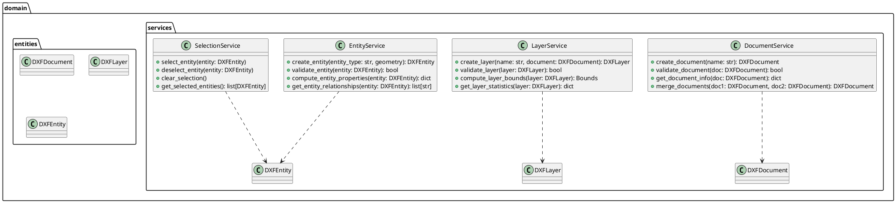
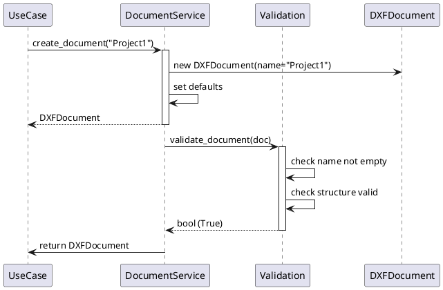
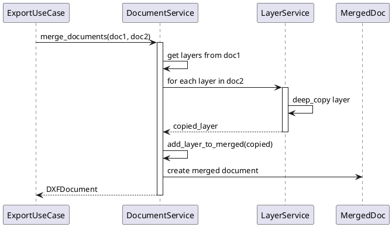
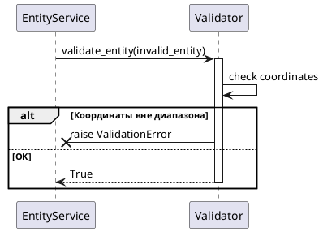
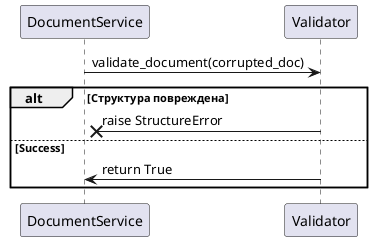
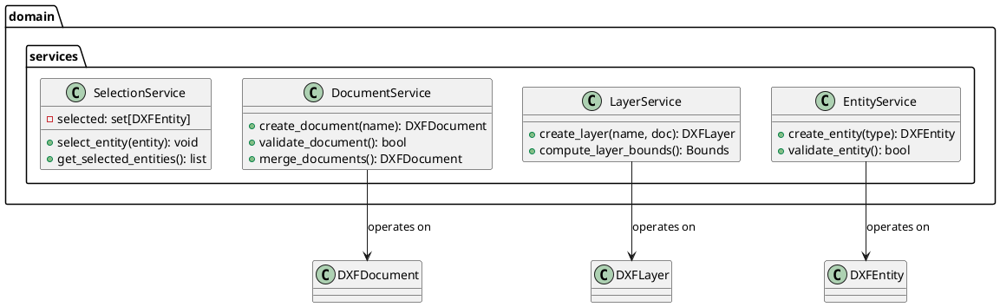
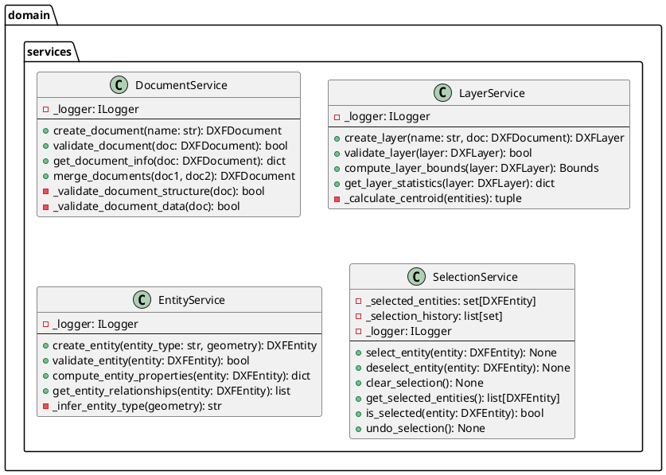

# Проектирование пакета services (domain)

**Пакет**: `domain/services`

**Назначение**: Бизнес-логика сервисов предметной области независимо от реализации, содержит главные операции над доменными объектами.

**Расположение**: `src/domain/services/`

---

## 1. Исходная диаграмма классов

---

## 2. Таблица описания классов

| Класс | Назначение | Тип |
|-------|-----------|-----|
| **DocumentService** | Операции над документами (создание, валидация, слияние) | Service |
| **LayerService** | Операции над слоями (создание, границы, статистика) | Service |
| **EntityService** | Операции над сущностями (создание, валидация, свойства) | Service |
| **SelectionService** | Управление выбранными сущностями | Service |

---

## 3. Четыре диаграммы последовательности

### 3.1 Нормальный ход: Создание документа с валидацией

### 3.2 Альтернативный ход: Слияние двух документов

### 3.3 Прерывание: Невалидная сущность

### 3.4 Системное прерывание: Ошибка в валидации

---

## 4. Уточненная диаграмма классов

---

## 5. Детальная диаграмма классов

---

## 6. Таблицы описания полей и методов

### DocumentService

| Название | Параметры | Возвращает | Описание |
|----------|-----------|-----------|---------|
| `create_document()` | name: str | DXFDocument | создаёт новый документ |
| `validate_document()` | doc: DXFDocument | bool | проверяет структуру документа |
| `get_document_info()` | doc | dict | получает метаинформацию |
| `merge_documents()` | doc1, doc2 | DXFDocument | объединяет два документа |

### LayerService

| Название | Параметры | Возвращает | Описание |
|----------|-----------|-----------|---------|
| `create_layer()` | name, doc | DXFLayer | создаёт слой в документе |
| `validate_layer()` | layer | bool | проверяет слой на ошибки |
| `compute_layer_bounds()` | layer | Bounds | вычисляет границы слоя |
| `get_layer_statistics()` | layer | dict | статистика (кол-во элементов и т.д.) |

### EntityService

| Название | Параметры | Возвращает | Описание |
|----------|-----------|-----------|---------|
| `create_entity()` | type, geometry | DXFEntity | создаёт элемент |
| `validate_entity()` | entity | bool | проверяет элемент |
| `compute_entity_properties()` | entity | dict | вычисляет свойства (площадь и т.д.) |
| `get_entity_relationships()` | entity | list | связи с другими элементами |

### SelectionService

| Название | Параметры | Возвращает | Описание |
|----------|-----------|-----------|---------|
| `select_entity()` | entity | void | выбрать элемент |
| `deselect_entity()` | entity | void | отменить выбор |
| `clear_selection()` | - | void | очистить выбор |
| `get_selected_entities()` | - | list | получить выбранные |
| `is_selected()` | entity | bool | проверить выбран ли |
| `undo_selection()` | - | void | отменить последнее действие |

---

## 7. Состояние проектирования

✅ **Завершено**: полная документация domain/services слоя.
