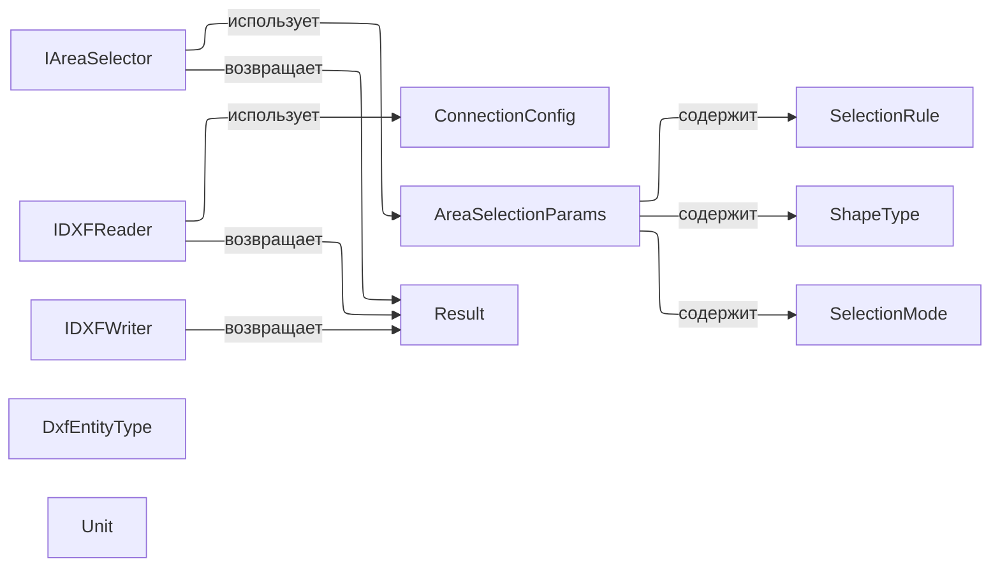
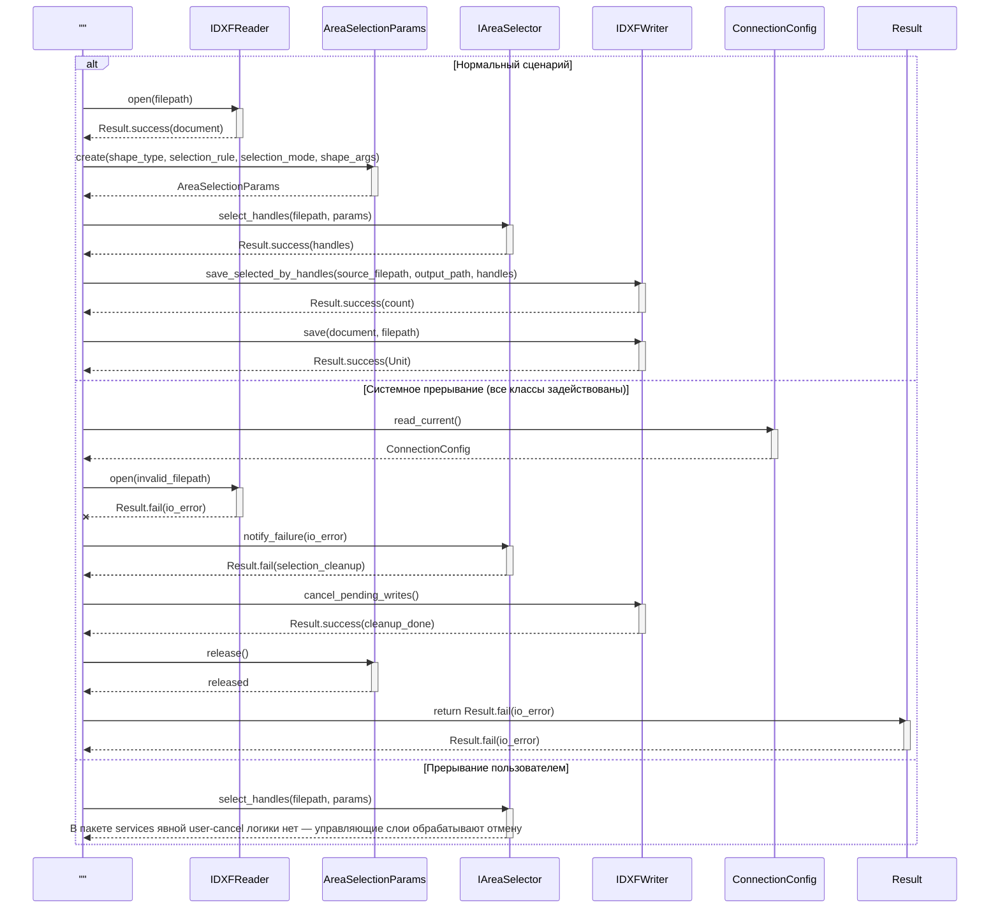
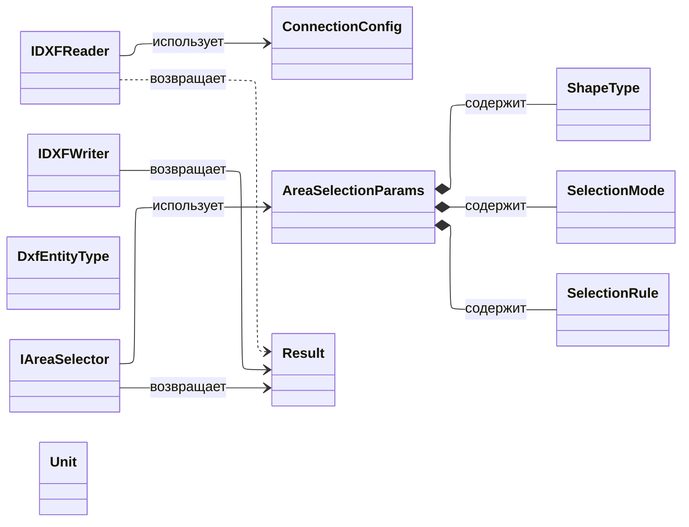
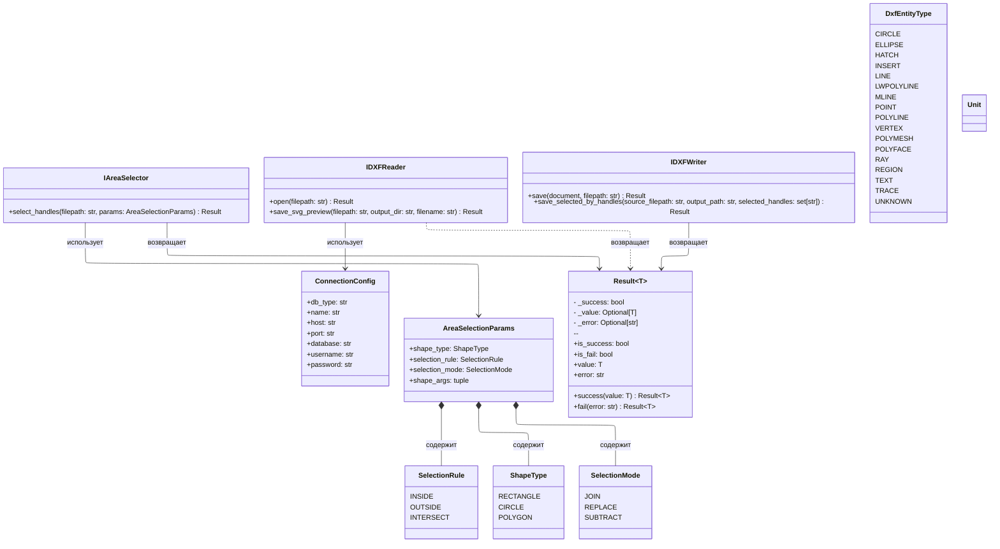

# 5.2.13. Проектирование классов пакета «services»

Пакет `services` в этом проекте объединяет `domain/services` и `domain/value_objects`.
Он содержит абстракции сервисного слоя предметной области и общие неизменяемые объекты-значения, которые используются этими контрактами.

## 5.2.13.1. Исходная диаграмма классов



В исходной диаграмме показаны все типы пакета: 11 элементов. `SelectionRule`, `ShapeType`, `SelectionMode` и `DxfEntityType` являются перечислениями, а `ConnectionConfig`, `AreaSelectionParams`, `Result` и `Unit` — неизменяемыми объектами-значениями. Они отображаются отдельными узлами, но без детализации полей и методов.

### Таблица 1. Описание классов пакета «services»

| Класс | Описание |
|---|---|
| IAreaSelector | Абстракция выбора DXF-сущностей по геометрической области и набору параметров выбора |
| IDXFReader | Абстракция чтения DXF-файла и подготовки вспомогательных представлений, включая SVG preview |
| IDXFWriter | Абстракция записи DXF-документа и сохранения отфильтрованных сущностей по handle |
| ConnectionConfig | Неизменяемый объект конфигурации подключения к БД |
| AreaSelectionParams | Неизменяемые параметры геометрического выбора |
| SelectionRule | Правило проверки попадания сущности в область выбора |
| ShapeType | Тип геометрической области выбора |
| SelectionMode | Режим комбинирования результата выбора |
| DxfEntityType | Перечень поддерживаемых типов DXF-сущностей |
| Result | Унифицированный результат операции с успехом или ошибкой |
| Unit | Пустой тип для операций без полезного возвращаемого значения |

## 5.2.13.2. Диаграмма последовательностей взаимодействия объектов классов

На одной диаграмме показано взаимодействие всех классов пакета. Первый блок играет роль общего инициатора сценариев. Все ветки (включая системное прерывание) задействуют все классы пакета.



В ветке пользовательского прерывания показано, что явная отмена на уровне сервисных контрактов отсутствует и управляется верхними слоями приложения.

## 5.2.13.3. Уточненная диаграмма классов



## 5.2.13.4. Детальная диаграмма классов



### Таблица 2. Ключевые поля классов пакета «services»

| Класс | Поле | Описание |
|---|---|---|
| ConnectionConfig | db_type/name/host/port/database/username/password | Параметры подключения к БД |
| AreaSelectionParams | shape_type/selection_rule/selection_mode/shape_args | Параметры геометрического выбора |
| Result | _success/_value/_error | Унифицированное состояние операции |

### Таблица 3. Ключевые методы классов пакета «services»

| Класс | Метод | Назначение |
|---|---|---|
| IAreaSelector | select_handles | Поиск handle сущностей, попавших в заданную область |
| IDXFReader | open | Открытие DXF-файла и построение доменного документа |
| IDXFReader | save_svg_preview | Создание SVG-предпросмотра DXF-файла |
| IDXFWriter | save | Сохранение DXF-документа в файл |
| IDXFWriter | save_selected_by_handles | Сохранение только выбранных сущностей по handle |
| Result | success/fail | Создание результата операции |
| Result | is_success/is_fail | Проверка состояния результата |
| Result | value/error | Получение значения или текста ошибки |

## 5.2.13.5. Подробные таблицы полей и методов классов

Таблица 4
Описание методов класса «IAreaSelector»

| Название | Параметры | Возвращает | Описание |
|---|---|---|---|
| select_handles | filepath: str, params: AreaSelectionParams | Result[list[str]] | Возвращает список handle сущностей, попавших в область выбора |

Таблица 5
Описание методов класса «IDXFReader»

| Название | Параметры | Возвращает | Описание |
|---|---|---|---|
| open | filepath: str | Result[DXFDocument] | Открывает DXF-файл и формирует доменный документ |
| save_svg_preview | filepath: str, output_dir: str, filename: str = "" | Result[str] | Создает SVG-предпросмотр DXF-файла |

Таблица 6
Описание методов класса «IDXFWriter»

| Название | Параметры | Возвращает | Описание |
|---|---|---|---|
| save | document: DXFDocument, filepath: str | Result[Unit] | Сохраняет документ в DXF-файл |
| save_selected_by_handles | source_filepath: str, output_path: str, selected_handles: set[str] | Result[int] | Сохраняет только сущности с указанными handle и возвращает число удаленных сущностей |

Таблица 7
Описание полей класса «ConnectionConfig»

| Название | Тип | Описание |
|---|---|---|
| db_type | str | Тип СУБД |
| name | str | Название соединения |
| host | str | Хост |
| port | str | Порт |
| database | str | Имя базы данных |
| username | str | Имя пользователя |
| password | str | Пароль |

Таблица 8
Описание полей класса «AreaSelectionParams»

| Название | Тип | Описание |
|---|---|---|
| shape_type | ShapeType | Тип геометрической области |
| selection_rule | SelectionRule | Правило попадания сущности в область |
| selection_mode | SelectionMode | Режим объединения результата выбора |
| shape_args | tuple[Any, ...] | Параметры формы области |

Таблица 9
Описание полей класса «SelectionRule»

| Значение | Описание |
|---|---|
| INSIDE | Полностью внутри |
| OUTSIDE | Полностью снаружи |
| INTERSECT | Частичное пересечение |

Таблица 10
Описание полей класса «ShapeType»

| Значение | Описание |
|---|---|
| RECTANGLE | Прямоугольник |
| CIRCLE | Круг |
| POLYGON | Полигон |

Таблица 11
Описание полей класса «SelectionMode»

| Значение | Описание |
|---|---|
| JOIN | Добавить к выбору |
| REPLACE | Заменить выбор |
| SUBTRACT | Вычесть из выбора |

Таблица 12
Описание полей класса «DxfEntityType»

| Название | Описание |
|---|---|
| FACE3D, SOLID3D, ACADPROXYENTITY, ARC, ATTRIB, BODY, CIRCLE, DIMENSION, ARC_DIMENSION, ELLIPSE, HATCH, HELIX, IMAGE, INSERT, LEADER, LINE, LWPOLYLINE, MLINE, MESH, MPOLYGON, MTEXT, MULTI_LEADER, POINT, POLYLINE, VERTEX, POLYMESH, POLYFACE, RAY, REGION, SHAPE, SOLID, SPLINE, SURFACE, TEXT, TRACE, UNDERLAY, VIEWPORT, WIPEOUT, XLINE, UNKNOWN | Все поддерживаемые типы сущностей DXF |

Таблица 13
Описание полей класса «Result»

| Название | Тип | Описание |
|---|---|---|
| _success | bool | Признак успешного результата |
| _value | Optional[T] | Значение результата |
| _error | Optional[str] | Сообщение об ошибке |

Таблица 14
Описание методов класса «Result»

| Название | Параметры | Возвращает | Описание |
|---|---|---|---|
| success | value: T | Result[T] | Создает успешный результат |
| fail | error: str | Result[T] | Создает результат с ошибкой |
| is_success | - | bool | Проверяет успешность результата |
| is_fail | - | bool | Проверяет неуспешность результата |
| value | - | T | Возвращает значение успешного результата |
| error | - | str | Возвращает сообщение об ошибке |

Таблица 15
Описание полей класса «Unit»

| Название | Тип | Описание |
|---|---|---|
| Unit | Value Object | Пустой тип для операций без полезного значения |

@enduml
```

---

## 6. Таблицы описания полей и методов

### DocumentService

| Название | Параметры | Возвращает | Описание |
|----------|-----------|-----------|---------|
| `create_document()` | name: str | DXFDocument | создаёт новый документ |
| `validate_document()` | doc: DXFDocument | bool | проверяет структуру документа |
| `get_document_info()` | doc | dict | получает метаинформацию |
| `merge_documents()` | doc1, doc2 | DXFDocument | объединяет два документа |

### LayerService

| Название | Параметры | Возвращает | Описание |
|----------|-----------|-----------|---------|
| `create_layer()` | name, doc | DXFLayer | создаёт слой в документе |
| `validate_layer()` | layer | bool | проверяет слой на ошибки |
| `compute_layer_bounds()` | layer | Bounds | вычисляет границы слоя |
| `get_layer_statistics()` | layer | dict | статистика (кол-во элементов и т.д.) |

### EntityService

| Название | Параметры | Возвращает | Описание |
|----------|-----------|-----------|---------|
| `create_entity()` | type, geometry | DXFEntity | создаёт элемент |
| `validate_entity()` | entity | bool | проверяет элемент |
| `compute_entity_properties()` | entity | dict | вычисляет свойства (площадь и т.д.) |
| `get_entity_relationships()` | entity | list | связи с другими элементами |

### SelectionService

| Название | Параметры | Возвращает | Описание |
|----------|-----------|-----------|---------|
| `select_entity()` | entity | void | выбрать элемент |
| `deselect_entity()` | entity | void | отменить выбор |
| `clear_selection()` | - | void | очистить выбор |
| `get_selected_entities()` | - | list | получить выбранные |
| `is_selected()` | entity | bool | проверить выбран ли |
| `undo_selection()` | - | void | отменить последнее действие |

---

## 7. Состояние проектирования

✅ **Завершено**: полная документация domain/services слоя.
