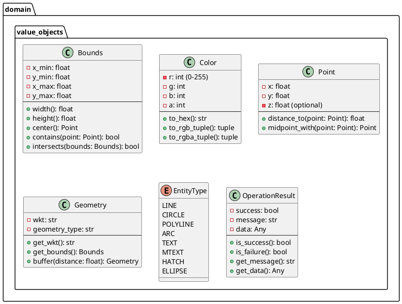

# Проектирование пакета value_objects (domain)

**Пакет**: `domain/value_objects`

**Назначение**: Объекты-значения (Value Objects) — неизменяемые объекты, которые определяются своими значениями, а не идентификатором.

---

## 1. Таблица описания классов

| Класс | Назначение | Тип |
|-------|-----------|-----|
| **Bounds** | Прямоугольные границы (x_min, y_min, x_max, y_max) | Value Object |
| **Color** | RGBA цвет (r, g, b, a) | Value Object |
| **Point** | 2D или 3D точка с координатами | Value Object |
| **Geometry** | Геометрическая фигура (WKT представление) | Value Object |
| **EntityType** | Тип сущности (LINE, CIRCLE, POLYLINE и т.д.) | Enum |
| **OperationResult** | Результат операции (успех/ошибка с сообщением) | Value Object |

---

## 2. Диаграмма классов

---

## 3. Полное описание

### Bounds (прямоугольные границы)
- **Неизменяемый**: создаётся один раз, не меняется
- **Методы**: width, height, center, contains, intersects
- **Использование**: определение видимой области, пересечения

### Color (цвет)
- **Формат**: RGBA (красный, зелёный, синий, прозрачность)
- **Методы**: to_hex (для UI), to_rgb_tuple, to_rgba_tuple
- **Использование**: стили отображения в QGIS

### Point (точка в пространстве)
- **Координаты**: x, y, и опционально z (для 3D)
- **Методы**: distance_to, midpoint_with
- **Использование**: вершины геометрии, центры объектов

### Geometry (геометрия)
- **Формат**: WKT (Well-Known Text) — стандартный формат PostGIS
- **Примеры**: POINT(0 0), LINESTRING(0 0, 1 1), POLYGON(...)
- **Методы**: get_wkt, get_bounds, buffer (буферизация)

### EntityType (тип сущности)
- **Enum** с поддерживаемыми типами DXF
- **Используется**: для определения типа сущности при импорте

### OperationResult (результат операции)
- **Оборачивает** результат операции (успех или ошибка)
- **Методы**: is_success, is_failure, get_message, get_data
- **Использование**: безопасный возврат результатов из методов

**Статус**: ✅ Завершено
