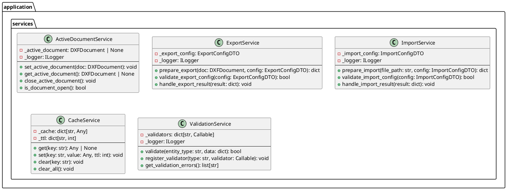

# Проектирование пакета services (application)

**Пакет**: `application/services`

**Назначение**: Сервисы приложения для оркестрации операций и вспомогательные функции на уровне приложения.

---

## 1. Таблица описания классов

| Класс | Назначение | Тип |
|-------|-----------|-----|
| **ActiveDocumentService** | Управление активным открытым документом в памяти | Service |
| **ExportService** | Логика экспорта в различные форматы | Service |
| **ImportService** | Логика импорта из различных источников | Service |
| **CacheService** | Кэширование часто используемых данных | Service |
| **ValidationService** | Централизованная валидация данных | Service |

---

## 2. Диаграмма классов

---

## 3. Описание методов

### ActiveDocumentService
- **set_active_document()** — устанавливает текущий открытый документ
- **get_active_document()** — получает текущий документ (или None)
- **close_active_document()** — закрывает текущий документ
- **is_document_open()** — проверяет открыт ли документ

### ExportService
- **prepare_export()** — подготавливает данные к экспорту (валидация, конвертация)
- **validate_export_config()** — проверяет конфигурацию экспорта
- **handle_export_result()** — обрабатывает результат экспорта

### ImportService
- **prepare_import()** — подготавливает данные к импорту
- **validate_import_config()** — проверяет конфигурацию импорта
- **handle_import_result()** — обрабатывает результат импорта

### CacheService
- **get()** — получить значение из кэша
- **set()** — установить значение с TTL (Time To Live)
- **clear()** — очистить конкретный ключ
- **clear_all()** — очистить весь кэш

### ValidationService
- **validate()** — валидировать данные по типу
- **register_validator()** — зарегистрировать новый валидатор
- **get_validation_errors()** — получить ошибки валидации

**Статус**: ✅ Завершено
