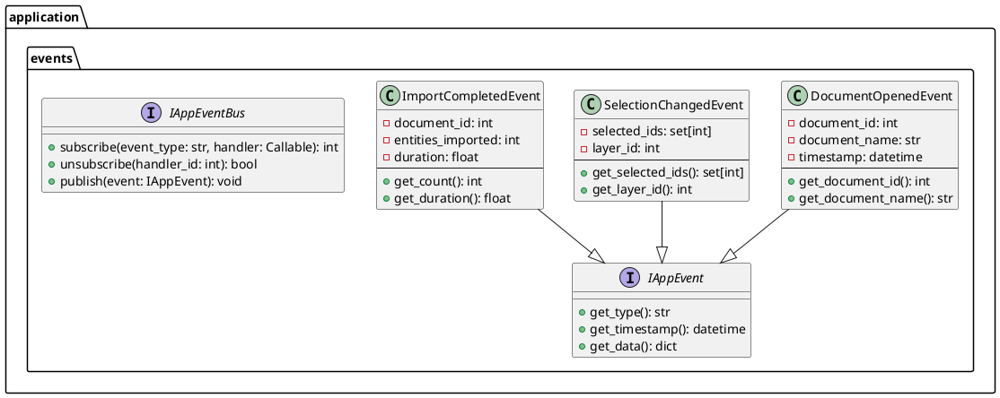

# Проектирование пакета events (application)

**Пакет**: `application/events`

**Назначение**: Определение событий приложения и их обработчики для реактивного программирования.

---

## 1. Таблица описания классов

| Класс | Назначение | Тип |
|-------|-----------|-----|
| **IAppEvent** | Базовый интерфейс события | Interface |
| **DocumentOpenedEvent** | Событие открытия документа | Event |
| **DocumentClosedEvent** | Событие закрытия документа | Event |
| **SelectionChangedEvent** | Событие изменения выбора | Event |
| **ImportStartedEvent** | Событие начала импорта | Event |
| **ImportCompletedEvent** | Событие завершения импорта | Event |
| **ExportStartedEvent** | Событие начала экспорта | Event |
| **ExportCompletedEvent** | Событие завершения экспорта | Event |
| **IAppEventBus** | Шина событий для подписки и публикации | Interface |

---

## 2. Диаграмма классов



---

## 3. Описание событий

### DocumentOpenedEvent
- **Данные**: document_id, document_name
- **Когда**: при открытии DXF файла
- **Слушатели**: UI обновляет заголовок, становятся доступными кнопки

### SelectionChangedEvent
- **Данные**: selected_ids (множество выбранных ID), layer_id
- **Когда**: пользователь выбирает элемент в дереве или на карте
- **Слушатели**: UI обновляет подсветку, показывает свойства

### ImportCompletedEvent
- **Данные**: document_id, entities_imported (кол-во импортированных), duration
- **Когда**: завершен импорт из DXF
- **Слушатели**: UI показывает сообщение об успехе, обновляет прогресс

### ExportCompletedEvent
- **Данные**: file_path, entities_exported
- **Когда**: завершен экспорт в DXF
- **Слушатели**: UI показывает сообщение, может открыть папку

---

## 4. Интерфейс IAppEventBus

```python
# Пример использования
event_bus.subscribe("document_opened", on_document_opened)
event_bus.subscribe("selection_changed", on_selection_changed)

# Публикация события
event = DocumentOpenedEvent(doc_id=123, doc_name="Project1")
event_bus.publish(event)
```

**Статус**: ✅ Завершено
