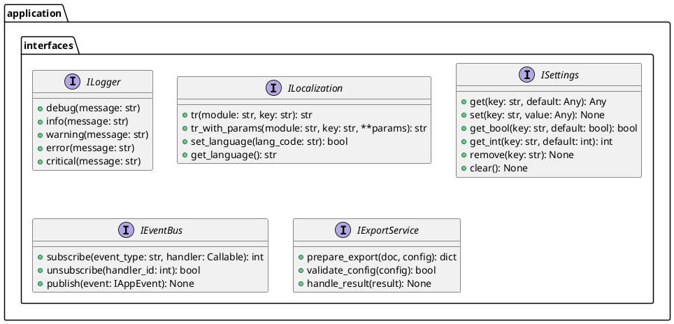

# Проектирование пакета interfaces (application)

**Пакет**: `application/interfaces`

**Назначение**: Определение контрактов для зависимостей, инъектируемых из infrastructure слоя.

---

## 1. Таблица описания интерфейсов

| Интерфейс | Назначение | Методы |
|-----------|-----------|--------|
| **ILogger** | Логирование событий и ошибок | debug, info, warning, error, critical |
| **ILocalization** | Локализация строк интерфейса | tr, tr_with_params, set_language |
| **ISettings** | Хранение и получение настроек | get, set, remove, clear |
| **IEventBus** | Подписка и публикация событий | subscribe, unsubscribe, publish |
| **IExportService** | Экспорт в различные форматы | prepare_export, validate_config |

---

## 2. Диаграмма интерфейсов



---

## 3. Полное описание интерфейсов

### ILogger
**Назначение**: логирование сообщений на разные уровни
- `debug()` — отладочная информация (детальная)
- `info()` — информационные сообщения
- `warning()` — предупреждения
- `error()` — ошибки (не критичные)
- `critical()` — критические ошибки (приложение может упасть)

**Реализация**: infrastructure/qgis/QtLogger

### ILocalization
**Назначение**: многоязычная поддержка интерфейса
- `tr()` — получить перевод строки по ключу
- `tr_with_params()` — перевод с подстановкой параметров
- `set_language()` — установить язык
- `get_language()` — получить текущий язык

**Реализация**: infrastructure/localization/LocalizationManager

### ISettings
**Назначение**: сохранение и загрузка настроек приложения
- `get()` — получить значение
- `set()` — установить значение
- `get_bool()`, `get_int()` — типизированный доступ
- `remove()` — удалить значение
- `clear()` — очистить все

**Реализация**: infrastructure/qgis/QtSettings

### IEventBus
**Назначение**: система событий для слабо связанных компонентов
- `subscribe()` — подписаться на событие, получить ID подписки
- `unsubscribe()` — отписаться от события
- `publish()` — опубликовать событие

**Реализация**: infrastructure/qgis/QtAppEvents

### IExportService
**Назначение**: логика экспорта документов
- `prepare_export()` — подготовить данные к экспорту
- `validate_config()` — проверить конфиг экспорта
- `handle_result()` — обработать результат

**Реализация**: application/services/ExportService

---

## 4. Инъекция зависимостей

Используется паттерн **Dependency Injection** через декоратор `@inject.autoparams()`:

```python
from application.interfaces import ILogger, ILocalization

class SomeUseCase:
    @inject.autoparams('logger', 'localization')
    def __init__(self, logger: ILogger, localization: ILocalization):
        self._logger = logger
        self._localization = localization
    
    def execute(self):
        self._logger.info("Starting operation")
        message = self._localization.tr("MODULE", "key")
```

**Статус**: ✅ Завершено
