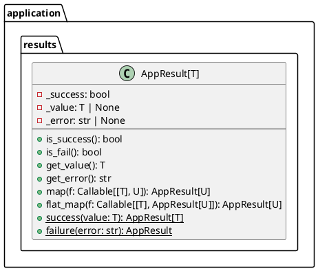

# Проектирование пакета results (application)

**Пакет**: `application/results`

**Назначение**: Обёртки результатов операций для безопасной обработки успеха и ошибок.

---

## 1. Таблица описания классов

| Класс | Назначение | Методы |
|-------|-----------|--------|
| **AppResult[T]** | Результат операции (успех или ошибка) | is_success, is_fail, get_value, get_error |
| **Success[T]** | Успешный результат с данными | value: T |
| **Failure** | Неудачный результат с ошибкой | error: str |

---

## 2. Диаграмма классов



---

## 3. Использование

```python
# Успешный результат
result: AppResult[Document] = AppResult.success(document)
if result.is_success():
    doc = result.get_value()

# Неудачный результат
result: AppResult = AppResult.failure("Database connection error")
if result.is_fail():
    error_msg = result.get_error()

# Трансформация результата
result = AppResult.success(5)
doubled = result.map(lambda x: x * 2)  # AppResult.success(10)

# Цепочка операций
result = AppResult.success(document)
result = result.flat_map(save_to_db)  # flat_map обрабатывает AppResult
```

---

## 4. Преимущества

✅ **Type safe** — использует Generics[T] для типизации
✅ **避免исключения** — вместо try-except возвращает Result
✅ **Readable** — понятно из кода, успех или ошибка
✅ **Composable** — можно цеплять с map и flat_map
✅ **Явная обработка ошибок** — неблагоприятный путь не пропустить

**Статус**: ✅ Завершено
