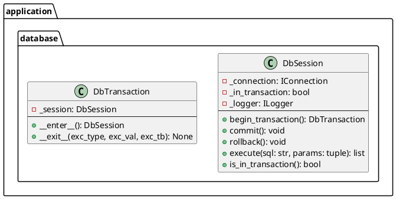

# Проектирование пакета database (application)

**Пакет**: `application/database`

**Назначение**: Сессионное управление подключением и трансакциями на уровне приложения.

---

## 1. Таблица описания классов

| Класс | Назначение | Методы |
|-------|-----------|--------|
| **DbSession** | Управление БД сессией и трансакциями | begin, commit, rollback, execute |
| **DbTransaction** | Контекстный менеджер для трансакций | `__enter__`, `__exit__` |

---

## 2. Диаграмма классов



---

## 3. Использование

```python
# С контекстным менеджером (рекомендуется)
db = DbSession(connection, logger)

with db.begin_transaction():
    # Все операции в трансакции
    doc_repo.save_document(doc)
    layer_repo.save_layer(layer)
    # При выходе автоматически commit или rollback

# Или явно
db.begin_transaction()
try:
    doc_repo.save_document(doc)
    db.commit()
except Exception:
    db.rollback()
    raise
```

---

## 4. ACID гарантии

- **A**tomicity — либо всё, либо ничего
- **C**onsistency — целостность данных
- **I**solation — изоляция трансакций
- **D**urability — персистентность данных

**Статус**: ✅ Завершено
