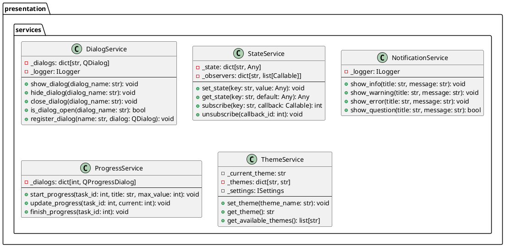

# Проектирование пакета services (presentation)

**Пакет**: `presentation/services`

**Назначение**: Сервисы presentation слоя для управления состоянием UI и взаимодействию между диалогами/виджетами.

---

## 1. Таблица описания классов

| Класс | Назначение | Методы |
|-------|-----------|--------|
| **DialogService** | Управление жизненным циклом диалогов | show, hide, close, is_open |
| **StateService** | Управление глобальным состоянием UI | set_state, get_state, subscribe |
| **NotificationService** | Показ уведомлений и сообщений | show_info, show_warning, show_error |
| **ProgressService** | Управление прогрессом операций | start_progress, update_progress, finish_progress |
| **ThemeService** | Управление темой оформления | set_theme, get_theme, get_available_themes |

---

## 2. Диаграмма классов



---

## 3. Использование

### DialogService
```python
# Регистрация диалога при инициализации
dialog_service.register_dialog("import_dialog", ImportDialog())

# Показ диалога
dialog_service.show_dialog("import_dialog")
```

### StateService
```python
# Установка состояния
state_service.set_state("selected_layer_id", 42)

# Подписка на изменение состояния
state_service.subscribe("selected_layer_id", on_layer_changed)
```

### NotificationService
```python
# Показ уведомления
notification_service.show_info("Import", "Successfully imported 100 entities")

# Диалог вопроса
if notification_service.show_question("Delete", "Delete this layer?"):
    # пользователь подтвердил
    pass
```

### ProgressService
```python
# Начало операции с прогрессом
progress_service.start_progress(task_id=1, title="Importing...", max_value=100)

# Обновление прогресса
for i in range(100):
    progress_service.update_progress(task_id=1, current=i)

# Завершение
progress_service.finish_progress(task_id=1)
```

### ThemeService
```python
# Смена темы
theme_service.set_theme("dark")

# Получение доступных тем
themes = theme_service.get_available_themes()
```

---

## 4. Архитектурные причины

✅ **Разделение ответственности** — различные аспекты UI управления отделены
✅ **Переиспользуемость** — сервисы используют несколько диалогов/виджетов
✅ **Тестируемость** — легко мокировать сервисы в юнит тестах
✅ **Слабая связанность** — диалоги не знают друг о друге, общаются через сервисы

**Статус**: ✅ Завершено
